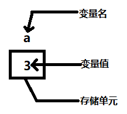
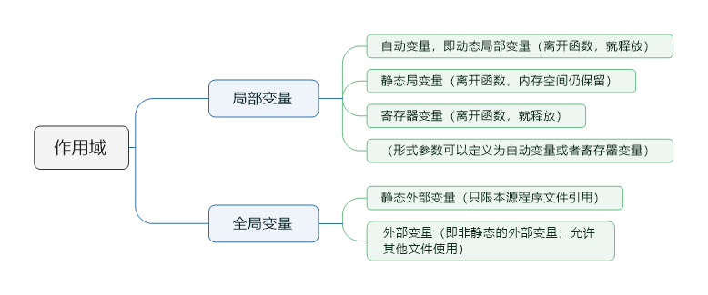

# 第零章 程序设计和C语言概述

## 一、软件概述

### 1、软件

软件（计算机程序设计），即能够完成预定功能和性能的可执行的计算机程序，包括使程序正常执行所需要的数据，还包括在软件开发过程中记录的开发活动以及为了维护和使用软件的一系列文档。

**软件 = 计算机程序 + 程序文档**

### 2、计算机程序

程序，即一组计算机能识别和执行的指令，每一条指令使计算机执行特定的操作。计算机执行程序，就是在执行各条指令，而一个特定的指令序列完成指定的功能。

**程序 = 算法 + 数据结构**

**算法是灵魂，数据结构是加工对象，语言是工具，编程采用合适的程序设计方法**

### 3、数据结构

对**数据**的描述，即在程序中需要指定使用哪些数据，以及这些数据的类型和数据的组织形式；是一门研究非数值计算程序问题中，计算机的操作对象以及这些操作对象之间的关系和操作等的学科。

### 4、算法

对**操作**的描述，即要求计算机对数据进行加工处理的步骤；由有限条指令的序列确定了解决某个问题的运算或操作的步骤。

### 5、算法分类

 1）数值运算算法，如求方程的根、求一个函数的积分等。

 2）非数值运算算法，如将一张职工表按姓名排序、图书检索等。

### 6、算法的特性

1）有穷性

算法由有限的操作步骤构成，不能是无限的。

2）确定性

算法包含的每一个步骤都应当是确定的，而不能是含糊的、模棱两可的。

3）有零个或者多个输入

输入，即执行算法时，需要从外界获得必要的信息。

4）有一个或者多个输出

算法的目的是为了求解，“解”就是输出。

5）有效性

算法中的每一个步骤都应当能有效地执行，并得到确定的结果。

### 7、算法的表示

1）自然语言

2）传统流程图

3）结构化流程图

4）伪代码

### 8、结构化程序设计

1）结构化程序设计是什么？

①使用计算机语言表示的结构化算法；②使用基本结构（顺序结构、选择结构、循环结构）组成的程序必然是结构化的程序。

2）为什么使用结构化程序设计？

①结构清晰；②层次分明；③便于编写和阅读；④易于修改和维护；⑤提高程序的可靠性；⑥保证了程序的质量。

3）结构化程序设计基本思路

把一个复杂问题的求解过程分阶段进行，每个阶段处理的问题都控制在人们容易理解和处理的范围内；即首先通过**①自顶向下** **②逐步细化**的方式将一个复杂问题分解成为一个一个容易理解容易实现的简单问题，然后通过**③模块化设计**将这些简单问题设计成独立的模块，最后采用合适的语言和程序设计方法进行**④结构化编码**求解问题。

划分子模块时应注意**模块的独立性**，即使用一个模块完成一项功能，耦合性越少越好。

4）结构化的算法是什么？

由基本结构（顺序结构、选择结构、循环结构）顺序组成，在基本结构之间不存在向前向后的跳转，流程的转移只存在于一个基本结构范围之内（如循环中流程的跳转）；一个非结构化的算法可以使用一个等价的结构化算法代替，其功能不变；若是一个算法不能分解为若干个基本结构，则这个算法必然不是一个结构化的算法。

## 二、进制

进制是一个关于逢几进一的问题，通常N进制就是逢N进一。

### 1、十进制

逢10进1；

十进制的基数：0、1、2、3、4、5、6、7、8、9；

任何十进制的数都是由十个基数组合而成。

### 2、二进制

逢2进1；

二进制的基数：0、1

### 3、八进制

逢8进1；

八进制的基数：0、1、2、3、4、5、6、7

### 4、十六进制

逢16进1；

十六进制的基数：0、1、2、3、4、5、6、7、8、9、a（或A）、b（或B）、c（或C）、d（或D）、e（或E）、f（或F）

### 5、常用进制转换

| 十进制 | 二进制 | 八进制 | 十六进制 |
| ------ | ------ | ------ | -------- |
| 0      | 0000   | 0      | 0        |
| 1      | 0001   | 1      | 1        |
| 2      | 0010   | 2      | 2        |
| 3      | 0011   | 3      | 3        |
| 4      | 0100   | 4      | 4        |
| 5      | 0101   | 5      | 5        |
| 6      | 0110   | 6      | 6        |
| 7      | 0111   | 7      | 7        |
| 8      | 1000   | 10     | 8        |
| 9      | 1001   | 11     | 9        |
| 10     | 1010   | 12     | a        |
| 11     | 1011   | 13     | b        |
| 12     | 1100   | 14     | c        |
| 13     | 1101   | 15     | d        |
| 14     | 1110   | 16     | e        |
| 15     | 1111   | 17     | f        |

### 6、任意进制转十进制

1）二进制转十进制

<div>
    二进制 (1011)<sub>2</sub></br>
	十进制 1 ✖ 2<sup>3</sup> + 0 ✖ 2<sub>2</sub> + 1 ✖ 2<sub>1</sub> + 1 ✖ 2<sub>0</sub> = 11
</div>

2）八进制转十进制

<div>
    八进制 (17)<sub>8</sub></br>
	十进制 1 ✖ 8<sup>1</sup> + 7 ✖ 8<sup>0</sup> = 15
</div>

3）十六进制转十进制

<div>
    十六进制 (32C)<sub>16</sub></br>
	十进制 3 ✖ 16<sup>2</sup> + 2 ✖ 16<sup>1</sup> + c ✖ 16<sup>0</sup> = 812
</div>

### 7、十进制转任意进制

十进制转R进制，用十进制数除以R取余，直到商为零时，将余数倒序排列。

## 三、计算机存储单位

### 1、位

位（bit，b）， 二进制数中的一个数位，可以是0或者1，是计算机中数据的最小单位。 

### 2、字节

字节（Byte，B）计算机中数据的基本单位，由八位（8b或者8bit）组成一个字节。各种信息在计算机中存储、处理至少需要一个字节。

### 3、字

字（Word）：两个字节（2byte或者2B）称为一个字。中文汉字的存储单位都是一个字。

### 4、扩展的存储单位

在计算机各种存储介质（例如内存、硬盘、光盘等）的存储容量单位使用bit、B、KB、MB、GB、TB、PB、EB、ZB、YB、BB、NB、DB等来表示，它们之间的关系为：

```C
1B = 8b
1KB = 1024B
1MB = 1024KB
1GB = 1024MB
1TB = 1024GB
1PB = 1024TB
  ......
```

**注：生产厂家在生产存储设备时，是以1000作为存储容量的单位进制，而不是计算机的1024为单位进制，因此存储设备标明的容量大小，在计算机中显示时并没有那么多。**

## 四、计算机语言


### 1、机器语言

计算机工作基于二进制，因此计算机只能识别和接收由0和1组成的指令（代码），这种能被计算机直接识别和接收的指令称为**机器指令**，而机器指令的集合即为该计算机的**机器语言**。

### 2、符号语言

由英文字母和数字表示一个指令，但计算机不能直接识别和执行符号语言，需要借助一种称为**汇编程序**的软件，将符号语言的指令转换为机器语言，转换的过程称为“代真”或“汇编”，符号语言又称为“符号汇编语言”或“汇编语言”。

>  不同型号的机器语言和汇编语言是互不通用的，机器语言和汇编语言是完全依赖于具体机器特性的，是面向机器的语言，称为计算机**低级语言**。

### 3、FORTRAN语言

20世纪50年代，第一个计算机高级语言。

### 4、高级语言

不依赖于具体机器，使用高级语言编写的程序对任何型号的计算机都适用(只需做很少的修改)。高级语言不能被计算机直接识别和执行，需要通过一种称为**编译程序**的软件把高级语言编写的程序（称为源程序），转换为机器指令的程序（称为目标程序）。

### 5、非结构化的语言

编程风格比较随意，只要符合语言要求的语法规则，没有严格的规范要求，程序中的流程可以随意跳转。

### 6、结构化语言

程序必须由具有良好特性的基本结构（顺序结构、选择结构、循环结构）构成，流程不允许随意跳转，程序总是由上而下的顺序执行各个基本结构。

### 7、面向过程的语言

非结构化的语言和结构化语言都是面向过程的语言（以过程为中心），在编程时，需要具体指定每一个过程的细节。

### 8、面向对象的语言

 以对象作为基本程序结构单位的程序设计语言，指用于描述的设计是以对象为核心，而对象是程序运行时刻的基本成分。 

## 五、C语言概念

C语言是一种用途广泛、功能强大、使用灵活的过程性编程语言，既可用于编写应用软件，又可用于编写系统软件。

## 六、C语言发展历程

| 时间          | 内容                                                         |
| ------------- | ------------------------------------------------------------ |
| 1972年11月    | 由Dennis Ritchie(丹尼斯·里奇)以B语言为基础完成主体设计       |
| 1978年11月    | 贝尔实验室正式发布C语言                                      |
| 1983年        | 为统⼀C语⾔版本，由美国国家标准局(ANSI)开始制定C语⾔标准     |
| 1989年12月    | ANSI完成C语⾔标准的制定(ANSI C 或 C89)                       |
| 1990年9月     | 由ANSI将C89提交至国际化标准组织(ISO)，被一字不改地采纳为国际标准(ISO C 或 C90) |
| 1999年8月     | 经过一些必要的修正和完善后，ISO发布新的C语言标准(C99)        |
| 2011年12月8日 | ISO又正式发布了新的标准(C11)                                 |

## 七、C语言特点

1. 语⾔简洁、紧凑，使用方便灵活；
2. 具有结构化的控制语句；
3. 丰富的数据类型；
4. 丰富的运算符；
5. 语法限制不太严格，程序设计自由度大；
6. 允许对物理地址进⾏直接操作，能进行位操作，能实现汇编语言的大部分功能，可直接对硬件进行操作；
7. 代码具有较好的可移植性；
8. 可⽣成⾼质量、⽬标代码执⾏效率⾼的程序。

## 八、C语言应用领域

### 1、系统软件开发

1）操作系统

Unix、Linux、Windows

2）驱动程序

显卡、主板、摄像头

3）数据库

DB2、SQL Server、Oracle

### 2、应用软件开发

1）办公软件

WPS

2）图形图像多媒体

Photoshop

3）嵌入式软件

智能手机、掌上电脑

4）游戏开发

2D、3D

## 九、C语言的编译器

### 1、GCC

由GNU（ GNU's Not Unix! ）组织开发的基于Linux系统的开源免费编译器。

### 2、MinGW

MinGW（Minimalist GNU for Windows），它是将GNU开发工具移植到Win32平台下的产物，即一套Windows上的GNU工具集，用其开发的程序不需要额外的第三方DLL支持就可以在Windows下运行，相对地，不使用动态库导致的就是编译出来的程序大很多。 

### 3、CLang

Clang是一个由Apple主导编写，基于LLVM的C/C++/Objective-C编译器。

## 十、C语言集成开发环境

### 1、Visual Studio

微软公司的Windows平台应用程序的集成开发环境。

### 2、Code::Blocks

开源免费跨平台（Windows、Linux、Mac OS）的C/C++ IDE。

### 3、Dev-C++

Dev-C++（或者叫做 Dev-Cpp）是 Windows 环境下的一个轻量级 C/C++ 集成开发环境（IDE） 。

## 十一、C程序实例分析

```C
#include <stdio.h>
int main()
{
    /* 这是一个C程序 */
    printf("Hello World!\n");
    return 0;
}
```

>  程序分析：
>
>  1、`#include <stdio.h>` 为预处理指令，`stdio.h`为C语言标准库函数文件，`.h`后缀表示这个文件是头文件，C 编译器在实际编译之前，先将`#include <stdio.h>`替换为`stdio.h`文件中的内容。
>
>  2、`int main () {}`为C程序的主函数，也是一个C程序的入口，任何C程序都是是从这里开始执行的；`int`表示该函数的类型为`int`类型，在执行函数后会得到一个`int`类型的值。
>
>  3、`/* 这是一个C程序 */`为C程序的注释，写在 `/* */` 之间的内容，在被编译器编译之前每一个注释会被替换为一个空格。
>
>  4、`printf("Hello World!\n");` `printf` 为C语言标准库函数`stdio.h`提供的输出函数，将双引号内的`Hello World!`原样输出；`\n`为转义字符换行符，在将`Hello World!`输出后，将显示屏光标位置移动到下一行的起始处；`；`每一条语句最后都有一个分号，表示该语句结束。
>
>  5、`return 0`当`main`函数执行结束前，将`0`（int类型）返回到调用函数处。**在main函数中，当main函数正常执行结束时，返回的值是0，但当执行main函数过程中出现异常或者错误时，函数值是一个非0的值，这个值是返回给调用mian函数的操作系统的，通过操作指令检查main函数返回值，从而判断main函数是否已正常执行，若是缺省这条指令，有的C编译器会自行补充。**

```C
#incldue <stdio.h>
int main ()
{
    int a, b, sum;
    a = 123;
    b = 456;
    sum = a + b;
    printf("sum = %d\n", sum);
    return 0;
}
```

>  程序分析：
>
>  1、`int a, b, sum;`声明（定义）名为`a, b, sum`的`int`类型的变量。
>
>  2、`a=123;`为变量进行赋值，使`a`等于`123`。
>
>  3、`b=456;`为变量进行赋值，使`b`等于`456`。
>
>  4、`sum=a+b;`将变量`a`和`b`的值相加，然后将和赋值给`sum`。
>
>  5、`printf("sum = %d\n", sum);` `printf`函数有两个有逗号分隔的参数，双引号内的内容称为输出格式字符串，其中`sum = `为原样输出字符，`%d`是格式字符，`d`表示“十进制整数”格式，第二个参数为`sum`,表示在输出时，将`sum`的值以十进制整数的形式替换`%d`。

```C
#include <stdio.h>
int max (int x, int y);
int main ()
          {
    int a, b, c;
    scanf("%d,%d", &a, &b);
    c = max (a, b);
    printf("max = %d\n", c);
    return 0;
}
int max (int x, int y)
{
    return x > y ? x : y;
}
```

>  程序分析：
>
>  1、`int max (int x, int y);`函数声明，在C语言中，不论函数还是变量都要先声明（定义），再使用，这是由于C语言是从上向下执行语句的。
>
>  2、`scanf("%d,%d", &a, &b);` `scanf`为C语言标准库函数`stdio.h`提供的输如函数，由逗号分隔为三个参数，双引号内的内容称为输入格式字符串，`&a, &b`为地址表列；`scanf`函数按照`整数，整数`的格式，读入两个整数并赋值给变量`a`和`b`。
>
>  3、`max (a, b);`使用`max(a,b)`调用函数`max`，将变量`a`和`b`的值作为函数`max`的变量`x`和`y`，然后执行`max`函数。
>
>  4、`return x > y ? x : y;`将变量`x`和`y`进行比较，若是变量`x`的值大于变量`b`的值，就将变量`x`的值返回到调用函数处，否侧就将变量`y`的值返回到调用函数处；即用返回的值替换`max (a, b)`，并赋值给变量`c`。

# 第壹章、C语言基本语法

## 一、注释

### 1、单行注释

```c
// 单行注释
```

可以独占一行，也可出现在一行中其他内容的右侧，从`//`开始，以换行符结束。（C99新增标准）

### 2、多行注释

```c
/* 多行注释 */

/*
	多行注释
*/
```

以`/*`开始，以`*/`结束，可以独占一行，也可以包含多行，当C编译器识别到一个`/*`时，会直接寻找`*/`（就近原则），然后将二者中间的内容作为注释。

## 二、常量

### 1、常量是什么？

常量是**固定值**，在程序执⾏期间不允许改变。这些固定的值，⼜叫做**字面量**。 

### 2、整型常量

**整数**都属于整型常量：

```c
十进制 : 100， 0， -123
八进制 : 017,  077
十六进制 : 0xac, 0X3c
```

### 3、实型常量

1）十进制的小数形式的实型常量：

```c
0.25，1.5，-36.72
```

2）指数形式的实型常量：

<div>
1e10 表示 1×10<sup>10</sup>;</br>
-3.14e2 表示 -3.14×10<sup>2</sup>;</br>
-3.46E-12 表示 -3.14×10<sup>-12</sup></br>
</div>

其中字母**e**和**E**用来表示以10为底的指数；**字母e和E之前必须有数字，且e和E之后必须为整数**。

### 4、字符常量

1）普通字符

由单引号（单撇号）括起来的单个字符：

```c
'1', 'a', '?', '#'
```

单引号只是界限符，字符常量只能是一个不包含单引号的字符。

2）转义字符

转义字符是以字符 `\` 开头的一种的特殊的字符常量：

| 转义字符                                      | 字符值(实例)            | 输出结果                       |
| --------------------------------------------- | ----------------------- | ------------------------------ |
| `\'`                                          | `'`                     | 单引号（单撇号）字符`'`        |
| `\"`                                          | `"`                     | 双引号（双撇号）字符`"`        |
| `\?`                                          | `?`                     | 问号字符`?`                    |
| `\\`                                          | `\`                     | 反斜线字符`\`                  |
| `\a`                                          | 警告（alert）           | 产生声音或者视觉信号           |
| `\b`                                          | 退格（backspace）       | 将光标向前移动一个字符         |
| `\f`                                          | 换页（form feed）       | 将光标移至下一页的开头         |
| `\n`                                          | 换行（enter）           | 将光标移至下一行的开头         |
| `\r`                                          | 回车（carriage return） | 将光标移至本行的开头           |
| `\t`                                          | 水平制表符（tab）       | 将光标移至下一个Tab位置        |
| `\v`                                          | 垂直制表符              | 将光标移至下一个垂直制表对齐点 |
| `\0o`、`\0oo`、`\0ooo`，`o`代表一个八进制数   | `\012`                  | 八进制 12（十进制 10）         |
| `\xh`、`\xhh`、`\xhhh`，`h`代表一个十六进制数 | `\x41`                  | 十六进制 41（十进制65）        |

### 5、字符串常量

使用双引号（双撇号）将若干个单个字符括起来：

```c
"boy", "123", "how are you"
```

双引号只是界限符，字符串常量是双引号内的全部字符（不包含双引号）。

### 6、符号常量

使用预处理指令 `#define` 指定一个符号代表一个常量：

```c
#define PI 3.14 // 这里使用符号 PI 代表 3.14
```

**注：①符号需要见名知意；②符号常量使用大写字母表示。**

## 三 、数据类型

### 1、数据类型有哪些？


### 2、基本类型的存储空间

<table>
	<tr>
        <th>类型</th>
        <th>存储空间(字节Byte)</th>
        <th>值的范围</th>
    </tr>
    <tr>
        <td>char</td>
        <td>1</td>
        <td>-2<sup>7</sup>(-128) ~ 2<sup>7</sup>-1(127)</td>
    </tr>
    <tr>
        <td>short</td>
        <td>2</td>
        <td>-2<sup>15</sup>(-32,768) ~ 2<sup>15</sup>-1(32,767)</td>
    </tr>
    <tr>
        <td rowspan="2">int</td>
        <td>2</td>
        <td>-2<sup>15</sup>(-32,768) ~ 2<sup>15</sup>-1(32,767)</td>
    </tr>
    <tr>
        <td>4</td>
        <td>-2<sup>31</sup>(-2,147,483,648) ~ 2<sup>31</sup>-1(2,147,483,647)</td>
    </tr>
    <tr>
        <td rowspan="2">long</td>
        <td>4</td>
        <td>-2<sup>31</sup>(-2,147,483,648) ~ 2<sup>31</sup>-1(2,147,483,647)</td>
    </tr>
    <tr>
        <td>8</td>
        <td>-2<sup>63</sup> ~ 2<sup>63</sup>-1</td>
    </tr>
    <tr>
        <td>long long</td>
        <td>8</td>
        <td>-2<sup>63</sup> ~ 2<sup>63</sup>-1</td>
    </tr>
</table>

<table>
    <tr>
        <th>类型</th>
        <th>存储空间(字节Byte)</th>
        <th>有效数字</th>
        <th>值的范围</th>
    </tr>
    <tr>
        <td>float</td>
        <td>4</td>
        <td>6</td>
        <td>-3.4×10<sup>38</sup> ~ -1.2×10<sup>-38</sup>；0；1.2×10<sup>-38</sup> ~ 3.4×10<sup>38</sup></td>
    </tr>
    <tr>
        <td>double</td>
        <td>8</td>
        <td>15</td>
        <td>-1.7×10<sup>308</sup> ~ -2.3×10<sup>-308</sup>；0；2.3×10<sup>-308</sup> ~ 1.7×10<sup>308</sup></td>
    </tr>
    <tr>
        <td rowspan="2">long double</td>
        <td>8</td>
        <td>15</td>
        <td>-1.7×10<sup>308</sup> ~ -2.3×10<sup>-308</sup>；0；2.3×10<sup>-308</sup> ~ 1.7×10<sup>308</sup></td>
    </tr>
    <tr>
        <td>16</td>
        <td>19</td>
        <td>-1.1×10<sup>4932</sup> ~ -3.4×10<sup>-4932</sup>；0；3.4×10<sup>-4932</sup> ~ 1.1×10<sup>4932</sup></td>
    </tr>
</table>

**注：在计算机中，数据是存放在存储单元中的，是具体存在的，而每一个存储单元都是由有限的字节构成，因此能够存放的数据的范围是有限的，无法存放“无限大”或者无限循环的数，因此计算机进行计算多数情况下得到的只是近似的结果。**

### 3、整型数据

1）整型数据的存储方式

在存储单元中，整数通过补码的方式进行存储。正整数的补码就是该整数的二进制形式，不够位数时左边补零；负整数的补码为该负整数的绝对值的二进制形式按位取反再加一，不够位数时左边补一：

```c
/*
	在32位的系统中:
	 5 : 0101 (二进制形式)
	     0000 0000 0000 0000 0000 0000 0000 0101 (补码,不足32位前面补0)
	-5 : 1101 (二进制形式)
		 0101 (取绝对值)
	     1010 (按位取反)
	     1011 (加1)
	     1111 1111 1111 1111 1111 1111 1111 1011 (补码,不足32位前面补1)
*/
short a = 5, b = -5;
printf("a = %d, b = %d\n", a, b); // a = 5, b = -5

short c = 0, d = -0;
printf("c = %d, d = %d\n", c, d); // c = 0, d = 0
```

**注：变量在存储值时，一定不能超出所分配的存储单元允许的值的范围**

```C
/*
	使用2字节(16位)存储
	则 最大值为32767
	而 最小值为-32768
	
	若是用此空间存储 32768 ,在32位的系统中
	1000 0000 0000 0000 (二进制形式)
	0000 0000 0000 0000 1000 0000 0000 0000 (补码) 正数的二进制形式就是它的补码
*/
short a = 32767, b = 32768;
short c = a + 1;
printf("a = %d, b = %d, c = %d\n", a, b, c); // a = 32767, b = -32768, c = -32768
/*
	之所以会出现这种数值失真的情况,原因是 32768 是个整数,在32位系统中,这个整数是使用了32位的
	即 0000 0000 0000 0000 1000 0000 0000 0000
	但是赋值给 short 类型变量时,只截取了最后面的16位二进制位,即 1000 0000 0000 0000
	所以最后这个数值的符号位就不再是 0 而是 1 了
	1000 0000 0000 0000 --- 判定负数
	0111 1111 1111 1111 (按位取反)
	1000 0000 0000 0000 (加1)
	1000 0000 0000 0000 (该负数的绝对值形式) = 32768
	结果 : -32768
*/
short d = 32769;
printf("f = %d\n"); // f = -32767
/*
	0000 0000 0000 0000 1000 0000 0000 0001 (32769的补码)
	1000 0000 0000 0001 (赋值给short类型变量d后)
	0111 1111 1111 1110 (按位取反)
	0111 1111 1111 1111 (加1)
	0111 1111 1111 1111 (绝对值的二进制) = 32767
	结果 : -32767
*/

short e = 32767;
printf("e+1 = %d\n", e+1); // e+1 = 32768 这之所以是个正数,是因为是以32位表示的
```

2）数据类型代表的存储空间大小的问题

在C语言的标准中，没有具体规定各种数据类型所占用的存储空间的大小，而是由各个编译系统自行决定的。在C标准中只规定了 `sizeof(short) ≤ sizeof(int) ≤ sizeof(long) ≤ sizeof(long long)`。

3）无符号整型和有符号整型

在`short`、`int`、`long`、`long long`型的变量的存储单元中，值都是以补码的形式进行存储的，存储单元的第一位（最高位）二进制位作为符号位（0表示正，1表示负）；若指明是无符号的，则存储单元的全部二进制位都作为数值的存储位使用，因此无符号的变量只能存储正数，且存储范围扩大一倍。

通过关键字`signed`或`unsigned`对变量进行修饰，来指定变量是有符号的还是无符号的；其中`signed`可以省略，即不使用`unsigned`进行修饰，变量默认是有符号的。

| 名称           | 类型                     |
| -------------- | ------------------------ |
| 有符号短整型   | [signed] short [int]     |
| 无符号短整型   | unsigned short [int]     |
| 有符号整型     | [signed] int             |
| 无符号整型     | unsigned int             |
| 有符号长整型   | [signed] long [int]      |
| 无符号长整型   | unsigned long [int]      |
| 有符号双长整型 | [signed] long long [int] |
| 无符号双长整型 | unsigned long long [int] |

**注：只有整型数据可以使用关键字`signed`和`unsigned`进行修饰**

<table>
	<tr>
        <th>类型</th>
        <th>存储空间(字节Byte)</th>
        <th>值的范围</th>
    </tr>
    <tr>
        <td>[signed] short [int]</td>
        <td>2</td>
        <td>-2<sup>15</sup>(-32,768) ~ 2<sup>15</sup>-1(32,767)</td>
    </tr>
     <tr>
        <td>unsigned short [int]</td>
        <td>2</td>
        <td>0 ~ 2<sup>16</sup>-1(65535)</td>
    </tr>
    <tr>
        <td rowspan="2">[signed] int</td>
        <td>2</td>
        <td>-2<sup>15</sup>(-32,768) ~ 2<sup>15</sup>-1(32,767)</td>
    </tr>
    <tr>
        <td>4</td>
        <td>-2<sup>31</sup>(-2,147,483,648) ~ 2<sup>31</sup>-1(2,147,483,647)</td>
    </tr>
    <tr>
        <td rowspan="2">unsigned int</td>
        <td>2</td>
        <td>0 ~ 2<sup>16</sup>-1(65535)</td>
    </tr>
    <tr>
        <td>4</td>
        <td>0 ~ 2<sup>32</sup>-1(4,294,967,295)</td>
    </tr>
    <tr>
        <td rowspan="2">[signed] long [int]</td>
        <td>4</td>
        <td>-2<sup>31</sup>(-2,147,483,648) ~ 2<sup>31</sup>-1(2,147,483,647)</td>
    </tr>
    <tr>
        <td>8</td>
        <td>-2<sup>63</sup> ~ 2<sup>63</sup>-1</td>
    </tr>
    <tr>
        <td rowspan="2">unsigned long [int]</td>
        <td>4</td>
        <td>0 ~ 2<sup>32</sup>-1(4,294,967,295)</td>
    </tr>
    <tr>
        <td>8</td>
        <td>0 ~ 2<sup>64</sup>-1</td>
    </tr>
    <tr>
        <td>[signed] long long [int]</td>
        <td>8</td>
        <td>-2<sup>63</sup> ~ 2<sup>63</sup>-1</td>
    </tr>
    <tr>
        <td>unsigned long long [int]</td>
        <td>8</td>
        <td>0 ~ 2<sup>64</sup>-1</td>
    </tr>
</table>

**注：C 编译系统不对数据类型的正负进行判断，需要自行注意不要将负值使用无符号类型进行存储**

```c
/*
	使用2字节(16位)进行无符号存储,32位系统中
	 1 : 0000 0000 0000 0001 (二进制)
	     0000 0000 0000 0000 0000 0000 0000 0001 (补码) ----- 无符号结果 1
	-1 : 1000 0000 0000 0001 (二进制)
	     0000 0000 0000 0001 (取绝对值)
	     1111 1111 1111 1110 (按位取反)
	     1111 1111 1111 1111 (加1)
	     0000 0000 0000 0000 1111 1111 1111 1111 (补码) ----- 无符号结果 65535
*/
unsigned short a = 1, b = -1;
printf("a = %u, b = %u\n", a, b); // a = 1, b = 65535
```

4）长整型的使用问题

`long`类型在使用时，需要在整数末尾加上`l`或者`L`字母，用于表示这是一个长整型。

```C
long a = 123L;
printf("a = %ld\n", a); // 输出时的格式字符需要添加字母`l`表示输出的是长整型
```

### 4、字符型数据

1）字符

字符主要是指由单引号（单撇号）括起来的单个字符。

2）字符代码

字符代码是指系统字符集中的字符，如系统使用ANSII字符集，那么ANSII字符集中的字符就属于字符代码。

在C语言中，使用1个字节（8位）存储一个字符，且最高位（第一位）二进制位置0。

3）ANSII

 ASCII ((American Standard Code for Information Interchange): 美国信息交换标准代码），由于在计算机中，所有的数据在存储和运算时都要使用二进制数表示，例如，像a、b、c、d这样的52个字母（包括大写）以及0、1等数字还有一些常用的符号（例如*、#、@等），共计127个符号，在计算机中存储时也要使用二进制数来表示，因此ANSII规定了具体用哪些二进制数字表示哪个符号。

```C
'0' ---- 48 (0011 0000)
'a' ---- 97 (0110 0001)
'A' ---- 65 (0100 0001)
```

4）字符与整数的关系

①字符 `'1'` 和整数 `1` 是不同的概念

```c
/*
	字符 '1' 指的是一个形状是 1 的字符,在内存中是以对应的字符代码进行存储的,如ANSII码中字符'1'是以1字节（8位）进行存储的,
	'1' : 0011 0001
	而整数 1 则是按照二进制补码的方式在内存中进行存储的,且至少占用2字节(16位)的存储空间
	 1  : 0000 0000 0000 0001
*/
```

②`'1' +'1' `和 `1 + 1`是不等价的运算

```c
/*
	'1' : 0011 0001
	'1' : 0011 0001
	    = 0110 0010 (十进制为 98) 对应的ANSII码为字符 'b'
	 1  : 0000 0000 0000 0001
	 1  : 0000 0000 0000 0001
	    = 0000 0000 0000 0010 (十进制为 2) 对应的是整数 2
*/
```

③字符输出和整数输出是不同的格式字符

```c
char a = '1';
short b = 1;
printf("a = %c\n", a); // a = 1
printf("a = %d, b = %d\n", a, b); // a = 49, b = 1
```

④字符类型也属于整型的一种

字符类型也可以使用关键字`signed`和`unsigned`进行修饰。

<table>
	<tr>
        <th>类型</th>
        <th>存储空间(字节Byte)</th>
        <th>值的范围</th>
    </tr>
    <tr>
        <td>[signed] char</td>
        <td>1</td>
        <td>-2<sup>7</sup>(-128) ~ 2<sup>7</sup>-1(127)</td>
    </tr>
     <tr>
        <td>[unsigned] char</td>
        <td>1</td>
        <td>0 ~ 2<sup>8</sup>-1(255)</td>
    </tr>
</table>

### 5、浮点型数据

浮点型数据用来表示具有小数点的实数。如3.14159、3.14159×10<sup>0</sup>、0.314159×10<sup>1</sup>、0.0314159×10<sup>2</sup>、0.0314159×10<sup>3</sup>这些实数代表同一个值，但由于小数点的位置不同，从而表现形式不同，因此将具有小数点的实数称为浮点数。

1）浮点型数据存储方式

浮点型数据的存储分为小数部分（包括符号位）和指数部分（包括符号位）两部分，但具体两部分使用多少个二进制位进行存储，在C标准中无具体规定。

由于使用有限的二进制位进行数据的存储，因此**不可能存储完全精准的值**，而是存储成有限的精确度。小数部分占用的位数越多，则存储的值的有效数字位数越多；指数部分占用的位数越多，则能够表示的值的范围越大。

2）浮点型类型之间的关系

①C语言中，进行浮点运算时，会先将`float`型的数据自动转换为`double`型，再进行运算。

②C语言中，浮点类型的常量都是以`double`类型进行存储的。

③通过在浮点数据后面加上`f`或者`F`，用于强制指定该浮点型数据按单精度（float）浮点常量处理。

```c
float a = 3.14159F;
```

④通过在浮点数据后面加上`l`或者`L`，用于强制指定该浮点型数据按长双精度（long double）浮点常量处理。

```c
long double a = 1.235L; // C99新增long double类型
```

**注：在常量末尾使用专用字符时，通常用大写字母`F`和`L`，这样容易辨认和阅读。**

## 四、变量

### 1、变量是什么？



1）变量代表一个有名字、具有特定属性的一个存储单元。

2）变量用于存储数据（即变量的值）。在C程序中每个变量都有特定的数据类型，类型决定了变量的存储范围。

3）变量名（即标识符）可以由字⺟、数字和下划线字符组成。变量名必须以字⺟或下划线开头。大写字⺟和小写字⺟是不同的，因为 C语言 是严格区分大小写的。

**注：①变量的本质是一块存储单元（用于存储数据的内存空间）；②变量必须先声明（定义），后使用。**

### 2、变量的声明

```C
type variable_list;
```

type 必须是⼀个有效的 C 数据类型，可以是 char、int、float、double 或⽤户⾃定义的类型，variable_list 可以由⼀个或多个标识符名称组成，多个标识符之间⽤逗号 `,` 分隔。下⾯是几个有效的声明：

```c
int i, j, k;
char c, ch;
float f, salary;
double d;
```

### 3、变量的初始化

```c
int a, b; // 声明变量 a 和 b
int d = 3, f = 5; // 声明并初始化变量 d 和 f
```

未初始化的变量，若声明的是静态存储的变量，则在程序运行期间会被隐式初始化为 NULL（即所有字节的值都是 0），而其他变量的初始值可能是NULL、也可能是无意义的值、还可能是编译器自动填入的填充字（由所使用的编译器决定）。

声明变量之所以需要初始化，是因为系统分配的内存空间中的值，对于本程序而言是没有任何实际意义的；如：这块内存空间被其他程序使用过，然后这块内存空间被系统回收再分配给本程序，但是这块内存空间中存储的值并不会被系统清除，因此这个内存空间是有值的，但对于本程序而言没有意义（就好比上一个上厕所的没有冲厕所，下一个上厕所的就得先替上一个冲厕所）；又如：对未初始化的变量，有的编译器会自行给这块内存空间填入一个填充字，但是对于本程序而言依旧没有任何意义。

```C
/*
	int a;
	int b;
	等价于  int a, b;
*/
/*
	int a;
	a = 10;
	等价于  int a = 10;
*/
/*
	int a;
	int b;
	b = 89;
	等价于  int a, b = 89;
*/
/*
	int a, b;
	a = 10;
	b = 10; 
	等价于  int a = 10, b = 10;
	等价于  int a, b; 
		   a = 10;
		   b = 10;
*/
```

### 4、常变量

使用 `const` 对变量进行修饰：

```c
const int a = 5;
```

常变量具有变量的一切属性，即具有变量名、变量值和内存地址，但是在程序运行期间，常变量的值不允许改变。

## 五、标识符

### 1、标识符是什么？

在C程序中**标识符**是用来对变量、函数等命名的有效字符序列。

```c
int a, b;
```

这里的用来标识变量的字母`a`和`b`就是标识符。

### 2、标识符的组成

⼀个合法的标识符以字⺟ **A-Z** 或 **a-z** 或下划线 **_** 开始，后跟零个或多个字⺟、下划线和数字（0-9）。 

### 3、标识符的约束条件

1）标识符内不允许出现标点字符，⽐如 @、$ 和 %等。

2）由于C语言是严格区分字母大小写的编程语⾔。在C程序中，XDCLASS 和 xdclass 是两个不同的标识符。

## 六、关键字

### 1、关键字是什么？

 关键字是C语⾔⾥保留字，这些保留字另有他有，在定义、使⽤标识符时不能使⽤C语⾔的关键字。

### 2、关键字有哪些？

| 关键字   | 说明                                                         |
| -------- | ------------------------------------------------------------ |
| auto     | 声明自动变量                                                 |
| break    | 跳出当前循环                                                 |
| case     | 开关语句分支                                                 |
| char     | 声明字符类型变量或函数返回值类型                             |
| const    | 声明只读变量                                                 |
| continue | 结束当前循环，开始下一轮循环                                 |
| default  | 开关语句中的“其他”分支                                       |
| do       | 循环语句的循环体                                             |
| double   | 声明双精度类型变量或函数返回值类型                           |
| else     | 条件语句中“其他”分支，需要和if搭配                           |
| enum     | 声明枚举类型                                                 |
| extern   | 声明变量或函数是在其他文件或本文件的其他位置定义             |
| float    | 声明浮点类型变量或函数返回值类型                             |
| for      | 循环语句                                                     |
| goto     | 无条件跳转语句                                               |
| if       | 条件语句                                                     |
| int      | 声明整型类型变量或函数返回值类型                             |
| long     | 声明长整型类型变量或函数返回值类型                           |
| register | 声明寄存器变量                                               |
| return   | 程序返回语句（可以带参数，也可以不带参数）。                 |
| short    | 声明短整型类型变量或函数返回值类型                           |
| signed   | 声明有符号类型变量或函数返回值类型                           |
| sizeof   | 计算数据类型或者变量长度(即占用的字节数)                     |
| static   | 声明静态变量                                                 |
| struct   | 声明结构体类型                                               |
| switch   | 开关语句                                                     |
| typedef  | 给数据类型起别名                                             |
| union    | 声明共用体类型                                               |
| unsigned | 声明无符号类型变量或函数返回值类型                           |
| void     | 声明无返回值或无参数函数，声明无类型指针(但使用时需要强制转换类型) |
| volatile | 声明变量在程序执行中可被隐含的改变                           |
| while    | 循环语句                                                     |

**注：以上关键字未列出C99及之后标准新增关键字。**

## 七、输出函数 printf

| 函数                                   | 返回值                                                       | 描述                            | 库函数    |
| -------------------------------------- | ------------------------------------------------------------ | ------------------------------- | --------- |
| `int printf(const char *format, ...);` | 成功，则返回写入的字符总数，否则返回一个EOF（EOF是一个负数） | 发送格式化输出到标准输出 stdout | `stdio.h` |

### 1、 printf 是什么？

1）在C程序中使⽤ `printf` 那么就必须要引入头⽂件 `stdio.h`。这个函数由该头⽂件提供。 

2）功能就是将指定内容输出到屏幕上。

3）C语言本身不提供输出语句，`printf`不是C语言的关键字。

### 2、使用形式

1）`printf("字符串");`

```c
#include <stdio.h> // 引入头文件 stdio.h

int main()
{
	printf("Hello World\n"); // Hello World 会被原样输出, \n 表示换行
	return 0;
}
/*
	Hello World
	
*/
```

**注：在printf函数中可以包含转义字符。**

2）` printf("输出控制符"，输出参数); `

```c
#include <stdio.h>

int main()
{
	int out = 100;
	printf("%d\n", out); // %d 输出控制符，以十进制输出变量out标识的存储空间所存储的值
	return 0;
}
/*
	100
	
*/
```

3）` printf("输出控制符1 输出控制符2…", 输出参数1, 输出参数2, …); `

```c
#include <stdio.h>
int main()
{
	int a = 100;
    short b = 200;
    long c = 400;
	printf("%d %hd %ld\n", a, b, c); // 以十进制输出变量a b c标识的存储空间所存储的值,且每个值之间使用空格隔开
	return 0;
}
/*
	100 200 400
	
*/
```

4）` printf("非输出控制符 输出控制符"，输出参数); `

```c
#include <stdio.h>
int main()
{
	int a = 100;
    short b = 200;
    long c = 400;
	printf("a=%d,b=%hd,c=%ld\n", a, b, c); // 以十进制输出变量a b c标识的存储空间所存储的值,非输出控制符部分原样输出
	return 0;
}
/*
	a=100,b=200,c=400
	
*/
```

### 3、输出控制符

| 格式字符 | 说明                                                         |
| -------- | ------------------------------------------------------------ |
| `d,i`    | 以带符号的十进制输出整数(正数不输出符号)                     |
| `o`      | 以无符号的八进制输出整数(不输出前导符0)                      |
| `x,X`    | 以无符号的十六进制输出整数(不输出前导符0x)，用x使用 a~f 输出，用X使用 A~F 输出 |
| `u`      | 以无符号的十进制输出整数，无符号整数也可使用d输出，将无符号转换为有符号再输出 |
| `c`      | 以字符形式输出一个字符                                       |
| `s`      | 输出字符串                                                   |
| `f`      | 以⼩数形式输出单精度和双精度，不指定域宽时，默认整数部分全部输出，小数部分输出6位（四舍五⼊） |
| `e,E`    | 以指数形式输出实数，用e使用“e”表示指数，用E使用“E”表示指数   |
| `g,G`    | 输出%f和%e中域宽最短的一种格式，不输出无意义的0；若以指数输出，用g使用“e”表示指数，用G使用“E”表示指数 |

**注：若要将输出控制符直接输出，而不被编译器转换为对应的输出参数，需要在输出控制符前再加上一个 `%`**

```c
#include <stdio.h>

int main(){
	int out = 100;
	printf("%%d,%d\n", out); // %d,100
	return 0;
}
```

### 4、格式附加字符

| 字符 | 说明                                                         |
| ---- | ------------------------------------------------------------ |
| `h`  | 输出短整型整数（`%hd,%hu,%ho,%hx`）                          |
| `l`  | 输出长整型整数（`%ld,%lu,%lo,%lx`）                          |
| `m`  | 数据最小宽度（即域宽）                                       |
| `n`  | 指定输出实数（ 浮点数）的小数部分为n位；指定字符串截取的字符个数 |
| `-`  | 输出的值在指定的域宽内左对齐                                 |
| `#`  | 与 o、x 或 X 说明符一起使用时，非零值前面会分别显示前导符 0、0x 或 0X。<br/>与 e、E 和 f 一起使用时，会强制输出包含一个小数点，即使后边没有数字时也会显示小数点。默认情况下，如果后边没有数字时候，不会显示显示小数点。<br/>与 g 或 G 一起使用时，结果与使用 e 或 E 时相同，但是尾部的零不会被移除。 |

```c
#include <stdio.h>
int main()
{
	int a = 123;
	double b = 123.456789;
	// 指定变量a的域宽为7个列宽
	printf("%7d\n", a); //     123(前面有四个空格)
	// 指定变量a的域宽为7个列宽,且在域内左对齐
	printf("%-7d\n", a); // 123    (后面有四个空格)
	// 指定变量b的域宽为5个列宽,其中小数部分占2位
	printf("%5.2f\n", b); // 123.46
	return 0;
}
```

```c
#include <stdio.h>
int main(void)
{
        short i = 10;
        int j = 20;
        float k = 30.0F;
        float l = 40.0F;
        float m = 50.50F;
        double n = 60;
        double o = 70.787;

        printf("%#o, %#X\n", &i, &j);
        // printf("%#hn, %#ls\n", &i, &j);

        printf("%f, %#f, %E, %#E\n", k, k, k, k);
        printf("%f, %#f, %E, %#E\n", l, l, l, l);
        printf("%f, %#f, %E, %#E\n", m, m, m, m);

        printf("%f, %#f, %E, %#E\n", n, n, n, n);
        printf("%f, %#f, %E, %#E\n", o, o, o, o);

        return 0;
}
/*
        014505673646, 0X651777A8
        30.000000, 30.000000, 3.000000E+01, 3.000000E+01
        40.000000, 40.000000, 4.000000E+01, 4.000000E+01
        50.500000, 50.500000, 5.050000E+01, 5.050000E+01
        60.000000, 60.000000, 6.000000E+01, 6.000000E+01
        70.787000, 70.787000, 7.078700E+01, 7.078700E+01
        
        # 格式字符与 f,E 连用之后的与没有连用没有差别
*/
```

## 八、输入函数 scanf

| 函数                                  | 返回值                                                       | 描述                            | 库函数    |
| ------------------------------------- | ------------------------------------------------------------ | ------------------------------- | --------- |
| `int scanf(const char *format, ...);` | 成功，该函数返回成功匹配和赋值的个数。如果到达文件末尾或发生读错误，则返回 EOF （EOF是一个负数） | 从标准输入 stdin 进行格式化读取 | `stdio.h` |

### 1、 scanf是什么？

1）在C程序中使⽤ `scanf` 那么就必须要包含头⽂件 `stdio.h`。这个函数是由该头文件提供。 

2）功能就是将键盘输入的数据存入到指定的存储空间中。

3）C语言本身不提供输入语句，`scanf`不是C语言的关键字。

### 2、使用形式

1）`scanf("输入控制符", 输入参数);`

```c
#include <stdio.h>

int main()
{
	int out;
    scanf("%d", &out); // 读取一个值，转换为十进制数,存入到out所标识的存储空间, & 为取地址符
	printf("%d", out);
	return 0;
}
```

```c
#include <stdio.h>
int mian()
{
	int a, b;
	// 若是输入 123abc
	scanf("%d", &a);
	scanf("%d", &b);
	// a会被赋值为123,但是b无法被赋值
	printf("a = %d, b = %d\n", a, b);
	return 0;
}
/*
	输入控制符 %d 指定要输入的是可以转化为十进制数的值,若输入无法转化为十进制的值(如 a * +等),编译系统会判定为无效输入(即非法字符)从而只转换可以转换为十进制的部分。
	此时编译系统读取值时,由于 123 可以正常转化为十进制而被赋值给了变量a
	但是后面的 abc 会因为无法正常转化为十进制,滞留在缓存中空间,因此在完成变量a赋值后,会因为缓存空间不为空,而直接给变量b赋值,但是abc无法正常转化为十进制,无法赋值
*/
```

2）`scanf("非输入控制符 输入控制符", 输入参数);`

```c
#include <stdio.h>
int main()
{
	int out;
	scanf("a=%d", &out);
	printf("a=%d\n", out);
	return 0;
}
/*
	a=123 正确输入,变量out存入123
	123 错误输入,由于非输入控制符部分不是原样输入,编译系统无法正常匹配从而判定输入内容为无效输入(即非法字符),无法完成赋值
	对于需要在输入时需要输入非输入控制符的输入方式,一般不推荐
*/
```

```c
#include <stdio.h>
int main()
{
	int out;
    /* 
    	这里的使用 \n 并不会被编译系统判定为换行(回车),而是一个非出入控制符
    	即在进行输入需要键盘原样输入 \n 而不是敲回车键
    	123\n 正确输入,此时out存入123
    	123(回车) 错误输入,编译系统会继续等待 \n 的输入,才能完成变量out的赋值
    */
	scanf("%d\n", &out); 
	printf("out=%d\n", out);
	return 0;
}
```

3）`scanf("输入控制符1 输入控制符2 ...", 输入参数1, 输入参数2, ...);`

```c
#include <stdio.h>
int main()
{
	int a, b;
	scanf("%d %d", &a, &b); // 读取两个值,两个值之间需要插入空格,转换为十进制数分别存入变量a和b所标识的存储空间
	printf("a = %d, b = %d\n", a, b);
	return 0;
}
```

```c
#include <stdio.h>
int main()
{
	int a, b;
	scanf("%d,%d", &a, &b); // 读取两个值,两个值之间需要逗号隔开
	printf("a = %d, b = %d\n", a, b);
	return 0;
}
/*
	注意这里输入的值,非控制字符部分必须使用逗号(即非输入控制符必须原样输入)而不能使用空格
	123,456 正确输入,变量a赋值123,变量b赋值456
	123 456 错误输入,变量a赋值123,变量b无法赋值
	这个例子中若是使用空格隔开两个输入的值,则第二个值会因为非输入控制符部分不匹配导致编译系统判定自控格开始之后的部分为无效输入(即非法字符)。
*/
```

```c
#include <stdio.h>
int main()
{
	int a, b, c;
    char d, e, f;
    /*
    	当不使用任何非输入控制符 输入数值数据时,
    	1. 每输入一个值就通过回车提交输入
    	2. 输入数值时,通过插入空格(或者其他分隔符)
    	123(回车)
		56(回车)
		897(回车)
		或者
		123 56 897(回车)
		不论是回车还是空格,都是为了分隔数值,以便编译系统可以区分多个数值,而不会判定为一个数值
    */
	scanf("%d%d%d", &a, &b, &c);
	printf("a = %d, b = %d, c = %d\n", a, b, c);
    /*
    	当不使用任何非输入控制符 输入字符时,空格字符或者转义字符都将作为有效字符输入
    	连续输入字符时,无需进行分隔,编译系统可以区分字符(字符类型只能存入一个字符)
    	如: abc 那么 d 赋值 a,e 赋值 b,f 赋值 c
    	但是: a b c 那么 d 赋值 a,e 赋值 空格,f 赋值 b
    */
    scanf("%c%c%c", &d, &e, &f);
    printf("d = %c, e = %c, f = %c\n", d, e, f);
	return 0;
}
```

**注：在输入数值数据时，若输入空格、回车、Tab键或无效输入（非法字符）等不属于数值的字符，编译系统判定一个数值的输入结束。**

**注：从输入设备向计算机进行输入时，是在按下ENTER键之后，才将一批数据输入到内存的缓存区中，而不是输入一个字符，接提交一次到内存的缓存区中。**

### 3、输入控制符

| 格式字符  | 说明                                                         |
| --------- | ------------------------------------------------------------ |
| `d,i`     | 输入有符号十进制整数                                         |
| `u`       | 输入无符号十进制整数                                         |
| `o`       | 输入无符号八进制整数                                         |
| `x,X`     | 输入无符号十六进制整数（大小写作用相同）                     |
| `c`       | 输入单个字符                                                 |
| `s`       | 输入字符串，将字符串存入一个字符数组中，输入时从非空白字符开始，以第一个空白字符结束。字符串以穿结束标志 `\0` 最为其最后一个字符 |
| `f`       | 输入一个实数（ 浮点数），可以是小数形式或指数形式            |
| `e,E,g,G` | 输入一个实数（ 浮点数），可以是小数形式或指数形式（与`f`作用相同，大小写作用相同） |

### 4、格式附加字符

| 字符 | 说明                                         |
| ---- | -------------------------------------------- |
| `h`  | 输入短整型数据（`%hd,%hu,%ho,%hx`）          |
| `l`  | 输入double类型数据（`%lf,%le`）              |
| `m`  | 指定输入数据所占宽度（域宽），域宽应为正整数 |
| `*`  | 本输入项在读入后不赋给相应的变量             |

```c
#include <stdio.h>
int main()
{
	short a = 1, b = 1, c = 1, d = 1;
	scanf("%hd %*hd %*hd %hd", &a, &b, &c, &d); // 1 2 3 4
	printf("%hd, %hd, %hd, %hd\n", a, b, c, d); // 1, 4, 1, 1
	return 0;
}
/*
	scanf("%hd %*hd %*hd %hd", &a, &b, &c, &d); // 1 2 3 4
	%hd %*hd %*hd %hd
	 1    2    3   4
	使用了 * 之后,对应的值就会被跳过赋值操作
*/
```


## 十、运算符

### 1、算数运算符

| 运算符 | 含义               | 实例           | 结果         |
| ------ | ------------------ | -------------- | ------------ |
| `+`    | 正号运算符         | `+a`           | a的值        |
| `-`    | 符号运算符         | `-a`           | a的算术负数  |
| `+`    | 加法运算符         | `a+b`          | a和b的和     |
| `-`    | 减法运算符         | `a-b`          | a和b的差     |
| `*`    | 乘法运算符         | `a*b`          | a和b的乘积   |
| `/`    | 除法运算符         | `a/b`          | a除以b的商   |
| `%`    | 求余（取模）运算符 | `a%b`          | a除以b的余数 |
| `++`   | 自增运算符         | `a++` 或`++a`  | a的值加上1   |
| `——`   | 自减运算符         | `a——` 或 `——a` | a的值减去1   |

```c
#include <stdio.h>
int main()
{
	printf("%d\n", 5/3); // 1
	pritnf("%d\n", -5/3); // -1
	printf("%f\n", 5.0/3); // 1.666667
	return 0;
}
/*
	两个整数相除其结果也是一个整数,若是不能整除,只取整数部分,舍去小数部分(直接舍去,不做四舍五入)
	当除数或者被除数至少一个是浮点型数据时,相除的结果才会保留小数部分
*/
/*
	-5/3 的结果不一定就是 -1 也可能是 -2
	由于编译系统的实现方式不同,有的编译系统采用"向零取整"的方式结果就是 -1
*/
```

使用算术运算符将运算对象（也称操作数）连接起来的、符合C语法规则的式子称为**C算术表达式**。

```c
#include <stdio.h>
int main()
{
	printf("%d\n", 13%3); // 1
	printf("%d\n", -13%3); // -1
	printf("%d\n", 13%-3); // 1
    printf("%d\n", 3%5); // 3
	return 0;
}
/*
	取余的两个数的一定是整数,否则不能执行取余运算
	取余的结果的正负情况与被除数相同
*/
```

```c
#include <stdio.h>
int main()
{
	int i = 8, j = 0, k = 0;
	j = i++;
	printf("i = %d, j = %d\n", i, j); // i = 9, j = 8
	k = i--;
	printf("i = %d, k = %d\n", i, j); // i = 8, k = 9
	
	int x = 10, y = 0, z = 0;
	y = ++x;
	printf("x = %d, y = %d\n", i, j); // x = 11, y = 11
	z = --x;
	printf("x = %d, z = %d\n", i, j); // x = 10, z = 10
	
	return 0;
}
/*
	j = i++;
	当 ++ (自增后置) 时, 先执行的是 j = i 的赋值运算,再执行的 i = i + 1 的自增的运算
	
	y = ++x;
	当 ++ (自增前置) 时,先执行的是 i = i + 1 的自增运算,再执行的是 y = i 的赋值运算
*/
```

```c
#include <stdio.h>
int main()
{
	int i = 8;
	printf("%d\n%d\n%d\n%d\n%d\n%d\n",++i,--i,i++,i--);
	return 0;
}
/*
	由于编译系统对于printf函数的实现方式不同,因此输出参数入、出栈堆的顺序不同
	1. 输出参数分为由左到右、由右到左两种顺序
	2. 输出参数边计算边入栈堆、全部计算完成后一次性入栈堆两种计算方式
	在不同的编译系统中,上述代码的输出结果不一定相同
*/
```

<table>
    <tr>
    	<th></th>
        <th>VC6.0</th>
        <th>VS2005</th>
        <th>TC2.0</th>
    </tr>
    <tr>
        <th>输出参数计算顺序</th>
    	<td>由右到左</td>
        <td>由右到左</td>
        <td>由右到左</td>
    </tr>
    <tr>
        <th>入栈方式</th>
    	<td>边计算边入栈</td>
        <td>一次性入栈</td>
        <td>边计算边入栈</td>
    </tr>
    <tr>
        <th>等价过程</th>
        <td>
            temp1=i;</br>
            (push temp1,将temp1入栈) // 8</br>
    		temp2=i;</br>
    		(push temp2,将temp2入栈) // 8</br>
    		--i;</br>
			(push i,将i入栈) // 7</br>
			++i;</br>
			(push i,将i入栈) // 8</br>
			i--;</br>
			i++;</br>
    	</td>
        <td>
			temp1=i;</br>
            i--;</br>
			temp2=i;</br>
			i++;</br>
			--i;</br>
			++i;</br>
			(push temp1) // 8</br>
			(push temp2) // 7</br>
			(push i) // 8</br>
			(push i) // 8</br>
		</td>
        <td>
			temp1=i;</br>
			i--;</br>
			(push temp1) // 8</br>
			temp2=i;</br>
			i++;</br>
			(push temp2) // 7</br>
			--i;</br>
			(push i) // 7</br>
			++i;</br>
			(push i) // 8</br>
		</td>
    </tr>
    <tr>
        <th>入栈顺序</th>
    	<td>8,8,7,8</td>
        <td>8,7,8,8</td>
        <td>8,7,7,8</td>
    </tr>
    <tr>
        <th>输出结果</th>
    	<td>8,7,8,8</td>
        <td>8,8,7,8</td>
        <td>8,7,7,8</td>
    </tr>
</table>

**注：由上表可以看出后置的自增、自减运算符需要额外的空间进行原始值的存储，因此单独使用自增、自减运算时，推荐使用前置自增、自减。**

**注：代码需要满足清晰易读、不会引起歧义，因此自增、减运算符只使用最简单的形式（即：`++i`、`--i`、`i++`、`i--`）作为单独的表达式，而不会在一个复杂的表达式中使用自增自减运算符。**

### 2、关系运算符

| 运算符 | 含义                                                   |
| ------ | ------------------------------------------------------ |
| `<`    | 小于，检查左操作数的值是否小于右操作数的值             |
| `<=`   | 小于或等于，检查左操作数的值是否小于或等于右操作数的值 |
| `>`    | 大于，检查左操作数的值是否大于右操作数的值             |
| `>=`   | 大于或等于，检查左操作数的值是否大于或等于右操作数的值 |
| `==`   | 等于，检查两个操作数的值是否相等                       |
| `!=`   | 不等于，检查两个操作数的值是否不相等                   |

使用关系运算符将两个数值或数值表达式连接起来的、符合C语法规则的式子称为**C关系表达式**。

### 3、逻辑运算符

| 运算符 | 含义   | 实例   | 说明                                     |
| ------ | ------ | ------ | ---------------------------------------- |
| `&&`   | 逻辑与 | `a&&b` | 若a和b都为真，则结果为真，否则为假       |
| `||`   | 逻辑或 | `a||b` | 若a和b都为假，则结果为假，否则为真       |
| `!`    | 逻辑非 | `!a`   | 若a为真，则`!a`为假；若a为假，则`!a`为真 |


| `&&`     | 结果 | `||`     | 结果 | `!`   | 结果 |
| -------- | ---- | -------- | ---- | ----- | ---- |
| `真&&真` | 真   | `真||真` | 真   | `!真` | 假   |
| `真&&假` | 假   | `真||假` | 真   | `!假` | 真   |
| `假&&真` | 假   | `假||真` | 真   |       |      |
| `假&&假` | 假   | `假||假` | 假   |       |      |

```c
#include <stdio.h>
int main()
{
	int i = 10, k = 20, m;
	m = (11 > i) && (k = 8);
	printf("m = %d, k = %d\n", m, k); // m = 1, k = 8
    m = (11 > i) && (k = 0);
    printf("m = %d, k = %d\n", m, k); // m = 0, k = 0
    m = !i;
    printf("m = %d\n", m); // m = 0
    return 0;
}
/*
	在C语言中规定,非0即为真,0即为假
	因此 k = 8 的结果是 8 表示真
	
	在C语言中规定,逻辑表达式的结果,0表示假,1表示真
	因此 11 > i 的结果是 真 即为 1
	因此 1 && 8 即为 真 && 真 结果为 真
	因此 m = 1
	
	同理 k = 0 的结果为 0 表示假
	因此 1 && 0 即为 真 && 假 结果为 假
	因此 m = 0
	
	i 是一个非 0 的数值,
	因此 !i 就等价于 !真 结果为 假
	同理若 i 为 0
	!i 就等价于 !假 结果为 真
*/
```

使用逻辑运算符将关系表达式或其他逻辑量连接起来的、符合C语法规则的式子称为**C逻辑表达式**。

```c
#include <stdio.h>
int main()
{
	int i = 10, k = 20, m;
	m = (7 > i) && (k = 8);
	printf("m = %d, k = %d\n", m, k); // m = 0, k = 20
    return 0;
}
/*
	由于 7 > i 的结果为 假
	且 && 表达式的两侧均为真时,结果才为真
	所以 左侧表达式的结果为 假时, && 表达式已经为假,不再继续执行右侧的表达式
	这种执行的现象称为 短路效应
	
	C语言是一种注重效率的语言,因此会跳过无意义的语句提高效率
*/
```

```c
#include <stdio.h>
int main()
{
	int i = 10, j = 20, m;
	m = (12 > i) && (j = 9);
	printf("m = %d, j = %d\n", m, j); // m = 1, j = 20
	return 0;
}
/*
	由于 12 > i 的结果为 真
	且 || 表达式的两侧均为假时,结果才为假
	所以 左侧表达式的结果为 真时, || 表达式已经为真,不再继续执行右侧的表达式
*/
```

```c
#include <stdio.h>
int mian()
{
	int a = 1000, i;
	
	// a 的取值范围规定在90至100之间
	int i = (90 < a < 100);
	printf("i = %d\n", i); // i = 1
	
	int i = (90 < a) && (a < 100);
	printf("i = %d\n", i); // i = 0
	
	return 0;
}
/*
	(90 < a < 100) 经过测试,这个逻辑表达式中,只要变量a的值大于90,不论取得值是否小于100,变量i的值都是1,即(90 < a < 100)成立
	原因分析：
		(90 < a < 100) 等价于 ((90 < a) < 100)
		首先执行 (90 < a) 这个逻辑表达式,由于变量a的值确实大于90,因此运算结果为 1
        此时  ((90 < a) < 100) 等价于 (1 < 100)
        之后再执行的是 (1 < 100) 而不是 (a < 100)
        因此只要变量a的值大于90,不论取得值是否小于100, (90 < a < 100) 都成立
*/
```

**注：逻辑运算符两侧的运算对象还可以是字符型、浮点型、枚举型、指针型的纯量型数据。**

### 4、位运算符

| 运算符 | 含义                                                         |
| ------ | ------------------------------------------------------------ |
| `<<`   | 二进制左移运算符。将一个数的各二进制位全部左移若干位，左边的二进制位丢弃，右边补0。 |
| `>>`   | 二进制右移运算符。将一个数的各二进制位全部右移若干位，正数左补0，负数左补1，右边丢弃。 |
| `~`    | 取反运算符，按二进制位进行"取反"运算。运算规则：`~1=0`; `~0=1` |
| `|`    | 按位或运算符，按二进制位进行"或"运算。运算规则： `0|0=0`; `0|1=1`; `1|0=1`; `1|1=1` |
| `^`    | 异或运算符，按二进制位进行"异或"运算。运算规则： `0^0=0`; `0^1=1`; `1^0=1`; `1^1=0` |
| `&`    | 按位与操作，按二进制位进行"与"运算。运算规则： `0&0=0`; `0&1=0`; `1&0=0`; `1&1=1` |

```c
#include <stdio.h>
int main () {
	char a = 60;
	char b = -13;
	/*
	    整形常量在在存储时是以 int 类型的大小存储的
		a    = 0011 1100 （二进制形式）
			   0011 1100 （正数的二进制，即二进制补码）
		a>>2 = 0000 1111 = 60 / (2 * 2) = 15
		a<<2 = 1111 0000 = 60 *2 *2 = 240
	*/
    // 正数的右移、左移,最高位为数值位
	printf("a>>2 = %d\n", a>>2); // 15
	printf("a<<2 = %d\n", a<<2); // 240
	/*
		|b| = 0000 1101 (先写为绝对值形式二进制)
		      1111 0010 (按位取反)
			  1111 0011 (加1，得负数二进制补码)
		b>>2 = 1111 1100 （二进制补码）
		b   =  1000 0100 = -4 (最高位不变,其余位按位取反,在加1,得二进制形式)
		b<<2 = 1100 1100 （二进制补码）
		b   =  1011 0100 = -52 (最高位不变,其余位按位取反,在加1,得二进制形式)
	*/
    // 负数的右移、左移,最高位为符号位
	printf("b>>2 = %d\n", b>>2); // -4
	printf("b<<2 = %d\n", b<<2); // -52
	return 0;
}
```

**注：正数的右移、左移,最高位为数值位；负数的右移、左移,最高位为符号位**

```c
#include <stdio.h>
int main () {
	char a = 60;
	char b = -13;
	/*
		a  = 0011 1100
			 0011 1100 （二进制补码）
		~a = 1100 0011 （二进制补码）
			 1011 1101 = -61
	*/
	printf("~a = %d\n", ~a); // -61
	/*
		|b| = 0000 1101
		      1111 0010
			  1111 0011 (二进制补码)
		~b  = 0000 1100 (二进制补码) = 12
	*/
	printf("~b = %d\n", ~b); // 12
	return 0;
}
```

```c
#include <stdio.h>
int main () {
	char a = 60;
	char b = -13;
	char c = 30;
    /*
		a   = 0011 1100 (二进制补码)
		b   = 1111 0011 (二进制补码)
		a|b = 1111 1111 (二进制补码)
			  1000 0001 = -1
	*/
	printf("a|b = %d\n", a|b); // -1
	/*
		a	= 0011 1100 (二进制补码)
		c	= 0001 1110 (二进制补码)
		a|c = 0011 1110 (二进制补码) = 62
	*/
	printf("a|c = %d\n", a|c); // 62
    return 0;
}
```

**注：`|` 按位取或，同0为0，其余为1**

```c
#include <stdio.h>
int main () {
	char a = 60;
	char b = -13;
	char c = 30;
	/*
		a   = 0011 1100 (二进制补码)
		b   = 1111 0011 (二进制补码)
		a^b = 1100 1111 (二进制补码)
			  1011 0001 = -49
	*/
	printf("a^b = %d\n", a^b); // -49
	/*
		a	= 0011 1100 (二进制补码)
		c	= 0001 1110 (二进制补码)
		a^c = 0010 0010 (二进制补码) = 34
	*/
	printf("a^c = %d\n", a^c); //34
	return 0;
}
```

**注：`^` 按位取异或，同0异1**

```c 
#include <stdio.h>
int main () {
	char a = 60;
	char b = -13;
	char c = 30;
	/*
		a   = 0011 1100 (二进制补码)
		b   = 1111 0011 (二进制补码)
		a&b = 0011 0000 (二进制补码) = 48
	*/
	printf("a&b = %d\n", a&b);
	/*
		a	= 0011 1100 (二进制补码)
		c	= 0001 1110 (二进制补码)
		a&c = 0001 1100 (二进制补码) = 28
	*/
	printf("a&c = %d\n", a&c);
	return 0;
}
```

**注：`&` 按位取与，同1为1，其余为0**

### 5、赋值运算符

| 运算符 | 含义                                                         | 实例                  |
| ------ | ------------------------------------------------------------ | --------------------- |
| `=`    | 赋值运算符，把右边操作数的值赋给左边操作数                   | `a=b`将b的值赋给a     |
| `+=`   | 加且赋值运算符，把右边操作数加上左边操作数的结果 赋值给左边操作数 | `a+=b`相等于`a=a+b`   |
| `-=`   | 减且赋值运算符，把左边操作数减去右边操作数的结果 赋值给左边操作数 | `a-=b`相当于`a=a-b`   |
| `*=`   | 乘且赋值运算符，把右边操作数乘以左边操作数的结果 赋值给左边操作数 | `a*=b`相当于`a=a*b`   |
| `/=`   | 除且赋值运算符，把左边操作数除以右边操作数的结果 赋值给左边操作数 | `a/=b`相当于`a=a/b`   |
| `%=`   | 求模且赋值运算符，求两个操作数的模赋值给左边操作 数          | `a%=b`相当于`a=a%b`   |
| `<<=`  | 左移且赋值运算符                                             | `a<<=b`相当于`a=a<<b` |
| `>>=`  | 右移且赋值运算符                                             | `a>>=b`相当于`a=a>>b` |
| `&=`   | 按位与且赋值运算符                                           | `a&=b`相当于`a=a&b`   |
| `^=`   | 按位异或且赋值运算符                                         | `a^=b`相当于`a=a^b`   |
| `|=`   | 按位或且赋值运算符                                           | `a|=b`相当于`a=a|b`   |

```c
#include <stdio.h>
int main()
{
	int a = 10, b = 3, c = 7, d = 9;
    a += 1;
    printf("a += 1 : %d\n", a); // a += 1 : 11 即 a = a + 1; 等价于 a += 1;
    b -= 2;
    printf("b -= 2 : %d\n", b); // b -= 2 : 1 即 b = b - 2; 等价于 b -= 2;
    c /= 3;
    printf("c /= 3 : %d\n", c); // c /= 3 : 2 即 c = c / 3; 等价于 c /= 3;
    d *= 2;
    printf("d *= 2 : %d\n", d); // d *= 2 : 18 即 d = d * 2; 等价于 d *= 2;
    return 0;
}
```

使用赋值运算符将运算对象（也称操作数）连接起来的、符合C语法规则的式子称为**C赋值表达式**。

在C语言中采用赋值运算符，一方面是为了精简程序代码，另一方面是为了提高编译的效率。

```c
#include <stdio.h>
int main()
{
	int a = 3, b = 5;
	
	// 交换变量a和b存储的值
	a = b; // a == 5, b == 5
	b = a; // a == 5, b == 5 直接交换不可能
    
    printf("a = %d, b = %d\n", a, b); // a = 5, b = 5
	
    int c = 3, d =5;
	int temp; // 通过定义一个临时存储变量来辅助完成交换
	temp = c; // temp == 3, c == 3, d == 5
	c = d; // temp == 3, c == 5, d == 5
	d = temp; // temp == 3, c == 5, d == 3 完成交换
	
	printf("c = %d, d = %d\n", c, d); // c= 5, d = 3
	
	return 0;
}
```

### 6、条件运算符

| 运算符 | 含义       | 实例                                                         |
| ------ | ---------- | ------------------------------------------------------------ |
| `? : ` | 条件表达式 | `表达式1?表达式2:表达式3`，若表达式1为真，执行表达式2并返回其结果，否则返回表达式3的执行结果 |

```c
#include <stdio.h>
int mian()
{
	int a = 10, b = 20, max;
	max = a > b ? a : b;
	printf("%d\n", max); // 20
	return 0;
}
/*
	a > b ? a : b
	首先执行表达式 a > b
	若结果为真,将变量a的值赋值给变量max
	若结果为假,将变量b的值赋值给变量max
*/
```


### 7、求字节数运算符

| 运算符   | 含义                 | 实例                                       |
| -------- | -------------------- | ------------------------------------------ |
| sizeof() | 返回变量(类型)的大小 | `sizeof(a)`，变量a所占用内存空间的字节大小 |

```c
#include <stdio.h>

/*
	查看所使用的编译器中，各个基本类型的所占用的字节数
*/

int main ()
{
	printf("sizeof(char)=%ld\n", sizeof(char));
	printf("sizeof(short)=%ld\n", sizeof(short));
	printf("sizeof(int)=%ld\n", sizeof(int));
	printf("sizeof(long)=%ld\n", sizeof(long));
	printf("sizeof(long long)=%ld\n", sizeof(long long));
	printf("sizeof(float)=%ld\n", sizeof(float));
	printf("sizeof(double)=%ld\n", sizeof(double));
	printf("sizeof(long double)=%ld\n", sizeof(long double));
	return 0;
}

/*
	64位Ubuntu系统，gcc编译器,64位系统中 sizeof 计算的字节数是long类型
	sizeof(char)=1
	sizeof(short)=2
	sizeof(int)=4
	sizeof(long)=8
	sizeof(long long)=8
	sizeof(float)=4
	sizeof(double)=8
	sizeof(long double)=16
*/
```

### 8、逗号运算符

| 运算符 | 含义                       |
| ------ | -------------------------- |
| `,`    | 逗号运算符(顺序求值运算符) |

```c
#include <stdio.h>
int main()
{
	int i = 0, j = 2;
	i = (j++, ++j, j + 2, j - 3);
	// 3 , 4 , 4+2=6, 4-3=1
	printf("i = %d\n", i); // 1
	return 0;
}
/*
	逗号运算符,运算顺序为从左至右,但是最终起到作用的是最右边的最后一个表达式.
*/
```

### 8、运算符和结合性

<table border="">
    <tr>
    	<th>优先级</th>
        <th>运算符</th>
        <th>含义</th>
        <th>运算对象个数</th>
        <th>结合方向</th>
    </tr>
    <tr>
    	<td rowspan="4"><center>1</center></td>
        <td><code>( )</code></td>
        <td>圆括号</td>
        <td rowspan="4"></td>
        <td rowspan="4"><center>由左至右</center></td>
    </tr>
    <tr>
    	<td><code>[ ]</code></td>
        <td>下标运算符</td>
    </tr>
    <tr>
    	<td><code>-></code></td>
        <td>指向结构体成员运算符</td>
    </tr>
    <tr>
    	<td><code>.</code></td>
        <td>结构体成员运算符</td>
    </tr>
    <tr>
    	<td rowspan="9"><center>2</center></td>
        <td><code>!</code></td>
        <td>逻辑非运算符</td>
        <td rowspan="9"><center>1</br>(单目运算符)</center></td>
        <td rowspan="9"><center>由右至左</center></td>
    </tr>
    <tr>
    	<td><code>~</code></td>
        <td>按位取反运算符</td>
    </tr>
    <tr>
    	<td><code>++</code></td>
        <td>自增运算符</td>
    </tr>
    <tr>
    	<td><code>--</code></td>
        <td>自减运算符</td>
    </tr>
    <tr>
    	<td><code>-</code></td>
        <td>负号运算符</td>
    </tr>
    <tr>
    	<td><code>(类型)</code></td>
        <td>类型转换运算符</td>
    </tr>
    <tr>
    	<td><code>*</code></td>
        <td>指针运算符</td>
    </tr>
    <tr>
    	<td><code>&</code></td>
        <td>取地址运算符</td>
    </tr>
    <tr>
    	<td><code>sizeof</code></td>
        <td>长度运算符</td>
    </tr>
	<tr>
    	<td rowspan="3"><center>3</center></td>
        <td><code>*</code></td>
        <td>乘法运算符</td>
        <td rowspan="3"><center>2</br>(双目运算符)</center></td>
        <td rowspan="3"><center>由左至右</center></td>
    </tr>
	<tr>
    	<td><code>/</code></td>
        <td>除法运算符</td>
    </tr>
    <tr>
    	<td><code>%</code></td>
        <td>取余运算符</td>
    </tr>
    <tr>
    	<td rowspan="2"><center>4</center></td>
        <td><code>+</code></td>
        <td>加法运算符</td>
        <td rowspan="2"><center>2</br>(双目运算符)</center></td>
        <td rowspan="2"><center>由左至右</center></td>
    </tr>
	<tr>
    	<td><code>-</code></td>
        <td>减法运算符</td>
    </tr>
	<tr>
    	<td rowspan="2"><center>5</center></td>
        <td><code><<</code></td>
        <td>左移运算符</td>
        <td rowspan="2"><center>2</br>(双目运算符)</center></td>
        <td rowspan="2"><center>由左至右</center></td>
    </tr>
	<tr>
    	<td><code>>></code></td>
        <td>右移运算符</td>
    </tr>
	<tr>
    	<td><center>6</center></td>
        <td><code>< <= > >=</code></td>
        <td>关系运算符</td>
        <td><center>2</br>(双目运算符)</center></td>
        <td><center>由左至右</center></td>
    </tr>
	<tr>
    	<td rowspan="2"><center>7</center></td>
        <td><code>==</code></td>
        <td>等于运算符</td>
        <td rowspan="2"><center>2</br>(双目运算符)</center></td>
        <td rowspan="2"><center>由左至右</center></td>
    </tr>
	<tr>
    	<td><code>!=</code></td>
        <td>不等于运算符</td>
    </tr>
	<tr>
    	<td><center>8</center></td>
        <td><code>&</code></td>
        <td>按位与运算符</td>
        <td><center>2</br>(双目运算符)</center></td>
        <td><center>由左至右</center></td>
    </tr>
	<tr>
    	<td><center>9</center></td>
        <td><code>^</code></td>
        <td>按位异或运算符</td>
        <td><center>2</br>(双目运算符)</center></td>
        <td><center>由左至右</center></td>
    </tr>
	<tr>
    	<td><center>10</center></td>
        <td><code>|</code></td>
        <td>按位或运算符</td>
        <td><center>2</br>(双目运算符)</center></td>
        <td><center>由左至右</center></td>
    </tr>
	<tr>
    	<td><center>11</center></td>
        <td><code>&&</code></td>
        <td>逻辑与运算符</td>
        <td><center>2</br>(双目运算符)</center></td>
        <td><center>由左至右</center></td>
    </tr>
	<tr>
    	<td><center>12</center></td>
        <td><code>||</code></td>
        <td>逻辑或运算符</td>
        <td><center>2</br>(双目运算符)</center></td>
        <td><center>由左至右</center></td>
    </tr>
	<tr>
    	<td><center>13</center></td>
        <td><code>? :</code></td>
        <td>条件运算符</td>
        <td><center>3</br>(三目运算符)</center></td>
        <td><center>由右至左</center></td>
    </tr>
	<tr>
    	<td><center>14</center></td>
        <td><code>= += -= *= /=</br> %= >>= <<= &=</br> ^= |=</code></td>
        <td>赋值运算符</td>
        <td><center>2</br>(双目运算符)</center></td>
        <td><center>由右至左</center></td>
    </tr>
	<tr>
    	<td><center>15</center></td>
        <td><code>,</code></td>
        <td>逗号运算符(顺序求值运算符)</td>
        <td></td>
        <td><center>由左至右</center></td>
    </tr>
</table>

**注：同一优先级的运算符,运算次序由结合方向决定。**

## 十一、类型转换

### 1、强制类型转换

将一个变量或表达式转化成所需的类型，如：

`(double) a; // 将变量a的值转换成double类型`

`(int)(x + y); //将x+y的值转换成int类型`

`(float)(5 % 3); // 将5%3的值转换成float类型`

**注：`(int)x + y;`不使用圆括号将`x+y`括起来表示，将变量x的值转换成int类型，再与变量y的值相加。**

```c
#include <stdio.h>
int main()
{
	int a;
	float x = 14.2F;
	a = (int) x;
	printf("a = %d, x = %f\n", a, x);// a = 14, x = 14.2
	return 0;
}
/*
	强制类型转化不会改变变量原本的数据类型,
	即对变量x进行强制类型转化,不会改变变量x的数据类型,
	只是将变量x存储的值强制转化为int类型的临时值,这个值等于变量x的整数部分,然后将这个值赋值给了变量a,
	但是变量x的数据类型以及变量x存储的值都不发生变化
*/
```

```c
#include <stdio.h>
int main()
{
	short a = 97;
	char ch = a; // 这里会发生截断
	/*
		 a : 0000 0000 0110 0001
		ch : 0110 0001
	*/
	return 0;
}
```

**注：将一个占用字节数多的整形数据赋值给一个占用字节数少的整形变量或字符变量（如：把占用2个字节的short类型数据赋值给占用一个字节的char类型变量），只将其低位字节原封不动的复制到被赋值的变量的存储空间（即发生“截断”）**。

### 2、隐式类型转换

当一个运算符两侧的值的数据类型不相同时，编译系统会先自动进行类型转换，使二者的值成为同一种类型，然后再进行运算，如：

1）`+、-、*、/`运算时，两个值中有一个值为float或者double类型，系统都会将值转换为double类型，再进行运算，结果为double类型；

2）当整型与float或double类型数据运算时，先将整型和float型转换为double类型，再进行运算，结果为double类型；

3）当字符型与整型数据运算时，先将字符型转化为对应的整型数据（即字符对应的ANSII码），再进行计算。

# 第贰章、流程控制

流程控制分为：顺序结构、选择结构、循环结构（也称重复结构）。

## 一、选择结构のif & else

在一定的条件下，有选择的执行或者不执行某些代码。

### 1、`if`最简单的用法

```c
#include <stdio.h>
int main()
{
	int a = 10;
    /*
    	根据条件是否为真，决定是否执行的语句
    */
	if (a == 10)
    {
		printf ("a == 10");
	}
    /*
    	当if的方法体内只有一条语句时，也可以如下这么写
    */
    if (a == 10) printf ("a == 10");
    
    if (a == 10)
        printf ("a == 10"); // 但是为了方便阅读,推荐写成这种锯齿形式
    return 0;
}
/*
	if的最简单写法格式:
	if (表达式)
		C语句;
	当表达式为真时,执行C语句;
	当表达式为假时,不执行C语句;
	C语句结束后末尾的 ; 分号不能缺少
*/
```

**注：if (表达式) 中表达式可以是关系表达式、逻辑表达式、数值表达式。**

### 2、`if`执行的范围

```c
#include <stdio.h>
int main()
{
	if (3 > 2)
		printf("AAAA\n"); // 正常输出 AAAA
		printf("BBBB\n"); // 正常输出 BBBB
	if (1 > 2)
		printf("CCCC\n"); // 不输出
		printf("DDDD\n"); // 正常输出 DDDD
	return 0;
}
/*
	if (表达式) 默认只能控制一条C语句的执行或者不执行
*/
```

```c
#incldue <stdio.h>
int main()
{
	if (3 > 2)
	{
		printf("AAAA\n"); // 正常输出 AAAA
		printf("BBBB\n"); // 正常输出 BBBB
	}
    printf("CCCC\n"); // 正常输出 CCCC
	if (1 > 2)
	{
		printf("DDDD\n"); // 不输出
		printf("EEEE\n"); // 不输出
	}
    printf("FFFF\n"); // 正常输出 FFFF
	return 0;
}
/*
	if (表达式)
	{...}
	可以控制花括号内的C语句的执行或者不执行
	因此使用if控制多条C语句的执行或者不执行需要使用花括号将这些C语句包含起来
*/
```

```c
#include <stdio.h>
int main()
{
	if (2 > 3);
	printf("AAAA\n"); // 正常输出 AAAA
	printf("BBBB\n"); // 正常输出 BBBB
	return 0;
}
/*
	if (表达式); 
	等价于
	if (表达式)
		; // 一条空语句
	这里的 if 控制任何一条空语句的执行或者不执行
	
	由于在C语言中 ; (分号) 表示一条C语句的结束
	因此直接在if后面加上 ; 编译系统判定if所控制语句是不执行任何操作的语句(空语句)
*/
```

### 3、`if...else...`的用法

```c
#include <stdio.h>
int main()
{
    if (2 > 3)
        printf ("AAAA\n"); // 正常输出 AAAA
    else
        printf ("BBBB\n"); // 不输出
    	printf("CCCC\n"); // 正常输出 CCCC
    
    if (1 > 3)
		printf ("DDDD\n"); // 不输出
    else
        printf ("EEEE\n"); // 正常输出 EEEE
    	printf("FFFF\n"); // 正常输出 FFFF
    return 0;
}
/*
	else 默认也只能控制一条C语句的执行或者不执行
	
	if 和 else 所控制的C语句不能同时执行,要么执行if控制的C语句,要么执行else控制的C语句
	因此 if...else... 这个结构可以视为一条完整的C语句
*/
```

```c
#include <stdio.h>
int main()
{
	if (2 > 3); // 错误写法
	printf("AAAA\n");
	else printf("BBBB\n");
    
    if (2 > 3) 
		printf("AAAA\n"); // 正确写法
	else printf("BBBB\n");
	
	return 0;
}
/*
	if...else... 这个结构中 if 分支结束后 else 分支必须紧跟着
	
	if (表达式)
		; // if 分支结束
	printf("...");
	else ...;
	
	在 if 分支结束后,插入了一条完整的C语句,破坏了 else 分支必须和 if 分支紧挨着的原则,也导致了 if...else.. 这个结构无法被视为一条完整C语句
	else 分支无法单独作为语句使用
	因此这种结构的写法是属于非法写法
*/
```

```c
#include <stdio.h>
int main()
{
	int i = 0;
	if (2 > 3)
		i = 1;
	else
		i = -1
		
	// 等价于
	i = (2 > 3 ? 1 :-1);
	return 0;
}
```

### 4、`if...else if...else`用法

```c
#include <stdio.h>
int main()
{
	int a = 10, b = 20, c = 30;
	int x = 20;
	/*
		根据表达式是否为真，决定执行那条分支的语句
	*/
	if (x == a) printf ("x == a"); // 不输出
	else if (x == b) printf ("x == b"); // 正常输出 x == b
	else if (x == c) printf ("x == c"); // 不输出
    else printf("x不等于任何已有数据!!!"); // 不输出
	
    return 0;
}
/*
	if (表达式1) A;
	else if (表达式2) B;
	else if (表达式3) C;
	else D;
	
	1. 当表达式1为真时,执行语句A
	2. 当表达式1为假,表达式2为真时,执行语句B
	3. 当表达式1和表达式2为假时,表达式3为真,执行语句C
	4. 当表达式1、表达式2和表达式3为假时,执行语句D
	
	执行对应的分支C语句,一定是之前的表达式均为假
*/
```

```c
#inclde <stdio.h>
int main()
{
	int a = 10, b = 20, c = 30;
	int x = 20;

	if (x == a) printf ("x == a");
	printf("AAAA\n");
	else if (x == b) printf ("x == b"); // ERROR : illegal else without matching if
	else if (x == c) printf ("x == c");
    else printf("x不等于任何已有数据!!!");
	
	return 0;
}
/*
	if (x == a) printf ("x == a");
	else if (x == b) printf ("x == b");
	else if (x == c) printf ("x == c");
    else printf("x不等于任何已有数据!!!");
    
    这段代码有多个 ; (分号),看起来就好像有多条C语句,
    但实际上只会有一条分支的C语句被执行,而其他分支的C语句不被执行
    因此 if...else if...else... 这个结构同样可以视为一条完整的C语句
    
    所以在这个结构中插入 printf("AAAA\n"); 另外一条完整的C语句,就会破坏这段代码的基本结构,导致这段代码不再具有完整性,也就无法被视为是一条完整的C语句了
*/
```

```c
#include <stdio.h>
int main()
{
	if (2 > 1) printf("AAAA\n"); // 正常输出 AAAA
	else if (3 > 2) printf("BBBB\n"); // 不输出
	else if (4 > 3) printf("CCCC\n"); // 不输出
	else printf("DDDD\n"); // 不输出
    
    return 0;
}
/*
	上述分支条件中,(2 > 1) (3 > 2) (4 > 3) 三个表达式均是成立的,
	但是最终也只是有第一条分支的C语句被执行,其他分支的C语句均不执行
*/
```

```c
#include <stdio.h>
int main()
{
	int a = 10, b = 20, c = 30;
	int x = 20;
	
	if (x == a) printf ("x == a"); // 不输出
	else if (x == b) printf ("x == b"); // 正常输出 x == b
	else if (x == c) printf ("x == c"); // 不输出
	
    return 0;
}
/*
	if (表达式1) ...;
	else if (表达式2) ...;
	else if (表达式3) ...;
	
	缺省了最后一个 else 的写法不会出错,是合法的
	但是这种写法会导致 表达式1 表达式2 表达式3 三个表达式均不成立时,不执行任何分支语句,导致逻辑上存在漏洞
*/
```

```c
#include <stdio.h>
int main()
{
	int a = 10, b = 20, c = 30, d = 40;
	int x = 20;
	
	if (x == a)
        printf ("x == a");
	else if (x == b)
        printf ("x == b"); 
	else if (x == c)
        printf ("x == c"); 
    else (x == d) // 错误写法
        printf("x不等于任何已有数据!!!");
	
    return 0;
}
/*
	if (表达式1) ...;
	else if (表达式2) ...;
	else if (表达式3) ...;
	else (表达式4) ...;
	
	这种在 else 后面加 表达式 的写法是非法的,
	要么写成 else if (表达式4) ...;
	要么写成 else ...;
*/
```

```c
#include <stdio.h>
int main()
{
	int a = 10, b = 20, c = 30, d = 40;
	int x = 20;
	
	if (x == a)
        printf ("x == a");
	else if (x == b)
        printf ("x == b"); 
	else if (x == c)
        printf ("x == c"); 
    else (x == d); // 没有任何实际意义的语句
    	printf("x不等于任何已有数据!!!");
	
    return 0;
}
/*
	else (x == d);
    	printf("x不等于任何已有数据!!!");
    等价于
	else 
        (x == d);
    printf("x不等于任何已有数据!!!");
	
	这种写法是合法的,但是逻辑上是错误的,
	因为 (x == d); 这是一条没有任何实际意义的C语句
*/
```

### 5、`if...else if...else`嵌套

```c
#include <stdio.h>
int main()
{
    int a = 10, b = 20, c = 30;
	int x = 10;
    /*
    	选择分支语句还可以进行嵌套
    */
    if (x != 0)
    {
        if (x == a) printf ("x == a");
		else if (x == b) printf ("x == b");
		else if (x == c) printf ("x == c");
    }
    else printf ("x == 0");
}
```

### 6、`if...else if...else`成绩分级实例

```c
#include <stdio.h>
int mian()
{
	float score; // 成绩
	
	scanf("%f", &score);
	
	if (score > 100)
		printf("你在做梦！");
	else if (90 <= score && score <= 100)
		printf("优秀！");
	else if (80 <= score && score < 90)
		printf("良好！");
	else if (60 <= score && score < 80)
		printf("及格！");
	else if (0 <= score && score < 60)
		printf("不及格，需要加油了！");
	else
		printf("成绩输入错误！");
		
	// 上面的这个if...else if...else也可以改写为下面的格式
	
	if (score > 100)
		printf("你在做梦！");
	else if (90 <= score)
		printf("优秀！");
	else if (80 <= score)
		printf("良好！");
	else if (60 <= score)
		printf("及格！");
	else if (0 <= score)
		printf("不及格，需要加油了！");
	else
		printf("成绩输入错误！");
	
	return 0;
}
/*
	上面两种写法分析：
	第一种写法中,
		else if (90 <= score && score <= 100) ...;
		else if (80 <= score && score < 90) ...;
		else if (60 <= score && score < 80) ...;
		else if (0 <= score && score < 60) ...;
		这四个 else if 的顺序可以任意调换,都不会改变输出的结果
		
		但是 由于 if (score > 100) ...; 已经判断过了,所以 score 是一定小于等于 100 的,
		才会执行 else if (90 <= score && score <= 100) ...; 这里的判断,
		因此 score <= 100 这个判断实际上是增加了运算任务,降低了效率
		同理 else if (80 <= score && score < 90) ...;
		else if (60 <= score && score < 80) ...;
		else if (0 <= score && score < 60) ...;
		这三个 else if 中的 &&(逻辑与运算符) 之后的判断都是增加了运算任务
	
	第二种写法中,
		else if (90 <= score && score <= 100) ...;
		else if (80 <= score && score < 90) ...;
		else if (60 <= score && score < 80) ...;
		else if (0 <= score && score < 60) ...;
		删除了这四个 else if 中多余的判断,提升了运行的效率
		else if (90 <= score) ...;
		else if (80 <= score) ...;
		else if (60 <= score) ...;
		else if (0 <= score) ...;
		但是 这四个 else if 的顺序绝对不可以任意调换,否则输出的结果就会被改变
	
	实际上,第二种写法更为推荐,因为极高的运行效率是C语言的一大特点,因此书写代码的时候,采用效率更高的编写方式,才更符合C语言的特色
*/
```

### 7、`if`对任意三个数进行排序（降序）

```c
#include <stdio.h>
int main()
{
	int a, b, c;
	int temp;
	printf("请输入三个整数,整数之间通过空格隔开:");
	scanf("%d %d %d", &a, &b, &c);
    // 若是 a 小于 b 则交换,此时 a b 中 a 最大
	if (a < b)
	{
		temp = a;
		a = b;
		b = temp;
	}
    // 若是 a 小于 c 则交换,此时 a b c 中 a 最大
	if (a < c)
	{
		temp = a;
		a = c;
		c = temp;
	}
    // 若是 b 小于 c 则交换,此时 a b c 中 c 最小
	if (b < c)
	{
		temp = b;
		b = c;
		c = temp;
	}
	printf("%d %d %d\n", a, b, c);
	return 0;
}
```

## 二、选择结构の switch

通过匹配相应的分支，有选择的执行或者不执行某些代码。

### 1、`switch`的基本结构

```c
switch (表达式)
{
	case 常量表达式1: 语句1;break;
 	case 常量表达式2: 语句2;break;
 	......
 	case 常量表达式n: 语句n;break;
	default: 语句n+1; break;
}
/*
	执行流程:
		通过执行表达式得到一个值,
		将这个值与每一条case分支的常量表达式进行匹配,能够匹配的常量表达式,就会执行这个case分支的语句,
		当所有的case分支的常量表达式均不能匹配时,就会执行default分支的语句
*/
```

**注：常量表达式只能是（1）枚举常量（也称枚举元素）；（2）数值常量；（3）字符常量；（4）常变量；（5）宏名称；而普通变量、枚举变量都不能作为常量表达式。**

### 2、`switch`的用法

```c
#include <stdio.h>
int main () {
	int a = 10, b = 20, c = 30;
	int x = 20;
    /*
    	根据变量 x 的值匹配对应的case分支的常量
    */
    switch (x) {
        case 10:
            printf ("x == a\n"); // 不输出
            break;
        case 20:
            printf ("x == b\n"); // 输出 x == b
            break;
        case 30:
            printf ("x == c\n"); // 不输出
            break;
        default:
            printf("无匹配分支!");
            break;
    }
	return 0;
}
```

**注：在case分支中出现多条语句时，可以不使用花括号括起来，程序会自动执行该case分支中的所有语句，但使用花括号括起来也可以。**

### 3、`switch`的特性

当缺省`break`语句后，根据`switch`的表达式的值找到与之匹配的`case`分支，当执行完该`case`分支后，流程就会执行下一个`case`分支的语句，不再进行二次判断。

```c
switch (表达式) {
	case 常量表达式1: 语句1;
 	case 常量表达式2: 语句2;
 	default: 语句3;
 	case 常量表达式3: 语句4;
}
/*
	当表达式与常量表达式1匹配时,语句1、语句2、语句3、语句4都会执行;
	当表达式与常量表达式2匹配时,语句2、语句3、语句4都会执行;
	当表达式与常量表达式3匹配时,语句4会执行;
	当表达式不与任一常量表达式匹配时,语句3、语句4都会执行;
*/
```

```c
#include <stdio.h>
int main () {
	int a = 10, b = 20, c = 30;
	int x = 20;

    /*
    	若是case分支缺省break语句，则执行完匹配的case分支后会继续执行之后的case分支
    */
    switch (x) {
        case 10:
            printf ("x == a\n"); // 不输出
        case 20:
            printf ("x == b\n"); // 输出 x == b
        case 30:
            printf ("x == c\n"); // 输出 x == c
        default:
            printf("无匹配分支!"); // 输出 无匹配分支
    }
    /*
    	这里 x=20 因此会匹配 case 20 分支，
    	但是因为缺省了 break 所以之后的 case 30 分支和 default 分支的语句也会被执行。
    	只有当多个 case 分支执行相同的语句时，才会出现缺省 break 的情况
    */
	return 0;
}
```

当缺省`default`分支时，不会出现语法上的错误，但是在逻辑上会出现缺陷。

```c
#include <stdio.h>
int main () {
	int a = 10, b = 20, c = 30;
	int x = 40;
    switch (x) {
        case 10:
            printf ("x == a\n"); // 不输出
            break;
        case 20:
            printf ("x == b\n"); // 不输出
            break;
        case 30:
            printf ("x == c\n"); // 不输出
            break;
    }
    /*
    	当 x 不与 任何 case 分支匹配时,switch就不会有任何分支执行,就不会有任何输出
    */
	return 0;
}
```

```c
case 'a':
case 'b':
case 'c':
	printf("....AAAA...\n"); // 多个case分支共用一组执行语句
	break;
```

##  三、循环结构のwhile

### 1、`while`循环是什么？

`while`循环结构又称**当型循环结构**，即先验证是否满足循环的条件，在执行循环的内容（即循环体）。

### 2、`while`循环的基本结构

```c
while (表达式)
{
	循环体 (当只有一条语句时,可以省略花括号)
}
/*
	while循环的执行流程：
		表达式成立 循环体 (一次循环结束)
		表达式成立 循环体 (二次循环结束)
		...
		表达式不成立 (结束循环)
*/
```

表达式也可以称为**循环条件表达式**。

### 3、`while`循环的用法

```C
#include <stdio.h>
int main () {
    int x = 1;
    while (x <= 10) {
        printf ("x = %d\n", x);
        x++;
    }
    /*
    	这里的语句 x++ 时必须要有的，不能够省略，否则 x <= 10 的结果就会一直为真，循环体就会一直执行下去，无法终止。
    */
    return 0;
}
```

### 4、`求1+2+3+...+100的结果`

```c
#include <stdio.h>
int main()
{
	int i = 0, sum = 0;
	/*for (i = 1; i <= 100; i++)
	{
		sum += i;
	}
	*/
	i = 1;
	while (i <= 100)
	{
		sum += i;
		i++;
	}
	printf("%d\n", sum);
	return 0;
}
/*
	for 和 while 可以相互转化
	但是 for 的逻辑性更强,更不容易出错,因此能用 for 就不要使用 while
*/
```

### 5、`判断一个数是否为回文数`

```c
#include <stdio.h>
int main()
{
	int val = 0, temp = 0, invert = 0;
	scanf("%d", &val);
	temp = val;
	while (temp)
	{
		invert = invert * 10 + temp % 10;
		temp /= 10;
	}
	if (val == invert) printf("%d是回文数!", val);
	else printf("%d不是回文数!", val);
	return 0;
}
```

### 6、`斐波那契数列`

```c
#include <stdio.h>
int main()
{
	int num = 1, f1 = 1, f2 = 2, f3 = 1, i = 0;
	scanf("%d", &num);
	if (1 == num)
		f3 = f1;
	else if (2 == num)
		f3 = f2
	else
	{
		i = 3;
		while (i <= num)
		{
			f3 = f1 + f2;
			f1 = f2;
			f2 = f3
			i++;
		}
	}
	printf("%d\n", f3);
	return 0;
}
```

## 四、 循环结构のdo-while

### 1、`do-while`循环是什么？

`do-while`循环结构又称**直到型循环结构**，即先执行循环的内容（即循环体），再验证是否满足循环的条件。

### 2、`do-while`循环的基本结构

```c
do
{
	循环体
} while(表达式);
/*
	do-while循环的执行流程：
		循环体 表达式成立 (一次循环结束)
		循环体 表达式成立 (二次循环结束)
		......
		循环体 表达式不成立 (循环结束)
*/

do
    语句; (当只有一条语句时,花括号也不推荐省略,这里的 ; 很容易被误认为语句已经结束,实际上并没有)
while(表达式);
```

### 3、`do-while`循环的基本用法

```c
#include <stdio.h>
int main () {
    int x = 1;
    do {
        printf ("x = %d\n", x);
        x++;
    } while (x <= 10);
    /*
    	这里的语句 x++ 时必须要有的，不能够省略，否则 x <= 10 的结果就会一直为真，循环体就会一直执行下去，无法终止。
    */
    return 0;
}
```

### 4、`求解一元二次方程`

```c
#include <stdio.h>
#include <math.h>
int main()
{
	double a = 0, b = 0, c = 0, delta = 0, x1 = 0, x2 = 0;
	char ch_continue;
	do
	{
		printf("a = ");
		scanf("%lf", &a);

		printf("b = ");
		scanf("%lf", &b);

		printf("c = ");
		scanf("%lf", &c);

		delta = pow (b, 2.0) - 4 * a * c;

		if (delta > 0)
		{
			x1 = (- b + sqrt(delta)) / (2 * a);
			x2 = (- b - sqrt(delta)) / (2 * a);
			printf("两个解 x1 = %.2lf, x2 = %.2lf\n", x1, x2);
		}
		else if (0 == delta)
		{
			x1 = x2 = (- b) / (2 * a);
			printf("两个相同解 x1 = x2 = %.2lf\n", x1);
		}
		else printf("无解！\n");

		printf("是否继续解方程? (Y/N)\n");
		scanf(" %c", &ch_continue);
	} while ('y' == ch_continue || 'Y' == ch_continue);

	return 0;
}
/*
	注意: Linux GNU GCC 编译时
	gcc example.c -lm -o example.out
	
	在/lib或/usr/lib中,某些库被命名为lib<name>.a或lib<name>.so
	因此通过 -lm 参数来帮助GCC链接相应的库
*/
```

## 五、 循环结构のfor

### 1、`for`循环是什么？

`for`循环结构又称**当型循环结构**，即先验证是否满足循环的条件，在执行循环的内容（即循环体）。

### 2、`for`循环的基本结构

```c
for (表达式1; 表达式2; 表达式3)
{
	循环体 (当只有一条C语句时,可以不使用花括号括起来)
}
/*
	for 循环的执行顺序为:
		表达式1，表达式2（表达式成立），循环体，表达式3（第一次循环完成）；
		表达式2（表达式成立），循环体，表达式3（第二次循环完成）；
		表达式2（表达式成立），循环体，表达式3（第三次循环完成）；
		表达式2（表达式成立），循环体，表达式3（第四次循环完成）；
		……；
		表达式2（表达式不成立），（for 循环结束）。
*/
```

### 3、`for`循环的用法

```c 
#include <stdio.h>
int main ()
{
    int x = 0, sum = 0;
    
    for (x = 1; x <= 3; x++)
        sum += x;
    
    printf ("%d ", sum); // 6 
    
    return 0;
}
/*
	for 循环的流程:
	1. x = 1 	(表达式1)
	2. x <= 3 	(表达式2)
	3. sum += x (循环体)
	4. x++ 		(表达式3,第一次循环结束)
	5. x <= 3 	(表达式2)
	6. sum += x (循环体)
	7. x++ 		(表达式3,第二次循环结束)
	8. x <= 3 	(表达式2)
	9. sum += x (循环体)
	10. x++ 	(表达式3,第三次循环结束)
	11. x <= 3 	(表达式2,此时 x == 4 不满足循环条件,结束循环)
*/
```

### 4、`for`与`if`嵌套使用

```c
#include <stdio.h>
int main()
{
	int i = 0, sum = 0; // 这里一定要对变量sum初始化,否则变量sum存储的值是不确定的,对一个不确定的值执行运算得到的结果也是不确定的
	for (i = 3; i <= 99; i++)
	{
		if (0  == (i % 3))
			sum += i;
	}
	printf("sum = %d\n", sum);
	return 0;
}
```

### 5、`for`循环求`1+1/2+1/3+...+1/100`

```c
#include <stdio.h>
int main()
{
	int i = 0;
	float sum = 0;
	for (i = 1; i <= 100; i++)
	{
		sum += (1.0 / i); // 隐式类型转化
	}
	printf("sum = %f\n", sum);
	return 0;
}
```

```c
#include <stdio.h>
int main()
{
	int i = 0;
	float sum = 0;
	for (i = 1; i <= 100; i++)
	{
		sum += (1 / (float) i); // 强制类型转化
	}
	printf("sum = %f\n", sum);
	return 0;
}
```

```c
#include <stdio.h>
int main()
{
	int i = 0;
	float sum = 0;
	for (i = 1; i <= 100; i++)
	{
		sum += (1 / i); // 这里不论是 1 还是变量 i 都是整型,计算得到的结果也是整型(舍去了小数部分),因此得到的答案必然不正确
	}
	printf("sum = %f\n", sum);
	return 0;
}
```

```c
#include <stdio.h>
int main()
{
	float i = 0,  sum = 0; // 直接定义变量i为float类型 这种方式虽然可以求出答案,但是这种将用于控制循环的变量定义为浮点型数据的方式是错误的(浮点型在计算机的存储属于近似的非准确存储)
	for (i = 1; i <= 100; i++)
	{
		sum += (1 / i);
	}
	printf("sum = %f\n", sum);
	return 0;
}
```

### 6、`for`循环求`1-100内所有奇、偶数的平均值`

```c
#include <stdio.h>
int main()
{
	int i = 0, sumOdd = 0, sumEven = 0, countOdd = 0, countEven = 0;
	for (i = 0; i <= 100; i++)
	{
		if (1 == (i % 2)) // 也可以写成 0!=(i%2) 毕竟自然数中不是奇数就是偶数
		{	
			sumOdd += i;
			countOdd++;
		}
		else
		{
			sumEven += i;
			countEven++;
		}
	}
	printf("sumOdd = %d, countOdd = %d, averageOdd = %.2f\n", sumOdd, countOdd, (float)sumOdd/countOdd);
	printf("sumEven = %d, countEven = %d, averageEven = %.2f\n", sumEven, countEven, (float)sumOdd/countOdd);
	return 0;
}
```

### 7、`求1+2+3+...+100的结果`

```c
#include <stdio.h>
int main()
{
	int i = 0, sum = 0;
	
	/*i = 1;
	while (i <= 100)
	{
		sum += i;
		i++;
	}*/
    
    for (i = 1; i <= 100; i++)
	{
		sum += i;
	}
    
    printf("%d\n", sum);
	return 0;
}
/*
	for 和 while 可以相互转化
	但是 for 的逻辑性更强,更不容易出错,因此能用 for 就不要使用 while
*/
```

### 8、两个`for`循环的嵌套使用

```c
#include <stdio.h>
int main () {
	int x = 0, y = 0;
    
    for (x = 0; x <= 2; x++)
        for (y = 0; y <= 2; y++)
            printf ("AAAA\n"); // AAAA 输出9次
    printf ("BBBB\n"); // 输出BBBB
    return 0;
}
/*
	for(表达式1;表达式2;表达式3) // 第一个 for 循环
		for(表达式4;表达式5;表达式6) // 第二个 for 循环
			语句A;
			语句B;
	1、for循环在没有使用花括号包裹循环体时,默认只能控制一条C语句的执行
	2、两个for循环嵌套之后的执行顺序:
		1) 表达式1 表达式2(不成立) 整个循环结束
		2) 表达式1 表达式2(成立) 
				表达式4 表达式5(成立) 语句A 表达式6
                表达式5(成立) 语句A 表达式6
                表达式5(成立) 语句A 表达式6
                ...
                表达式5(不成立),内部for循环结束
		   表达式3 表达式2(成立)
		   		表达式4 表达式5(成立) 语句A 表达式6
                表达式5(成立) 语句A 表达式6
                表达式5(成立) 语句A 表达式6
                ...
                表达式5(不成立),内部for循环结束
           ...
           表达式3 表达式2(不成立) 整个循环结束
	3、第二个 for 循环控制语句A的执行,可以将第二个 for 循环和语句A视作一条完整的C语句
	   第一个 for 循环控制第二个 for 循环的执行,因此这两个嵌套的 for 循环可以视作一条完整的C语句
	   因此这个结构可以看做只有两条C语句,一条是两个for循环组成的,另一条是语句B
*/
```

```c
#include <stdio.h>
int main () {
	int x = 0, y = 0;
    
    for (x = 0; x <= 2; x++)
        for (y = 0; y <= 2; y++)
       	{
       		printf ("AAAA\n");
    		printf ("BBBB\n");
       	}

    return 0;
}
/*
	for(表达式1;表达式2;表达式3) // 第一个 for 循环
		for(表达式4;表达式5;表达式6) // 第二个 for 循环
		{
			语句A;
			语句B;
		}
	第二个 for 循环使用花括号包含了两条C语句,但是仍可以将第二个 for 循环视为一条完整C语句
	第一个 for 循环控制了第二个 for 循环的执行,因此这两个嵌套起来的两个 for 循环可以视作一条完整的C语句
*/
```

```c
for(表达式1;表达式2;表达式3) // 第一个 for 循环
	for(表达式4;表达式5;表达式6) // 第二个 for 循环
	{
		语句A;
		语句B;
		for(表达式7;表达式8;表达式9) // 第三个 for 循环
		{
			语句A;
			语句B;
		}
	}
第三个 for 循环使用花括号包含两条C语句,但整体可视为一条语句
第二个 for 循环使用花括号包含两条C语句和一个 for 循环,但整体可视为一条语句
第三个 for 循环控制第二个 for 循环的执行,因此整个循环仍可视为一条语句
```

### 9、`for`循环的其他写法

```c
// 省略表达式1,即不设置初值
i = 1;
for (; i <= 100; ++i)
	sum += i;
/* 这种写法语法上没有错误,但是可读性变差 */
```

```c
// 省略表达式2
for (i = 1; ; ++i)
    sum += i;
/* 这种写法会导致循环无法终止,for循环的可读性变差,反而使用while和do...while更好 */
i = 1;
while(1)
{
    sum += i;
    ++i;
}

i = 1;
do
{
    sum += i;
    ++i;
} while(1);
```

```c
// 省略表达式3
for (i = 1; i <= 100;)
{
	sum += i;
	++i;
}
/* 这种写法在语法上没有错误,但是使用while更好 */
i = 1;
while (i <= 100)
{
	sum += i;
	++i;
}
```

```c
// 省略表达式1和表达式2
i = 1;
for (; i <= 100;)
{
	sum += i;
	++i;
}
/* 这种写法在语法上没有错误,但是使用while更好 */
i = 1;
while (i <= 100)
{
	sum += i;
	++i;
}
```

```c
// 省略表达式1、表达式2和表达式3
for (; ;)
	printf("AAAA\n");
/* 这种写法会导致循环无法终止,但是这种情况下使用while和do...while更好 */
while (1)
	printf("AAAA\n");
	
do
{
	printf("AAAA\n");
} while (1);
```

```c
// 表达式1中包含与循环控制无关的语句
i = 1;
for (sum = 0; i <= 100; ++i)
	sum += i;
/* 语法上无误,但是不推荐将与循环控制无关的内容写进for循环的三个表达式 */
```

```c
// 表达式1和表达式3包含多个语句
for (sum = 0, i = 1; i <= 100; ++i)
	sum += i;
或者
for (i = 0, j = 100; i <= j; ++i,--j)
	k = i + j;
或者
for (i = 0; i <= 100; ++i, ++i) // ++i, ++i 等价于 i += 2
    sum += i;
/* 语法上无误,但是不推荐,过多的语句使得for循环变得臃肿、可读性极差 */
```

```
// 表达式2不仅可以是关系表达式,还可以是逻辑表达式、数值表达式或字符表达式,只要值为非零,就执行循环体
for (i = 0; (c = getchar() != '\n'); i += c)
	printf("%d\n", i);
或者
for (; (c = getchar() != '\n');)
	printf("%c\n", c)
/* 语法上无误,但是使得for循环的可读性变差,改用while循环更好 */
```

**注：`for和while`循环和`do...while`循环并不是等价的，前二者是先执行表达式，表达式为真才会执行循环体，而后者则是先执行循环体，再执行表达式。**

## 六、跳转语句の break

1、当`break`出现在一个循环的循环体中时，用于结束这个循环；

2、当`break`出现在`switch`结构中时，用于终止`switch`的执行；

3、当`break`与`if&else`结构搭配时，一定是共同出现在循环的循环体内（即`break`不能直接用于`if&else`结构中）。

```c
#include <stdio.h>
int main ()
{
    int x = 0;
    for (x = 0; x <= 5; x++)
    {
        if (x == 3)
        {
            break;
        }
        printf ("x = %d\n", x);
    }
    /*
    	当 x == 3 成立时,就会终止当前循环
    	即 x = 0
    	   x = 1
    	   x = 2
    	循环终止
    	
    	即 break语句 虽然是if内部的语句,但是确实用来终止外部的for循环
    */
    return 0;
}
```

```c
#include <stdio.h>
int main()
{
	int i = 0, j = 0;
	for (i = 0; i < 3; i ++)
	{
		for (j = 0; j < 2; j++)
			break;
		printf("AAAA\n"); // 输出三次 AAAA
	}
	return 0;
}
/*
	在多层循环嵌套中, break语句 只能终止离它最近的循环
*/
```

```c 
#incldue <stdio.h>
int main()
{
	int a = 0, b = 0, x = 1, y = 1;
	switch (x)
	{
		case 1:
			switch (y)
			{
				case 1:
					a++;
					break;
				case 2:
					b++;
					break;
			}
			b = 100;
			break;
		case 2:
            a++;
			b++;
			break;
	}
	printf("a = %d, b = %d\n", a, b); // a = 1, b = 100
	return 0;
}
/*
	多个 switch 嵌套时,break语句 只能终止离它最近的 swicth 的执行
*/
```

## 七、跳转语句の continue

```c
#include <stdio.h>
int main ()
{
    int x = 0;
    for (x = 0; x <= 5; x++)
    {
        if (x == 3)
        {
            continue;
        }
        printf ("x = %d\n", x);
    }
    /*
    	当 x == 3 成立时,就会跳过这次循环，直接开始下次循环
    	即 x = 0
    	   x = 1
    	   x = 2
    	   x = 4
    	   x = 5
    	循环执行完成
    */
    return 0;
}
```

```c
for (表达式1; 表达式2; 表达式3)
{
	语句A;
	语句B;
	continue;
	语句C;
	语句D;
}
/*
	执行顺序为:
		表达式1 表达式2(成立) 语句A 语句B continue 表达式3
		表达式2(成立) 语句A 语句B continue 表达式3
		......
		表达式2(不成立) 循环结束
*/
```

# 第叁章、数组

## 一、一维数组是什么？

一维数组是一组数据类型相同的数据的集合，一维数组中的每一个数据都可通过数组名和一个数组下标唯一确定；数组中的数据又称为元素。

## 二、一维数组的声明

```c
type arrayName [arraySize];
/*
	arraySize 数组的大小(或数组的长度、数组中元素的个数),必须是⼀个⼤于零的整数常量
	type 可以是任意有效的 C 数据类型
	arrayName 数组名属于标识符,需要遵循标识符的命名规则
*/
```

```c
int array[10];
/*
	声明(定义)一个包含 10 个 int 类型数据(元素)的一维数组,标识符为 array
	相当于一次性定义了 10 个 int 类型变量
*/
```

```c
int array[3+5]; // 数组的长度除了常量还是可以是常量和符号常量
```

```c
int length = 10;
int array[length]; // ERROR 数组的长度不可以是一个变量,即C语言不允许定义动态数组
```

## 三、一维数组的初始化

### 1、 使用初始化语句初始化数组

1）完全初始化

```c
int array[5] = {1, 2, 3, 4, 5}; // 声明包含 5 个元素的数组,并为5个元素进行了初始化
```

2）不完全初始化

```c
int array[5] = {1, 2, 3} // 这里为前三个元素进行了初始化，则之后的两个元素会被系统自动初始化为 0
```

3）不初始化

```c
int array[5]; // 默认所有元素都是 0
```

4）清零

```c
int array[5] = {0}; // 将数组内所有元素都置为 0
或者
int array[5] = {0, 0, 0, 0, 0};
```

### 2、 省略数组的大小初始化数组

```c
int array[] = {1, 2, 3, 4, 5} // 这里未指定数组的大小,但提供了5个初值,因此系统会根据初值的个数确定数组的大小
```

## 四、引用一维数组元素

```c
int array[10];
array[2] = 2; // 通过 数组名[下标] 引用指定下标的数组元素
/*
	数组包含 10 个元素,但是下标是从 0 开始的(下标 0 表示第一个元素),因此数组的有效下标为 0~9
	array[2] = 2; 下标为 2 ,表示数组的第 3 个元素赋值为 2
*/
array[10] = 10; // ERROR 数组越界,array[10]访问的是第11个元素,但是array数组只有10个元素
```


```c
int array[5];
array[5] = {1, 2, 3, 4, 5}; 
/*
	这种写法是在错误的,对一个数组整体赋值,只有在声明并初始化的时候才可以
*/
```

**注：声明数组时，“数据类型 数组名[数组长度]”这里的数组长度是指定数组包含的元素个数，“数组名[下标]”这里的下标表示引用数组中对应元素的序号，两者虽然形式上相同，但是含义上不同。**

## 五、遍历一维数组

```c
#include <stdio.h>
int main(){
	int array[] = {1,2,3,4,5,6,7,8,9,10};
	int i;
    /*
    	循环遍历数组的全部元素
    */
	for (i = 0; i < 10; i++) {
		printf ("第%d个数的值为%d\n", i + 1, array[i]);
	}
	return 0;
}
```

```c
#include <stdio.h>
int main()
{
	int a[5] = {1, 2, 3, 4, 5}, b[5];
	int i;
    /*
    	将一个数组的元素赋值给另一个数组,必须通过遍历的方式一个一个的赋值
    */
	for (i = 0; i < 5; ++i)
	{
		b[i] = a[i];
		printf ("第%d个元素的值为%d\n", i + 1, b[i]);
	}
	return 0;
}
```

## 六、下标越界

 C语言不检查数组下表越界，因此使⽤超过数组下标最⼤值的数去访问数组，造成不可预估的错误。 

```c
#include <stdio.h>
int main () {
 	int a[5] = {1,2,3,4,5};
 	printf("%d\n",a[0]);
 	printf("%d\n",a[1]);
 	printf("%d\n",a[2]);
 	printf("%d\n",a[3]);
 	printf("%d\n",a[4]);
    // 这里使⽤了超过数组a下标最⼤值4的数去访问、操作数组
 	a[5] = 6;
 	printf("\n");
 	printf("%d\n",a[5]);
 	return 0;
}
```

## 七、冒泡排序

```c
/*
	将一组数据按照升序排列 —— 冒泡排序
	2, 0, -9, 12, 5, 4 一共6个数据
	将第一个数据和第二个数据进行比较,若是前者大于后者,则交换这两个数据的位置;
	将第二个数据和第三个数据进行比较,若是前者大于后者,则交换这两个数据的位置;
	......
	将第五个数据和第六个数据进行比较,若是前者大于后者,则交换这两个数据的位置;
	到这里第一轮排序完成,此时这组数据的第六个数据,就是这组数据的最大值,
	之后再以同样的方式比较前五个数据,将前五个数据中最大的那个数据放在第五个位置;
	.......
	最后再以同样的方式比较前两个数据,将前两个数据中最大的那个数据放在第二个位置,第一个位置上的就是最小的数据;
	这样一共进行了五轮排序,这组数据就是按照升序排列了。
*/
/*
	程序执行冒泡排序的过程:
	
	声明一个变量i作为循环的次数,变量j作为前者数据的下标,j+1作为后者数据的下标,以及存储数据的数组a;
	
	第一轮排序时,变量i从0开始,变量j从0开始,比较a[j]和a[j+1]的大小,即比较第一个数据和第二个数据的大小;
	之后变量j递增至1,比较a[j]和a[j+1]的大小,即比较第二个数据和第三个数据的大小;
	之后变量j递增至2,比较a[j]和a[j+1]的大小,即比较第三个数据和第四个数据的大小;
	之后变量j递增至3,比较a[j]和a[j+1]的大小,即比较第四个数据和第五个数据的大小;
	之后变量j递增至4,比较a[j]和a[j+1]的大小,即比较第五个数据和第六个数据的大小;
	至此第一轮排序结束,此时a[5]是这个数组中值最大的元素,即第六个数据是这组数据中最大的.
	
	第二轮排序时,变量i从1开始,变量j从0开始,比较a[j]和a[j+1]的大小,即比较第一个数据和第二个数据的大小;
	之后变量j递增至1,比较a[j]和a[j+1]的大小,即比较第二个数据和第三个数据的大小;
	之后变量j递增至2,比较a[j]和a[j+1]的大小,即比较第三个数据和第四个数据的大小;
	之后变量j递增至3,比较a[j]和a[j+1]的大小,即比较第四个数据和第五个数据的大小;
	至此第二轮排序结束,此时a[4]是这个数组中第二大的元素,即第五个数据是这组数据中第二大的.
	
	第三轮排序时,变量i从2开始,变量j从0开始,比较a[j]和a[j+1]的大小,即比较第一个数据和第二个数据的大小;
	之后变量j递增至1,比较a[j]和a[j+1]的大小,即比较第二个数据和第三个数据的大小;
	之后变量j递增至2,比较a[j]和a[j+1]的大小,即比较第三个数据和第四个数据的大小;
	至此第三轮排序结束,此时a[3]是这个数组中第三大的元素,即第四个数据是这组数据中第三大的.
	
	第四轮排序时,变量i从3开始,变量j从0开始,比较a[j]和a[j+1]的大小,即比较第一个数据和第二个数据的大小;
	之后变量j递增至1,比较a[j]和a[j+1]的大小,即比较第二个数据和第三个数据的大小;
	至此第三轮排序结束,此时a[2]是这个数组中第四大的元素,即第三个数据是这组数据中第四大的.
	
	第五轮排序时,变量i从4开始,变量j从0开始,比较a[j]和a[j+1]的大小,即比较第一个数据和第二个数据的大小;
	至此第五轮排序结束,此时a[1]是这个数组中第五大的元素,即第二个数据是这组数据中第五大的,
	而a[0]是这个数组中值最小的元素,即第一个数据是这组数据中最小的.
*/
#include <stdio.h>
int main()
{
	int a[6] = {2, 0, -9, 12, 5, 4}, length = 6;
	int i, j, temp; 
	
	for (i = 0; i < length - 1; ++i) // 排序的轮数为总的数据数减一
	{
		/*
			1、第一轮时,j的最大值为4,j+1为5,不会出现下标越界
			2、每一轮结束后最后一个数据都不再参与排序,因此新的一轮排序开始就要减少一次比较
		*/
		for (j = 0; j < (length - 1 - i); ++j)
		{
			if (a[j] > a[j+1])
			{
				temp = a[j];
				a[j] = a[j+1];
				a[j+1] = temp;
			}
		}
	}
	
	for (i = 0; i < length; ++i)
		printf("%d\n", a[i]);
	/*
		程序运行结果:
		-9
		0
		2
		4
		5
		12
	*/
	return 0;
}
```

## 八、二维数组

### 1、二维数组是什么？

二维数组是一组长度相同的一维数组的集合，二维数组中的每一个一维数组都可以通过二维数组名和一个二维数组下标唯一确定；二维数组中的每一个一维数组中的每一个元素都可以通过二维数组名和两个数组下标唯一确定。二维数组常称为矩阵，写成行和列的排列形式，便于阅读和理解。

### 2、二维数组的声明

```C
int array[3][4]; // 3 表示有 3 个一维数组,4 表示每一个一维数组中包含 4 个 int 类型的元素
/*
	总共12个元素,可以等价的看作是一个三行四列的表格
	array[0][0] array[0][1] array[0][2] array[0][3]
	array[1][0] array[1][1] array[1][2] array[1][3]
	array[2][0] array[2][1] array[2][2] array[2][3]
	
	array[i][j] 表示第 i+1 行,第 j+1 列的元素
	
	int array[m][n]; // 该二维数组的右下角位置(最后一个元素)的是 array[m-1][n-1]
*/
```

**注：由于内存是线性、一维的，因此并不存在二维或者多维数组，只是为了方便理解才这样称呼。**

比如：`int array[3][4]`为了理解的方便，将这个二维数组等价的看做是一个三行四列的表格，但是实际上`int array[3][4]`是指包含三个一维数组数组，而每个一维数组又是由四个`int`类型的元素组成的。


### 3、二维数组的初始化

1）使用初始化语句初始化

```C
int array[3][4] = { {1, 2, 3, 4}, {5, 6, 7, 8}, {9, 10, 11, 12} };
int array[3][4] = {1, 2, 3, 4, 5, 6, 7, 8, 9, 10, 11, 12};
```

2）部分初始化

```c
int array[3][4] = { {1}, {5}, {9} }; // 只对每一行的第一列的元素赋初值
/*
	1 0 0 0
	5 0 0 0
	9 0 0 0
*/
```

```c
int array[3][4] = { {1}, {0, 6}, {0, 0, 11} };
/*
	1  0  0  0
	0  6  0  0
	0  0  11 0
*/
```

```c
int array[3][4] = { {1}, {5, 6} };
/*
	1 0 0 0
	5 6 0 0
	0 0 0 0
*/
```

```c
int array[3][4] = { {1}, {}, {9} };
/*
	1 0 0 0
	0 0 0 0
	9 0 0 0
*/
```

3）省略数组大小的初始化

``` c
int arrray[][4] = {1, 2, 3, 4, 5, 6, 7, 8, 9, 10, 11, 12}; // 只能省略行数,但是不能省略列数,否则系统也无法判断这个二维数组有多少行、多少列
/*
	1  2  3  4
	5  6  7  8
	9  10 11 12
*/
```

```c
int array[][4] = { {0, 0, 3}, {}, {0, 10} };
/*
	0  0  3  0
	0  0  0  0
	0  10 0  0
*/
```

### 4、遍历二维数组

```c
#incldue <stdio.h>
int main()
{
	int array[3][4] = {
		{1, 2, 3},
		{4, 5, 6},
		{7, 8, 9}
	};
	int i, j;
	for (i = 0; i < 3; ++i)
	{
		for (j = 0; j < 4; ++j)
			printf("%-5d", array[i][j]);
		printf("\n");
	}
	return 0;
}
```

## 九、字符数组和字符串

### 1、字符数组（字符串）是什么？

由于在C语言中没有字符串类型，也没有字符串变量，因此字符串指的是⼀个所有元素都是`char`类型的数组。

### 2、字符数组的声明

```c
char name[5]; // 声明一个可以包含5个字符的数组
```

```c
int name[5]; // 由于字符也是整数,也可使用整型声明,但是浪费存储空间
```

### 3、字符数组的初始化

```c
char name[4] = {'s', 'n', 'o', 'w'};

char name[] = {'s', 'n', 'o', 'w'};
/*
	1、字符数组在声明时，不进行初始化，内部元素是不可预测的
	2、初始化字符数组，单个字符必须使用单引号包含
	3、若是指定的数组大小小于初值的个数(即字符个数)，即为语法错误
	4、若是指定的数组大小大于初值的个数，则未被赋值的元素，系统自动填充 '\0'
*/
```

### 4、字符数组的输入与输出

1）字符输入函数`getchar()`

| 函数                 | 返回值                                                       | 描述                                          | 库函数    |
| -------------------- | ------------------------------------------------------------ | --------------------------------------------- | --------- |
| `int getchar(void);` | 将读取到的无符号 char 类型字符强制转换为 int 类型并返回，如果到达文件末尾或发生读错误，则返回 EOF。 | 从标准输入stdin读取一个字符（一个无符号字符） | `stdio.h` |

```c
#include <stdio.h>
int main()
{
	char ch;
	ch = getchar(); // 输入 snow
	printf("%c\n", ch); // 输出 s
    
    // 还可以写成如下形式
    printf("%c\n", getchar());
	return 0;
}
```

2）字符输出函数`putchar()`

| 函数                     | 返回值                                                       | 作用                                                         | 库函数    |
| ------------------------ | ------------------------------------------------------------ | ------------------------------------------------------------ | --------- |
| `int putchar(int char);` | 将写入的无符号 char 类型字符强制转换为 int 类型并返回，如果发生错误则返回 EOF | 把参数 char 指定的字符（一个无符号字符）写入到标准输出 stdout 中 | `stdio.h` |

```c
#include <stdio.h>
int main()
{
    char ch = 'a';
    putchar(ch); // a
    // 等价于  printf("%c", ch);
    return 0;
}
```

```c
#include <stdio.h>
int main()
{
    putchar(getchar()); // 将读取到的字符输出
    return 0;
}
```

3）输入输出字符数组

```c
#include <stdio.h>
int main()
{
	char name[5], ch;
	int i = 0;
	while (i < 5)
	{
		name[i] = getchar();
		++i;
	}
	
	for (i = 0; i < 5; ++i)
	{
		putchar(name[i]);
	}
	
	return 0;
}
```

`getchar()`和`putchar()`函数一次只能读取/输出一个字符（包括空格符、换行符等）。

### 5、字符串的初始化

1）在C语言中，字符串中的字符是逐个字符存放到字符数组中的，因此字符串实际上是被当做字符数组来处理。

2）C语言中规定以字符`\0`作为字符串的结束标志；在字符数组中出现了字符`\0`表示字符串结束，字符`\0`之前的字符就会组成一个字符串；在程序中往往通过检查`\0`的位置来判定字符串是否结束。

```c
char name[] = "snow";

char name[] = {"snow"};

/*
	以上两种字符串的初始化,
	等价于 char name[] = {'s', 'n', 'o', 'w', '\0'};
	系统会自动添加上字符 \0 作为结束标志
*/
```

**注：字符数组并不要求它的最后一个字符为`\0`，甚至可以不包含`\0`，但是由于系统在处理字符串常量存储的时候会自动添加`\0`，因此为了使字符数组和字符串的处理方法一致，在字符数组中也会人为的添加上一个`\0`。**


### 6、字符串的输入输出

1）由于字符串也是字符数组，因此可以使用数组下标逐个字符的输入输出。

```c
#include <stdio.h>
int main(void)
{
    char name[] ="snow"; // 等价于 char name[] = {'s', 'n', 'o', 'w', '\0'};
    int i = 0;
    
    while(name[i] != '\0')
    {
        printf("%c", name[i]);
        ++i;
    }
    printf("\n");
    
    return 0;
}
```

2）通过格式符`%s`将整个字符串一次输出。

```c
#include <stdio.h>
int main()
{
	char name[] ="snow"; // 等价于 char name[] = {'s', 'n', 'o', 'w', '\0'};
    
    printf("%s\n", name); // snow
    
    return 0;
}
/*
	1、输出的字符串不包括字符串结束标志 \0
	2、使用格式符 %s 输出字符串时,输出参数是字符数组名,而不是字符数组[下标]
	3、printf("%s\n", name);
		实际上双引号内的也是一个字符串,输出之前,系统自动在 \n 后面添加了一个 \0 作为字符串结束标志
		在执行输出时,每输出一个字符,都会检查下一个字符是不是 \0 ,
		不是，就继续输出,
		是,就停止输出
*/
```

```c
#include <stdio.h>
int main()
{
	char name[10] ="snow"; // 字符串有效字符4个，加上结束标志一共5个字节
    
    printf("%s\n", name); // snow
    
    return 0;
}
/*
	字符数组的长度大于字符串的长度,也只会输出到 \0 的前一个字符,结束输出
*/
```

```c
#include <stdio.h>
int main()
{
    char str[16] = {'s', 'n', 'o', 'w', '\0', 'l', 'i', 'k', 'e', '\0', 'c', '\0'};
    
    printf("%s\n", str); // snow
    
    return 0;
}
/*
	一个字符数组包含多个 \0 时,也只会输出到第一个 \0 的前一个字符,结束输出
	
	使用格式控制符 %c 和数组下标的方式可以输出 \0 之后的全部字符
*/
```

3）通过格式符`%s`将字符串一次输入。

```c
#include <stdio.h>
int main()
{
	char str[6];
    scanf("%s", str); // str 本身就是字符串的地址常量,因此无需使用 & 获取地址
    printf("%s\n", str);
    return 0;
}
/*
	snow
	此时存入 str : s n o w \0
	系统会自动在 snow 后面添加 \0
*/
```

```c
#include <stdio.h>
int main()
{
	char str[5], str_2[5], str_3[5];
    scanf("%s%s%s", str, str_2, str_3); // 输入的三个字符串需要使用空格隔开,不然系统无法分辨三个字符的分隔位置
    printf("%s\n%s\n%s\n", str, str_2, str_3);
    return 0;
}
/*
	How are you?
	此时存入 str : H o w \0
	       str_2 : a r e \0
	       str_3 : y o u ? \0
*/
```

**注：系统将空格字符作为字符串的之间的分隔符，因此才能将第一个空格前的`How`存储到字符数组`str`中。**

### 7、字符串输出函数`puts`

| 函数                         | 返回值                                                       | 描述                                                         | 库函数    |
| ---------------------------- | ------------------------------------------------------------ | ------------------------------------------------------------ | --------- |
| `int puts(const char *str);` | 成功，该函数返回该字符串长度（包括末尾的 **\0**），如果发生错误则返回 EOF | 把一个字符串写入到标准输出 stdout，直到空字符为止（但不包括空字符），然后追加一个换行符。 | `stdio.h` |

```c
#include <stdio.h>
int main()
{
	char name[] = "snow";
	puts(name); // snow
	puts("like C"); // like C
	return 0;
}
/*
	1、将一个字符串(以\0为结束标志的字符序列)输出到终端
	2、puts函数将字符串输出完成后,会将结束标志 \0 换成 \n ,即输出完成后换行
*/
```

**注：puts函数一次只能完成一个字符串的输出。**

### 8、字符串输入函数`gets`

| 函数                     | 返回值                                                       | 描述                                                         | 库函数    |
| ------------------------ | ------------------------------------------------------------ | ------------------------------------------------------------ | --------- |
| `char *gets(char *str);` | 成功，该函数返回 str。如果发生错误或者到达文件末尾时还未读取任何字符，则返回 NULL | 从标准输入 stdin 读取一行，并把它存储在 str 所指向的字符串中。当读取到换行符时，或者到达文件末尾时，停止读取 | `stdio.h` |

```c
#include <stdio.h>
int main()
{
	char name[10];
	gets(name);
	puts(name);
	return 0;
}
/*
	snow
	此时存入 name : s n o w \0
	虽然输入的字符个数是4个,但是存储字符数组的字符个数是5个,包含一个 \0
*/
```

**注：gets函数一次只能完成一个字符串的输入。**

### 9、获取字符串的长度

在程序中字符数组的长度往往大于字符串的有效长度（字符串结束标识符不是字符串的有效字符）

```c
#include <stdio.h>
int main () {
    char name[] = "snow";
    printf ("%ld\n", sizeof (name) / sizeof (char)); // 5
	return 0;
}
/*
	当字符串的有效长度加上结束标志的字符个数等于字符数组的大小时,可以使用sizeof计算
*/
```

| 函数                             | 返回值           | 描述                                                         | 库函数     |
| -------------------------------- | ---------------- | ------------------------------------------------------------ | ---------- |
| `size_t strlen(const char *str)` | 返回字符串的长度 | 计算字符串 **str** 的长度，直到空结束字符，但不包括空结束字符；size_t 是无符号整型，在32位系统上是4字节，在64位系统上是8字节， | `string.h` |

```c
#include <stdio.h>
#include <string.h>
int main () {
    char name[] = "snow";
    printf ("%ld\n", strlen(name)); // 4
	return 0;
}
/*
	strlen 测试字符串的有效长度
*/
```

### 10、复制字符串

| 函数                                                   | 返回值                         | 描述                                                         | 库函数     |
| ------------------------------------------------------ | ------------------------------ | ------------------------------------------------------------ | ---------- |
| `char *strcpy(char *dest, const char *src);`           | 返回一个指向字符串 dest 的指针 | 把 **src** 所指向的字符串复制到 **dest**。需要注意的是如果目标数组 dest 不够大，而 src 字符串的长度又太长，可能会造成缓冲溢出的情况。 | `string.h` |
| `char *strncpy(char *dest, const char *src, size_t n)` | 返回一个指向字符串 dest 的指针 | 把 **src** 所指向的字符串复制到 **dest**，最多复制 **n** 个字符。当 src 的长度小于 n 时，dest 的剩余部分将用空字节填充。 | `string.h` |

```c
#include <stdio.h>
#include <string.h>
int main () {
	char s1[100];
 	char s2[] = "snow";
    
    // s1 = s2; // ERROR 字符串名本身就是一个地址常量,不能进行赋值
    
 	strcpy(s1, s2); // 将字符串 s2 的内容复制到字符串 s1 中
 	printf("%s\n",s1); // snow
 	return 0;
}
/*
	1、将字符串 s2 的内容复制到字符串 s1 中去,要求字符串 s1 的长度不能小于字符串 s2 的长度
	2、字符串 s1 必须是一个字符数组,而字符串 s2 可以是一个字符数组也可以是一个字符串常量
	3、若是字符串 s1 没有初始化,则将字符串 s2 复制到字符串 s1 之后, \0 之后没有使用的存空间不会被改变 
*/
```

```c 
#include <stdio.h>
#include <string.h>
int main () {
	char s1[100];
 	char s2[] = "snow";
    // 将字符串 s2 的前3个字符复制到字符串 s1 中(系统会在复制完后，自动补上'\0') 
 	strncpy(s1, s2, 3); 
 	printf("%s\n",s1); // sno
 	return 0;
}
/*
	strncpy 可以将字符串 s2 的前 n 个字符复制到字符串 s1 中
*/
```

### 11、拼接（连接）字符串

| 函数                                        | 返回值                         | 描述                                                         | 库函数     |
| ------------------------------------------- | ------------------------------ | ------------------------------------------------------------ | ---------- |
| `char *strcat(char *dest, const char *src)` | 返回一个指向字符串 dest 的指针 | 把 **src** 所指向的字符串追加到 **dest** 所指向的字符串的结尾 | `string.h` |

```c
#include <stdio.h>
#include <string.h>
int main () {
	char s1[] = "I love ";
	char s2[] = "e3e4e20";
    
    // s1 + s2; // ERROR 字符串名本身就是地址常量,不可执行加法
    
    // 将字符串 s1 和字符串 s2 拼接成一个新字符串(系统会自动删除字符串 s1 中的 '\0')
 	printf("%s\n",strcat(s1,s2)); // I love e3e4e20
 	return 0;
}
/*
	1、字符串 s1 的长度必须足够容纳 s1 和 s2 的全部内容
	2、拼接后的字符串,属于字符串 s1 的 \0 会被删除,只保留字符串 s2 的 \0
*/
```

### 13、比较字符串

| 函数                                              | 返回值                                                       | 描述                                                         | 库函数     |
| ------------------------------------------------- | ------------------------------------------------------------ | ------------------------------------------------------------ | ---------- |
| `int strcmp(const char *str1, const char *str2);` | 如果返回值小于 0，则表示 str1 小于 str2。 如果返回值大于 0，则表示 str1 大于 str2。 如果返回值等于 0，则表示 str1 等于 str2。 | 把 **str1** 所指向的字符串和 **str2** 所指向的字符串进行比较 | `string.h` |

```c
#include <stdio.h>
#include <string.h>
int main () {
 	char s1[] = "like";
 	char s2[] = "love";
    /*
    	如果字符串1 = 字符串2，则函数值为0 
    	如果字符串1 > 字符串2，则函数值为正整数 
    	如果字符串1 < 字符串2，则函数值为负整数
    	
    	'l' - 'l' = (ASCII值) 108 - 108 = 0
        'i' - 'o' = (ASCII值) 105 - 111 = -6,返回值为-6
        因此的得到 "like" < "love"
        
        当两个字符串的每个字符(ASCII码)相减,若全为0,则字符串返回值为0
        当两个字符串的每个字符(ASCII码)相减,若出现第一个不为0的,该值即为返回值
    */
 	if (strcmp(s1, s2) > 0)
        printf ("yes");
 	else
        printf ("NO");
 	return 0;
}
```

### 14、字母大小写转换

| 函数                       | 返回值                  | 描述                                                         | 库函数     |
| -------------------------- | ----------------------- | ------------------------------------------------------------ | ---------- |
| `char *strlwr(char *str);` | 返回一个指向 str 的指针 | 将字符串 str 参数中出现的大写字母转化为小写字母，不改变其它字符 | `string.h` |
| `char *strupr(char *str);` | 返回一个指向 str 的指针 | 将字符串 str 参数中出现的小写字母转化为大写字母，不改变其它字符 | `string.h` |

```c
#include <stdio.h>
#include <string.h>
int main () {
    char name1[] = "SNOW";
    char name2[] = "snow";
    puts(strlwr(name1)); // 将大写字母转换为小写字母 snow
    puts(strupr(name2)); // 将小写字母转换为大写字母 SNOW
	return 0;
}
```

# 第肆章、函数

## 一、为什么需要函数？

如果一个C程序要完成的任务比较简单，可以把所有的程序代码都写在`main()`函数中，但是当一个C程序要完成的任务比较复杂，需要实现的功能比较多、规模比较大的时候，若将全部的代码都写在`main()`函数中，将会导致`main()`函数非常庞⼤臃肿、结构复杂、阅读性极差、维护程序变的困难。此外，程序可能还需要多次实现同一种功能，就需要多次重复编写这一功能的代码，使得程序极度冗长、不精练。

因此，若是能够将一个C程序按功能划分成一个一个的功能模块，在需要某个功能的时候，只需要调用对应的功能模块就可以实现对应的功能，这样的话，只需要将功能模块按照顺序组合起来，就实现了一个C程序。

在C语言中，用来实现一个特定功能的功能模块称为**函数**。

## 二、函数与C程序的关系

1、一个C程序包含一个或者多个函数；

2、每一个完整的C程序都必须包含一个主函数（或称程序入口函数）`main()`且有且仅有一个；

3、函数是C语⾔的基本模块，每一个函数都是用来实现一个特定功能的代码块（语句的集合），因此在C程序后续的修改或者维护过程中，只需要针对相应的函数进行修改和优化；

4、函数与函数之间是平行的、互相独立的，一个函数不从属于另一个函数（即函数不能嵌套定义），但是函数之间可以相互调用，即可以在函数A中调⽤函数B，也可在函数B中调⽤函数C，函数也可以调用自身，即在函数A中调用函数A，但是`main()`函数不可被其他函数调用，`main()`函数是由操作系统调用的。

5、函数是一种为了解决大量类似、相同问题的工具。

## 三、函数的定义

函数的定义，包括函数标识符（或称函数名称）、函数返回值的数据类型（或称函数类型）、函数的参数列表、函数的执行体（或称函数体，即详细描述实现某个特定功能的具体方法）。

### 1、定义无参函数

```c
return_type function_name()
{
    函数体(函数的执行体)
}
或者
return_type function_name(void) // 推荐写法,void 直接表示这个函数没有参数,直接为空存在漏写参数的可能
{
    函数体(函数的执行体)
}
/*
	1、返回值的数据类型【return_type】：函数执⾏完任务后，可以返回⼀个值，return_type是函数返回的值的数据类型，可以是int、char、double或其它⾃定义的数据类型。有些函数只执行任务而不返回值，在这种情况下，return_type使用关键字 void 声明。
	2、函数名称【function_name】：函数名称是标识符，命名规则与变量名称的命名规则相同。
	3、函数的执行体 : 实现具体功能的语句描述。
*/
```

### 2、定义有参函数

```c
return_type function_name(parameter_list)
{
    函数体(函数的执行体)
}
/*
	函数的参数列表【parameter_list】：参数列表包括参数的数据类型、参数的标识符、以及参数之间顺序。
*/
```

### 3、定义空函数

```c
return_type function_name(parameter_list)
{}
或者
return_type function_name()
{}
或者
return_type function_name(void)
{}
/*
	1、空函数的函数体为空,表示什么功能也不实现,没有任何实际作用。
	2、空函数在程序中起到占位的作用,一般出现在将来可能会扩充功能的地方,函数名一般就是将来要扩充的功能的实际函数名,等到将来扩充功能时,直接使用一个完整函数替换它。
	3、合理使用空函数可以使程序的结构清楚、可读性好、扩充新功能时方便且不会对程序的结构产生较大的影响。
*/
```

## 四、函数调用

定义了函数之后，就必须要调用函数，才能通过函数实现相关的功能，否则只定义函数而不调用，那么定义好的函数就只是详细描述实现某个特定功能的具体方法。

### 1、先定义后调用

```c
#include <stdio.h>
// 函数的定义包含: 函数类型,函数名,参数列表,函数体
/*
	函数类型 void 表示这个函数没有任何返回值
	函数名 printStar
	参数列表 void 表示这个函数没有任何参数
*/
void printStar(void)
{
	printf("这是一个C程序！");
}
int main(void)
{
    // 函数调用的格式：函数名(参数);
	printStar(); // 由于 printStar函数的参数列表为 void,没有参数所以括号内为空
    return 0;
}
/*
	printStar(); 称为 函数调用语句
*/
```

```c
#include <stdio.h>
/*
	函数类型 int
	函数名 age
	参数列表 void
	return 18; 表示 18 作为该函数返回值,由于函数类型是 int 类型,所以这里的 18 一定是一个 int 类型
*/
int age(void)
{
    return 18;
}
int main(void)
{
    // 函数调用不仅可以单独作为一条语句,还可以作为函数的一个参数
    printf("My age is %d\n", age()); // My age is 18
    /*
    	这里的 age() 可以等价的看做是 18, age 函数执行完成后的返回值是 18
    */
    return 0;
}
/*
	printf("My age is %d\n", age()); 
	age() 称为函数参数
*/
```

```c
#include <stdio.h>
/*
	函数类型 double
	函数名 area
	参数列表 double x, double y 这里不仅表示了参数的数量是两个,还指出参数的类型是 double 类型,以及参数顺序一定是先 x 后 y
	return area; 表示将变量area的值作为该函数的返回值
*/
double area(double x, double y)
{
    // 虽然可以声明和函数名相同的变量,但是最好不要,系统不一定可以准确的识别这个 area 是指变量还是没有写全的函数调用
	double area; 
	area = x * y;
	return area;
}
int main(void)
{
	// double area; // ERROR 由于已存在标识符为 area 的函数,那么就不可以在 area 函数体以外的地方声明相同标识符的其他变量和函数
	double width, height, result;
	// area = area(12.2, 16); // ERROR 出现两个标识符为 area,那么指变量 area 还是没有写全的 area 函数的调用
	// printf("area = %lf\n", area); // ERROR 出现两个标识符为 area,那么指变量 area 还是没有写全的 area 函数的调用
	
    result = area(12.2, 16); // 12.2 赋值给了 double x, 16 赋值给了 double y, 参数的顺序在函数定义时已经指定了
	printf("area = %lf\n", result);
    /*
		result = area(12.2, 16);
		调用自定义函数 area,这里会直接跳转到 area 函数中去执行 area 函数中的语句
		当执行完函数 area 后会将函数 area 的返回值替换 area(12.2, 16) 然后执行赋值操作
	*/

	scanf("%lf %lf", &width, &height);
	printf("area = %lf\n", area(width, height)); // width 的值赋值给了 double x, height 的值赋值给了 double y
	return 0;
}
/*
	area(12.2, 16)
	area(width, height)
	函数调用时,参数不仅可以是 常量,还可以是 变量
	
	result = area(12.2, 16); 称为函数表达式
*/
```

### 2、先声明后定义和调用

```c
#include <stdio.h>
// 函数的声明包含: 函数类型,函数名,参数列表,目的是用来提示编译系统该函数的存在
void printStar(void); // 函数声明,即函数的首行(或称函数首部、函数原型)加上一个分号

int main(void)
{
	printStar(); // 函数调用
    /*
    	由于程序运行时,执行顺序是 从上向下执行的 (从第一行到最后一行的顺序)
		函数也要遵循 先声明、后调用 的准则
		若是没有在函数调用之前对调用的函数进行声明,即便在函数调用语句之后有函数的定义,系统也会报错
	*/
    return 0;
}
// 函数的定义,但所指定的返回类型、函数名、参数列表必须和之前的函数的声明保持一致
void printStar(void)
{
	printf("这是一个C程序！");
}
/*
	#include <stdio.h> 引入文件 stdio.h 这个文件里面包含了部分库函数的声明
	printf scanf 等函数的声明,都在文件 stdio.h 文件中,所以不属于C语言的关键字
	文件名 stdio 是 standard input & output 标准输入输出的简写
	后缀 .h 表示这是一个头文件,主要用于保存程序函数的声明
*/
```

```c
#include <stdio.h>
int main(void)
{
	void printStar(void); // 函数的声明
	printStar(); // 函数调用
    /*
		被调用的函数的声明也可以写在调用该函数的函数体内,但也必须要在函数调用语句之前,否则系统一样会报错
	*/
    return 0;
}
// 函数的定义,但所指定的返回类型、函数名、参数列表必须和之前的函数的声明保持一致
void printStar(void)
{
	printf("这是一个C程序！");
}
```

```c
#include <stdio.h>
double area(double x, double y); // 函数声明

int main(void)
{
	double width, height, result;
	result = area(12.2, 16); // 函数调用
	printf("area = %lf\n", result);

	scanf("%lf %lf", &width, &height);
	printf("area = %lf\n", area(width, height)); // 函数调用
	return 0;
}
// 函数的定义,但所指定的返回类型、函数名、参数列表必须和之前的函数的声明保持一致
double area(double x, double y)
{
	double area; 
	area = x * y;
	return area;
}
```

```c
#include <stdio.h>
double area(double, double); // 函数声明
/*
	1、函数的声明可以省略参数列表中所有参数的参数名
	2、函数的声明最主要的是函数类型、函数名、参数列表中参数的类型及参数之间的顺序
	3、函数调用时,系统根据对于函数也只检查函数类型、函数名、参数列表中参数类型和顺序是否可以一一对应,并不会对参数名称进行核对
*/

int main(void)
{
	double width, height, result;
	result = area(12.2, 16); // 函数调用
	printf("area = %lf\n", result);

	scanf("%lf %lf", &width, &height);
	printf("area = %lf\n", area(width, height)); // 函数调用
	return 0;
}
// 函数的定义,但所指定的返回类型、函数名、参数列表必须和之前的函数的声明保持一致
double area(double x, double y)
{
	double area; 
	area = x * y;
	return area;
}
/*
	函数的声明有四种形式:
		1、return_type function_name();
		2、return_type function_name(void);
		3、return_type function_name(parameter_type_1 parameter_name_1, parameter_type_2 parameter_name_2, ..., parameter_type_n parameter_name_n);
		4、return_type function_name(parameter_type_1, parameter_type_2, ..., parameter_type_n);
*/
```

### 3、函数的声明和函数的定义对比

|          | 函数的声明                                 | 函数的定义                   |
| -------- | ------------------------------------------ | ---------------------------- |
| 函数类型 | 有，void或者其他有效数据类型               | 有，void或者其他有效数据类型 |
| 函数名   | 有，合法的标识符                           | 有，合法的标识符             |
| 参数列表 | void，参数类型加参数名，参数类型省略参数名 | void，参数类型加参数名       |
| 函数体   | 无                                         | 有                           |

**注：函数的声明和函数的定义并不是同一个过程，函数的定义是指定一个完整的、独立的函数，函数的声明只是为了辅助系统进行函数类型、函数名、参数列表中参数的类型及顺序进行检查。**

### 4、函数调用的过程

```c
#include <stdio.h>
double area(double x, double y); // 函数声明

int main(void)
{
	double width, height, result;
	result = area(12.2, 16); // 函数调用
	printf("area = %lf\n", result);

	scanf("%lf %lf", &width, &height);
	printf("area = %lf\n", area(width, height)); // 函数调用
	return 0;
}
// 函数的定义
double area(double x, double y)
{
	double area; 
	area = x * y;
	return area;
}
```

1）在这个程序中，`main()`函数通过函数调用`result=area(12.2,16);`和`printf("area = %lf\n", area(width, height));`调用`area(double,double)`函数，此时`main()`函数就称为主调函数，而`area(double,double)`称为被调函数；

2）无论是函数的声明`double area(double x, double y);`还是函数的定义`double area(double x, double y){...}`，在执行到函数调用`result=area(12.2,16);`和`printf("area = %lf\n", area(width, height));`之前，系统都不会给参数`double x,double y`分配内存空间，因此它们并不占用内存的存储单元；

3）在执行函数调用时，函数调用中给定的参数会按照从左到右顺序一一赋值给被调函数的参数，同样也是按照从左到右的顺序，同时系统也会分配相应的内存空间，之后执行被调函数中的语句；

4）当被调函数的所有语句或者执行到`return`语句时，被调函数的执行就会被终止，`return`语句会将返回值送回到主调函数中，若是被调函数的函数类型是`void`类型，就不会有返回值被送回主调函数；**注意返回值的数据类型一定与函数类型一致**；

5）调用结束后，被调函数的所有参数的内存空间就会被系统回收（即释放分配给本程序对于这些参数占用的内存空间的控制权限），**注意虽然此时被调函数的参数可能已经发生改变，而且被释放，但是对于主调函数中参数的值没有任何影响、内存空间也没有任何影响**。

## 五、实参和形参

在调用有参函数的时候，主调函数和被调函数之间会存在数据传递的关系，其中主调函数中的参数称为实际参数（简称实参），而被调函数中的参数称为形式参数（简称形参）或称虚拟参数。

```c
#include <stdio.h>
void print(int i, double j) // 参数列表中声明的变量 i 和 j 属于形参
{
	printf("%d %f\n", i, j);
}
int main()
{
	print(5, 6.8); // 函数调用中的 5 和 6.8 属于实参
	return 0;
}
```

```c
#include <stdio.h>
// 函数的定义
double area(double x, double y) // 参数列表中声明的变量 x 和 y 属于形参
{
	double area; 
	area = x * y;
	return area;
}

int main(void)
{
	double width, height, result;
	result = area(12.2, 16); // 函数调用中 12.2 和 16 属于实参
	printf("area = %lf\n", result);

	scanf("%lf %lf", &width, &height);
	printf("area = %lf\n", area(width, height)); // 函数调用中变量 width 和 height 属于实参
	return 0;
}
```

**注：1）实参和形参的个数相同，位置一一对应，且数据类型相同。2）函数调用时，实参的值会被赋值给形参。3）实参可以是常量、变量或者表达式，但必须是一个确定的值，不然在函数调用时无法赋值给形参。4）实参与形参的数据类型需要相同或者赋值兼容（char、short、int、float、double都是基本类型可以相互赋值）**

实参和形参，可以看作是原件和复印件的关系，虽然原件和复印件有着相同的内容，但却是不同的两张纸，而且对复印件执行任何操作都不会对原件产生任何影响。

## 六、return语句

1、通过被调函数中的`return`语句将一个确定的值送回到主调函数中，这个确定的值就是函数的返回值（简称函数值）。

2、定义函数的时候指定的函数类型一般和`return`语句中的表达式（如果有函数值的话）类型一致，若是函数类型和`return`语句中表达式的类型不一致时，以函数类型为准。对于基本类型（字符型、整型、浮点型）可以自动进行类型转化，即**函数类型决定返回值的类型**。

```c
#include <stdio.h>
int test()
{
	return 10.953;
}
int main()
{
	double x = 1;
	x = test();
	printf("%f\n", x); // 10.000000
	return 0;
}
/*
	return 10.953; 将一个浮点数 10.953 作为返回值返回到 x = test(); 处执行赋值操作
	但是 test() 函数的函数返回类型为 int 类型,因此 10.953 先被转换为 int 类型的数据,再返回
	所以 x = test(); 等价于 x = 10;
	
	函数的返回值类型 是由 函数类型 决定，即return语句返回的内容会被转换为函类型（如果可以转换），即最终函数的返回值类型是由函数类型决定的
*/
```

3、当`return`语句执行完毕，该函数的执行就会立即终止回到主调函数中，之后不论是否还有语句都不会在执行。

4、当一个函数中出现了一个以上的`return`语句时，执行到哪一个`return`语句，该`return`语句就起作用，并且终止函数的执行回到主调函数中。

```c
#include <stdio.h>
void test()
{
	int i = 0;
	for (i = 0; i < 5; ++i)
	{
		printf("AAAA\n"); // 正常输出一次 AAAA
		return;
		printf("BBBB\n"); // 不输出
	}
}
int main()
{
	test();
	return 0;
}
/*
	return 用来终止被调函数,回到主调函数继续执行
	1、return 表达式; 将表达式的值返回到主调函数
	2、return; 只会终止被调函数,不会返回任何值到主调函数
*/
```

## 七、函数的分类

### 1、有参函数 和 无参函数

```c
void print(void) // 无参函数
{
	printf("Hello Wprld!");
}

void printChar(char ch) // 有参函数
{
	printf("字符:%c\n", ch);
}
```

### 2、有返回值函数 和 无返回值函数

```c
void print(void) // 无返回值函数
{
	printf("Hello Wprld!");
}
double max(double x, double y) // 有返回值函数
{
	return (x > y ? x : y);
}
```

### 3、库函数 和 用户自定义函数

```c
#include <stdio.h>
void test(void)
{
	printf("test");
}
int main(void)
{
	printf("main"); // 这个通过 #include 引入头文件获得函数声明的 printf 函数是库函数
	test(); // 这个需要自行定义的 test 函数是用户自定义函数
	return 0;
}
```

### 4、普通函数 和 主函数（main函数）

```c
int main(void) // 主函数 (main函数)
{
	return 0;
}
/* 除主函数外其余函数的都是普通函数包括库函数 */
```

**注：1、一个程序有且仅有一个主函数；2、主函数可以调用普通函数，但是普通函数不能调用主函数；3、普通函数之间可以相互调用；4、主函数既是程序的入口，也是程序的出口。**

## 八、函数的嵌套调用

### 1、函数的嵌套调用是什么？

在C语言中，函数的定义是互相平行、独立的，即在定义函数的时候，一个函数的函数体内不能在定义另一个函数，否则就会构成函数的嵌套定义。

但是允许在调用A函数的时候，A函数又调用B函数，这个调用过程就称为函数的嵌套调用。

### 2、函数的嵌套调用结构

```C
void A(void);
void B(void);
int main(void)
{
	...
	A(); // main 函数执行过程中调用了 A 函数
	...
	return 0;
}
void A(void)
{
	...
	B(); // A 函数执行的过程中调用了 B 函数
	...
}
void B(void)
{
	...
}
/*
	执行流程:
	1、执行 main 函数的开头部分
	2、执行函数调用语句,调用 A 函数,流程转到 A 函数
	3、执行 A 函数的开头部分
	4、执行函数调用语句,调用 B 函数,流程转到 B 函数
	5、执行完 B 函数中全部语句
	6、流程返回到 A 函数中调用 B 函数的位置
	7、流程继续执行 A 函数的剩余语句
	8、执行完 A 函数中全部语句
	9、流程回到 main 函数中调用 A 函数的位置
	10、流程继续执行 main 函数的剩余语句
	11、执行完 main 函数中全部语句,流程结束,程序终止
*/
```

## 九、函数递归

### 1、函数递归是什么？

在函数的函数体内自己调用自己，然后在某个特定条件下，结束这种自我调用，这个自我调用的过程就称为函数递归。但是递归中如果不给予结束条件，就成了无限死循环了，这样这个递归也就毫⽆意义了。 

### 2、如何使用函数递归

如下是一个非递归的循环结构：

```c
int main (void) {
 	int x;
 	for(x = 1; x <= 5; x++)
        printf("%d\n",x);
 	return 0;
}
```

通过函数递归将这种循环结构改造成函数递归：

```c
void rev (int i);
int main () {
	rev (1);
	return 0;
}
int rev (int i) {
    // 递归调用的结束条件
    if (i > 5) {
        return i;
    }
    printf ("%d\n", i);
    rev (i + 1); // 函数自我调用
}
```

```C
/* 假设你正在爬楼梯。需要 ​​n​​ 阶你才能到达楼顶。
   每次你可以爬 ​​1​​​ 或 ​​2​​ 个台阶。你有多少种不同的方法可以爬到楼顶呢？*/

#include<stdio.h>
int climbStairs(int num);
int climbStairs2(int num);
int main(void){
	int num = 4;
	printf("%d", climbStairs(num)); // 5
	printf("\n");
	printf("%d", climbStairs2(num)); // 5
	return 0;
}
int climbStairs(num){
	if (0 == num || 1 == num) return 1;
	else return (climbStairs(num - 1) + climbStairs(num - 2));
}
int climbStairs2(int num){
	int dp[num + 1];
	int i = 0;
	dp[0] = 1;
	dp[1] = 1;
	for(i = 2; i <= num; ++i) dp[i] = dp[i - 1] + dp[i - 2];
	return dp[num];
}
```

## 十、如何合理设计函数

求出1到n之间所有的素数，并输出这些素数。

```c
#include <stdio.h>
int main(void)
{
	int val, i, j;
	scanf("%d", &val);
	for (i = 2; i <= val; ++i)
	{
		for (j = 2; j < i; ++j)
		{
			if (0 == i % j)
				break;
		}
		if (j == i)
			printf("%d\n", i);
	}
	return 0;
}
```

在主函数中，编写了所有的逻辑，显得主函数相当的庞大臃肿、代码不易理解、可读性差、利用率不高，局限性非常大。

```c
#include <stdio.h>
#include <stdbool.h> // C99新增库函数,新增bool数据类型,对应 真 true 和 假 false
bool isPrime(int);
int main(void)
{
	int val, i, j;
	scanf("%d", &val);
	for (i = 2; i <= val; ++i)
	{
		if (isPrime(i))
			printf("%d\n", i);
	}
	return 0;
}
bool isPrime(int m)
{
	int j;
	for (j = 2; j < m; ++j)
	{
		if (0 == m % j)
			break;
	}
	if (m == j)
		return true;
	else
		return false;
}
```

将判断素数代码提取出来，单独封装成一个函数，提高代码的可读性、利用率，但是主函数部分仍然过于庞大、利用率不高，若是求多个范围内（如1千个范围）的素数时，主函数的循环部分就需要循环相应的次数。

```c
#include <stdio.h>
#include <stdbool.h>
bool isPrime(int);
void printPrime(int);
int main(void)
{
	int val;
	scanf("%d", &val);
	printPrime(val);
	return 0;
}
bool isPrime(int m)
{
	int j;
	for (j = 2; j < m; ++j)
	{
		if (0 == m % j)
			break;
	}
	if (m == j)
		return true;
	else
		return false;
}
void printPrime(int val)
{
	int i;
	for (i = 2; i <= val; ++i)
	{
		
		if (isPrime(i))
			printf("%d\n", i);
	}	
}
```

将判断某个范围内的素数部分提取出来，单独封装成一个函数，这样主函数就可以简介，代码的可读性、利用率也更高。

## 十一、C语言编译预处理

使用C语言编写的程序称为源程序，一个C程序由一个或者多个程序模块组成，每一个程序模块作为一个源程序文件（`.c`文件），一个源程序文件可以被多个C程序所共用（如：头文件`stdio.h`），每一个源程序文件包含一个或者多个函数以及其它有关内容（如：预处理指令、数据声明等）。一个源程序文件就是一个编译单位，在程序编译时是以源程序文件为单位进行编译的。


计算机不能直接识别和执行使用高级语言编写的指令，必须使用编译程序（或称编译器）将指令翻译成二进制形式的目标程序，然后再将目标程序和系统的函数库以及其他目标程序连接起来，组成可执行的目标程序。

1、编译预处理

使用C编译器提供的预处理器（或称预处理程序、预编译器）对源程序中的预处理指令（如：`#include`、`#define`等）进行编译预处理。

>  `#include <stdio.h>`: 将文件`stdio.h`中的内容读取到源程序文件中，并取代`#include <stdio.h>`行。
>
>  `#define PI 3.14`: 将源程序文件中所有标识符`PI`全部替换成 `3.14`。

2、编译

经过编译预处理得到了可以进行正式编译的源程序，由编译系统对该源程序进行编译，首先对源程序进行检查，判定是否有语法方面的错误，若是有误，就发出警告，若是无误，编译系统会自动将该源程序转换为二进制形式的目标程序。

**注：使用编译系统对源程序进行编译，自动包括了预编译和正式编译两个阶段。**

3、连接处理

经过编译得到的二进制目标程序还不能提供给计算机直接执行，一个C程序是由一个或者多个源程序文件组成的，而编译是以源程序文件为单位的，每一个源程序文件经过编译之后只能得到一个与源程序文件相对应的目标文件（或称目标模块），目标模块只是整个程序的一部分。当所有的源程序文件都编译成目标模块之后，还需要将所有的目标模块连接装配起来，然后再与函数库相连接组成一个整体，才能构成一个可供计算机执行的目标程序，即可执行程序。即使一个C程序只有一个源程序文件，编译之后的目标模块也必须经过连接处理阶段，与函数库相连接组成一个整体，才能生成可执行程序。

## 十二、变量的作用域

### 1、作用域是什么？

一个变量是在一个源程序文件范围内有效还是在一个函数范围内有效，称这个有效的范围为该变量的**作用域**。变量的作用域分为**局部变量**和**全局变量**。

在一个变量的作用域内可以引用该变量，就称该变量在此作用域内**可见**，这种性质称为变量的**可见性**。

### 2、局部变量

1）在某个函数内部声明的变量、函数的形参以及某个代码块中声明的变量都称为局部变量。

2）局部变量只能在声明该变量的函数或代码块内部中使用。

2）局部变量在非声明该变量的函数或代码块内部使用会报错。

```c 
#include <stdio.h>
void sum(void);

int main (void)
{
	/* 局部变量声明 */
	int a, b, c, d;
    /* 实际初始化 */
	a = 10;
	b = 20;
	c = a + b;
    d = a + b + c;
	printf ("main value of a = %d, b = %d, c = %d and d = %d\n", a, b, c, d);
    
    // 复合语句(或称分程序、程序块、代码块)
    {
        // 声明局部变量
        int e, f; // 局部变量 e f 是在复合语句中声明的,因此只在该复合语句中有效
        // 实际初始化
        e = 30;
        f = 40;
        printf("e = %d, f = %d\n", e, f); // 程序执行到这里,复合语句中的所有语句执行完毕,此时 e f 两个局部变量就会被释放,系统会回收分配给这两个局部变量的内存空间
    }
    // printf("e = %d, f = %d\n", e, f); // ERROR!
    
    sum(); // 函数调用
	return 0; // 程序执行到这里 mian 函数内的所有语句全部执行完毕,此时 a b c d 四个局部变量就会被释放,系统回收分配给这四个变量的内存空间
}

void sum(void)
{
	/* 局部变量声明 */
	int a, b, c;
    /* 实际初始化 */
	a = 30;
	b = 40;
	c = a + b;
    /*
    	这里的变量 a b c 和main函数中定义的 a b c 虽然标识符相同,但是却不是同一个变量,
    	即局部变量在不同的函数中可以使用相同标识符
    */
	printf ("sum value of a = %d, b = %d and c = %d\n", a, b, c);
    /*
    	ERROR！ 由于变量 d 是main函数的局部变量，所以这里无法访问和输出变量 d
    */
    printf ("sum value of d = %d\n", d); // 当程序执行到这里 sum 函数内的所有语句全部执行完毕,此时 a b c 四个局部变量就会被释放,系统会回收分配给这四个变量的内存空间
}
```

### 3、全局变量

1）全局变量（或称外部变量、全程变量）是定义在所有函数的外部，通常是在程序的顶部。

2）全局变量从声明位置开始到本文件结束都是有效的。

3）全局变量可以被本文件内其他函数所共用。

```c
#include <stdio.h>
void test()
{
    printf("%d\n", g); // ERROR 程序从上向下执行,此时全局变量 g 并未执行声明语句,因此变量 g 无效
}

/* 全局变量声明 */
int g = 99;

void test ()
{
    // 访问输出全局变量 g
    printf("test value of g = %d\n", g);
}

int main ()
{
	/* 局部变量声明 */
	int a, b;
	/* 实际初始化 */
	a = 10;
	b = 20;
    /* 在一个函数中既可以使用本函数中声明的局部变量也可以使用有效的全局变量 */
    printf("main value of g = %d\n", g);
	g = a + b; // 重新给全局变量 g 赋值
	printf ("main value of a = %d, b = %d and g = %d\n", a, b, g);
    test();
    test2();
	return 0;
}
```

### 4、全局变量和局部变量命名冲突

```c
#include <stdio.h>
/* 全局变量声明 */
int g = 100;

void test()
{
    // 声明局部变量 g
    int g = 45;
    /*
    	这里输出的变量 g 是test函数中声明的局部变量 g 而不是全局变量 g
    	全部变量和局部变量的标识符可以相同，但是使用时优先使用局部变量
    	即全局变量与局部变量同名,在局部变量的作用域内,局部变量有效,而全局变量被"屏蔽",不起作用
    	
    	强龙不压地头蛇 ^_^
    */
    printf("test2 value of g = %d\n", g);
}

int main()
{
	test();
	return 0;
}
```

### 5、全局变量的缺陷

1）全局变量在程序执行的过程中都占用着内存单元，而不是仅在需要的时候才被分配内存单元。

2）当一个函数使用了全局变量，那么这个函数的执行就会受到全局变量的影响，当把这个函数移植到另一个程序中使用时，就必须要把它使用的全局变量一起移植过去，若是在另一个程序已经存在了同名但作用不同的全局变量时，就会出现问题，从而降低了函数的可靠性、通用性。**一般在C程序中，要求函数定义为一个相对封闭的个体，通过实参—形参的渠道与外界建立联系，确保程序的可移植性强、可读性好**。

3）由于全局变量的存在，各个函数执行时都可能改变全局变量的值，导致每个瞬时各个全局变量的值难以清楚的被判断出，从而降低程序的清晰性。

### 6、变量的生命周期

从空间的角度上看，变量具有作用域，但从时间的角度上看，一个变量从系统分配给它内存空间，到使用完毕被释放的这段时间称为该变量的**生命周期**，在一个变量的生命周期内变量值在任一时刻是存在的，可以认为这一时刻属于该变量的**生存期**，或称该变量在此时刻**存在**。

## 十三、数据的存储类别

### 1、变量的存储方式

变量的存储方式分为**静态存储方式**和**动态存储方式**。静态存储方式指在程序运行期间由系统分配固定的内存空间的方式，动态存储方式指在程序运行期间根据需要进行动态的分配内存空间的方式。

在程序开始执行时系统给全局变量分配内存空间，程序执行完毕后释放，在程序执行期间占据着固定的内存空间，而不是由系统动态地进行分配和释放。因此全局变量的存储方式属于静态存储方式。

在函数调用开始时系统给局部变量分配内存空间，函数执行结束后由系统自行释放，且在程序执行期间多次调用同一函数，系统分配给该函数的局部变量的内存空间可能并不相同，即每个函数中的局部变量的生命周期并不等于整个程序的生命周期，而只是程序生命周期的一部分。在程序执行期间，系统会动态的为局部变量分配和释放内存空间。因此局部变量的存储方式属于动态存储方式。

### 2、存储类别是什么？

在C语言中，每一个变量和函数都具有两个属性：数据类型（字符型、整型、浮点型等）和数据的存储类别（数据在内存中的存储方式）。C语言的存储类别：`auto`（自动的）、`static`（静态的）、`register`（寄存器的）、`extern`（外部的）。是用于定义 C 程序中变量或函数的作用域（可见性）和生命周期。 

### 3、局部变量的存储类别

1）自动变量（`auto`变量）

函数中的局部变量，包括函数中的形参、函数中的局部变量、复合语句中的局部变量，在调用该函数时，系统会给这些局部变量分配内存空间，在函数调用结束后，系统自动释放这些局部变量，这类局部变量称为自动变量。

`auto` 存储类别是所有局部变量默认的存储类。

```c
int a = 10;
auto int a = 10;
```

这两种声明变量  a 的方式是相同的，省略`auto` 则隐式的指定为自动存储类型。


2）静态局部变量（`static`局部变量）

使用关键字`static`声明的局部变量在函数调用后不会被系统释放，而是继续保留原值和分配的内存空间，且下一次在调用函数时，该局部变量的值为上一次调用结束时的值，即静态局部变量的声明和初始化只执行一次，在整个程序执行期间都不释放，属于静态存储方式。

```c
#include <stdio.h>
void test(void);
int main(void)
{
	test();
	test();
	test();
	return 0;
}
void test (void)
{
	int a = 10;
	static int b = 12;
    /*
    	test value of a = 10 and b = 12
		test value of a = 10 and b = 13
		test value of a = 10 and b = 14
    	每次输出的变量 a 的值都是 10
    	每次输出的变量 b 的值都是在上一次输出的值的基础上加 1
    */
	printf ("test value of a = %d and b = %d\n", a, b);
    /*
    	address of a = 8BEBF214 and b = 813C010
    	address of a = B6F76F34 and b = 813C010
    	address of a = 131F56D4 and b = 813C010
    	每次输出的变量 a 的地址都是不同的，由于每次test函数执行时，都会重新创建，执行完成后都会销毁
    	每次输出的变量 b 的地址都是相同的，由于变量 b 被声明为静态的，因此变量 b 只会创建一次，但是只有整个程序执行完成后，才会销毁
    */
    printf ("address of a = %X and b = %X\n", &a, &b);
    a++;
    b++;
}
```

**注：1）自动变量是在函数被调用时执行初始化，每一次调用函数都会执行一次初始化，而静态局部变量则是在编译时执行初始化，函数调用时不再执行初始化；**

**2）声明自动变量时，若是不执行初始化，它的值是一个不确定的值，声明静态局部变量时，若是不手动执行初始化，则编译时自动执行初始化，赋值为0（数值型）或‘\0’（字符变量）；**

**3）静态局部变量在函数调用结束之后不释放，但是仍然是局部变量，无法被其他函数引用。**

**4）静态局部变量在程序执行期间占用内存空间无法释放，当多次被执行函数调用时，往往不能准确的判断该静态局部变量的值，因此如非必要，不推荐使用。**

**5）当一个函数需要多次被调用，且某个局部变量只是被用来存储一个固定的值（函数不对该变量的值进行修改），可以声明为静态局部变量并执行初始化。**


3）寄存器变量（`register`变量）

使用关键字`register` 声明的局部变量的存储在CPU的寄存器中而不是内存空间中，需要时直接从寄存器中取值，而不需要再去内存中读取，且CPU对寄存器的存取效率远高于对内存中的数据的存取效率，因此可以提高程序的执行效率。

```c
#include <stdio.h>
int main (void)
{
    int a = 10;
    register int b = 20;
    /*
    	value of a = 10 and b = 20
    */
    printf("value of a = %d and b = %d\n", a, b);
    /*
    	error: address of register variable ‘b’ requested
    	由于变量 b 存储在寄存器中，取地址 & 获取的是内存空间的地址，无法取得寄存器的地址
    */
    printf("address of a = %d and b = %d\n", &a, &b);
    return 0;
}
```

**注：目前的编译系统已经可以自行将使用频繁的局部变量存放在寄存器中，而不需要程序设计者指定。**

**注：使用`auto,register,static`声明变量时，是不可以省略变量的数据类型的，即这三个关键字不可单独使用。**

### 4、全局变量的存储类别

全局变量的作用域（生命周期）是从全局变量声明处开始，到声明该全局变量的源程序文件末尾。在此作用域（生性周期）内全局变量可以为程序的各个函数所引用。

1）全局变量声明（`extern`变量）

使用关键字`extern`对全局变量进行声明，扩展全局变量在本源程序文件中的作用域。

```c
#include <stdio.h>
extern int a, b; // 也可以省略数据类型 extern a,b; 变量  a 和 b 的定义在 main() 之后,这里只是对变量做一次声明,只写出变量名即可
void test(void);
int main(void)
{
    printf("a = %d, b = %d\n", a. b); // a = 10, b = 20
    printf("&a = %#X, &b = %#X\n", &a. &b); // &a = 0X9A707014, &b = 0X9A707018
    test();
    return 0;
}
int a = 10, b = 20; // 全局变量 a 和 b 的作用域是从 本行 开始的,通过关键字 extern 在 main() 之前进行声明将全局变量 a 和 b 的作用域扩展到了 main() 之前
void test(void)
{
	printf("b = %d, c = %d\n", b, c); // a = 10, b = 20
    printf("&b = %#X, &c = %#X\n", &b, &c); // &a = 0X9A707014, &b = 0X9A707018
}
```

使用关键字`extern`对全局变量进行声明，还可以将全局变量的作用域扩展到其他源程序文件中。

```c
/* case-01.c */
#include <stdio.h>
extern a;
void test(void);
int main(void)
{
	printf("a = %d, &a = %#X\n", a, &a);
	test();
	return 0;
}
/*
	a = 100, &a = 0XED809010
	a = 100, &a = 0XED809010
*/
```

```c
/* case-02.c */
int a = 100;
void test(void)
{
	printf("a = %d, &a = %#X\n", a, &a);
}
```

当两个源程序文件需要使用到同一个全局变量的时候，若是每个源程序文件都声明该全局变量，那么就会导致“重复声明”，因此在一个源程序文件中声明该全局变量，在另一个源程序文件中使用关键字`extern`对该全局变量进行全局变量声明，编译和连接时，系统就会自动匹配该全局变量，并将该全局变量的作用域扩展到本源程序文件中，从而能够合法地使用该全局变量。

在编译过程中，对于使用`extern`声明的全局变量，先在本源程序文件匹配该全局变量的定义，进行作用域的扩展，若是本源程序文件中匹配不到，就在连接的其他源程序文件中匹配该全局变量的定义，将作用域的扩展至本源程序文件，若是其他源程序文件中匹配不到，报错。

**注：这种扩展全局变量作用域的方式需要十分慎重，在执行一个源程序文件的操作对该全局变量进行了修改，会影响到另一源程序文件中的全局变量的值。**


2）变量的声明和变量的定义辨析

`int a;`是需要分配相应内存空间的**定义性声明**，简称**定义**，而`extern a;`是不需要分配相应内存空间的**引用性声明**，对于`int a;`既是声明，又是定义，而对于`extern a;`只是声明，不是定义。声明包括定义，但是不是所有的声明都是定义。

全局变量定义只能有一次，位于所有的函数之外，而全局变量声明（特指`extern`）在同一文件中可以声明多次，可以位于函数之外，也可以位于函数之内，系统根据全局变量定义分配内存空间，对全局变量的初始化只能在定义时进行。


3）静态全局变量（`static`全局变量）

使用关键字`static`对全局变量进行声明，可以指定该全局变量仅限于本源程序文件中引用，不允许其他源程序文件进行引用。

```c
/* case-01.c */
#include <stdio.h>
static int a = 100;
int main(void)
{
	printf("a = %d\n", a);
	test();
	return 0;
}
```

```c
/* case-02.c */
extern a;
void test(void)
{
	printf("a = %d\n", a); // ERROR undefined reference to `a'
}
```

**注：在一个源程序文件中，为每一个全局变量都加上`static`，使该全局变量成为静态全局变量，相当于将本源程序文件的全局变量对外界“屏蔽”，以免被其他文件误用，也为程序的模块化、通用性提供方便。**

### 5、函数的存储类别

1）内部函数（`static`函数）

使用关键字`static`对函数进行定义，可以指定该函数仅限于本源程序文件中调用，不允许其他源程序文件进行调用。

```c
static int fun(int a, int b){ ... }
```

内部函数又称为静态函数，函数的作用域仅限于本源程序文件，提高了程序的可靠性。

2）外部函数（`extern`函数）

使用关键字`extern`对函数进行定义，表示该函数是外部函数，可供其他源程序文件调用。C语言规定，函数默认都是外部函数，关键字`extern`可以省略。

```c
extern int fun(int a, int b){ ... }
int fun(int a, int b){ ... }
```

在调用该函数的其他源程序文件中，使用关键字`extern`对函数进行声明，`extern`表示该函数是非本源程序文件中定义的函数，关键字`extern`可以省略。

```c
/* 文件 main.c */
extern void test(void); // 也可以写成 void test(void);
int main() 
{
	test();
    test();
    test();
	return 0;
}
/*
	value of a = 10 and b = 20
	address of a = E6236504 and b = C6A05014
	value of a = 10 and b = 21
	address of a = 370B56D4 and b = C6A05014
	value of a = 10 and b = 22
	address of a = 54E68044 and b = C6A05014
*/
```

```c
/* 文件 test.c */
#include <stdio.h>
extern void test (void) // 也可以写成 void test (void)
{
	int a = 10;
	static int b = 20;
	printf ("value of a = %d and b = %d\n", a, b);
	printf ("address of a = %X and b = %X\n", &a, &b);
	a++;
	b++;
}
```

**注：在使用非本源程序文件中定义的函数需要在本源程序文件中包含该函数的函数原型，就可以将该函数的作用域扩展到定义该函数的源程序文件之外。**

**注：利用函数原型扩展函数的作用域，最常见的是`#include`预处理指令，将指定的头文件中的库函数的函数原型包含进来。**

### 6、存储类别总结

1）作用域



2）生命周期


3）局部变量不能使用`extern`声明

```c
#include <stdio.h>
int main()
{
	extern a;
	printf("a = %d\n", a);

	int a = 20; // error: declaration of ‘a’ with no linkage follows extern declaration
	return 0;
}
/* extern声明后面是没有链接的'a'声明 */
```

4）全局变量不能使用`auto`声明

```c
#include <stdio.h>
int a = 10;
// auto int b = 20; // error: file-scope declaration of ‘b’ specifies ‘auto’
int main(void)
{
	printf("a = %d, b = %d\n", a, b);
	return 0;
}
```

5）全局变量不能使用`register`声明

```c
#include <stdio.h>
int a = 10;
// register int b = 20; //  error: register name not specified for ‘b’
int main(void)
{
	printf("a = %d, b = %d\n", a, b);
	return 0;
}
```


# 第伍章、指针

## 一、内存五大分区

内存按照地址，从高地址（0xffffffff）到低地址（0x00000000）顺序排列，分为栈区、堆区、全局静态区、常量区、代码区五大区。


### 1、栈区

1）栈区是一块**由高地址向低地址**扩展的**连续的**内存空间。

2）栈区的内存空间由**系统管理**，在程序运行时，由系统分配内存空间。

3）栈区遵循**“先进后出，后进先出”**的原则，使用效率高。

4）局部变量、形参等存放在栈区， 在需要的时候为变量分配内存空间，不需要时自动释放占用的内存空间。 


### 2、堆区（或称自由存储区）

1）堆区是一块**由低地址向高地址**扩展的**不连续的**内存空间。

2）堆区的内存空间由程序员**手动控制**内存的分配和释放。

3）堆区遵循“先进先出，后进后出”的原则，内存空间大。

4）由程序员手动申请（` malloc、calloc、realloc `）以及释放（`free`）的内存空间。


### 3、全局静态区（或称静态存储区、 全局存储区）

1）全局静态区包括BSS区（或称全局区、静态区）、数据区。

2）全局静态区用于存放全局变量和静态变量，初始化的变量放在BSS区，未初始化的变量放在数据区。

3）全局静态区由系统管理，程序运行时，系统分配内存空间，程序终止时，释放内存空间，在程序执行期间一直存在。

4）由`static`修饰的变量，程序运行时，仅执行声明一次，程序运行期间一直存在。

### 4、常量区

1）常量区用于存放常量（字符型、整型、浮点型）、字符串。

2）由`const`修饰的局部变量由编译器决定存放在栈区还是常量区。

3）常量区由系统管理，程序运行期间一直存在。

4）常量区存放的值，在程序运行期间，只可读、不可修改。

### 5、代码区

存放源程序的二进制代码。

```c
int a = 0;   // 数据段
 
char *p1; // BSS段
 
main()
{
	int b; // 栈
 
	char s[] = "abc";//  栈
 
	char *p2;//  栈
 
	char *p3 = "123456"; // 123456\0在常量区，p3在栈上。
 
	static int c =0； // BSS段
 
	strcpy(p1, "123456"); //123456\0放在常量区，编译器可能会将它与p3所指向的"123456"优化成一个地方。
}
```

### 6、内存泄露

内存泄漏是指手动申请的内存空间使用完毕之后，没有手动释放，内存空间未被系统回收，从而导致这块内存空间无法被系统再次分配。 

### 7、内存溢出

内存溢出是指正在运行的程序在申请内存时，由于没有足够的内存空间，系统无法为其分配所需的内存空间的情况。 

程序由代码和数据组成
代码放在代码区
数据分为静态数据和动态数据两类
动态数据放在堆区和栈区
堆区又叫自由存储区
静态只读数据可以放在代码区，也可以放在特定的只读数据区
可读写的已初始化的静态数据放在数据区
可读写的未初始化的静态数据放在bss区
以上所有区加起来组成进程空间

## 一、为什么需要指针？

```c
#include <stdio.h>
void swap(int ,int);
int main(void)
{
    int i, j;
    scanf("%d %d", &i, &j);
    swap(i, j);
    printf("main value : i = %d, j = %d\n", i, j);
    return 0;
}
void swap(int i, int j)
{
    int temp = i;
    i = j;
    j = temp;
    printf("swap value : i = %d, j = %d\n", i, j);
}
/*
	12 18
	swap value : i = 18, j = 12
	main value : i = 12, j = 18
*/
```

通过程序可以看到，使用函数进行两个变量值的交换，只能在被调函数中实现两个变量的交换，而在主调函数中的两个变量并不能实现交换。这是由于形参的值是通过实参赋值得到的，这种参数传递的方式属于“值传递”，也就使得`main`函数和`swap`函数中都有标识符为`i`和`j`的两个局部变量，但是除了在函数调用时，执行了赋值操作，就没有了其他的联系，因此在`swap`函数中将变量`i`和`j`交换后并输出，然后`swap`函数执行完毕，`i`和`j`被释放，这些操作都不会对`main`函数中`i`和`j`产生影响。

为了能够在`swap`函数中将`main`函数的两个局部变量`i`和`j`进行交换，C语言提供了“指针”，利用指针来实现这一操作。 

##  一、指针与地址

### 1、地址是什么？

计算机的内存空间是由多个位（bit）组成的，每8位构成1字节（Byte），为了确保能够准确的定位每一个字节在内存空间中的位置，系统为内存空间的每⼀个字节都分配了⼀个唯⼀编号，这个唯一的编号称为“地址”。

**注：地址的编号是从零开始的非负整数。** 

### 2、指针是什么？

通过地址能够准确的定位内存空间中的每一个字节，即地址“指向”该字节，因此在C语言中将这种“指向”关系形象化的称为“指针”，在物理上是通过地址实现的，即指针实质上就是地址。

**注：地址和指针是完全等价的，都是指用来唯一标识内存空间中的字节的编号。**

### 3、变量的地址


在程序运行期间，编译系统会为每一个变量分配内存空间（一个或者多个字节），但是由于内存空间中的每一个字节都有属于自己的地址，因此分配给变量的内存空间的第一个字节的地址就是这个变量的地址。

程序终止后，所分配的全部内存空间都会被编译系统回收（若是不回收，内存就会一直被占用，可用（或空闲）的内存空间就会越来越少，最终内存空间分配完毕，导致系统崩溃），因此程序多次运行时，编译系统也会多次给同一个变量分配内存空间，所以每次启动程序时变量的地址可能并不一定相同。 

### 4、内存空间的访问

通过地址可以找到所需的内控空间，但在C语言中，数据都是分类型，不同数据类型的数据占用的内存空间大小（字节大小）和存储方式（整数以补码方式存储，实数以指数形式存储）是不同的，因此仅仅只有地址是无法准确访问一个变量的。


因此对计算机内存单元的访问，就必须要指定数据的类型，即数据在内存空间中占用的字节数以及存储的方式，否则只有地址，是无法将数据准确的存储和读取的。

```c
int i, j, k;
i = 20;
j = 10;
k = i + j;
/*
	假设语句 'int i, j, k;' 系统为变量 i j k 分配内存空间如下:
	i 的内存空间地址范围 0x2000~0x2003
	j 的内存空间地址范围 0x2004~0x2007
	k 的内存空间地址范围 0x2007~0x200a
	
	语句 'i = 20;' 将整数 20 存入 0x2000~0x2003 所标识的4个字节空间中
	语句 'j = 10;' 将整数 10 存入 0x2004~0x2007 所标识的4个字节空间中
	
	语句 'k = i + j;' 
		从 0x2000~0x2003 所标识的4个字节空间中读取整数 20
		从 0x2004~0x2007 所标识的4个字节空间中读取整数 10
		将整数 20 和 10 相加的结果存入 0x2007~0x200a 所标识的4个字节空间中
*/
```

这种直接通过变量名访问内存空间的方式称为**直接访问**方式。

## 二、 指针变量是什么？

### 1、指针变量是什么？

在程序运行时，每一个变量都会有自己的地址，若是声明一个变量，使用这个变量来存储其他变量的地址，那么这个用来存储其他变量地址的变量就称为指针变量，指针变量也简称为指针。由于指针就是地址，因此指针变量也可以称为地址变量。

**注：指针和指针变量是不同的两个概念。指针是地址，指针变量是存储地址，指针变量的值是指针（地址）。**

### 2、指针变量的声明

```c
int *p;
// 1、int 表示该指针变量的基类型是 int 类型
// 2、'int *' 表示该变量是⼀个 int * 类型的指针变量
// 3、该指针变量的标识符（变量名）是 'p' ⽽不是 '*p'
// 4、在同⼀⾏声明多个指针变量是："int *p1, *p2；" ⽽不是 "int *p1, p2;"
```

基类型除了`int`类型，基本数据类型（`char`，`short`，`long`，`float`，`double`等）均有对应类型的指针变量，但指针变量是由基本数据类型派生出来的类型，不能离开基本数据类型而独立存在（即声明指针变量必须指定基类型）。

### 3、指针变量的赋值运算

```c
int i = 100, *p; // 声明一个普通变量 i 和一个指针变量 p

p = i; // ERROR 指针变量只能存储地址,且由于指针变量 p 是 int 类型的,所以只能存储 int 类型变量的地址
p = 55; // ERROR 理由同上

p = &i; // 将变量 i 的地址赋值给指针变量 p ,即使用指针变量 p 存储变量 i 的地址
/*
	1、指针变量 p 存储的是变量 i 的地址,通过这个地址可以准确的定位到变量 i 在内存中的位置,
	  因此存储了变量 i 地址的指针变量 p 又称为 指向整型变量 i 的指针变量 p ,即 p 指向 i 。
	2、指针变量 p 和变量 i 不相同,指针变量 p 存储的是变量 i 的地址,而变量 i 存储的是整数 100,
	  即修改变量 i 的值,不会影响指针变量 p 的值,同样修改指针变量 p 的值也不会影响变量 i 的值。
	3、变量 i 的数据类型是 int
	4、指针变量 p 的基类型是 int ,指针类型是 int *
	5、'&i' 称为变量 i 的地址(指针),或者 整型变量 i 的地址(指针), & 是取地址(指针)运算符
	6、'&i' 基类型是 int ,指针类型是 int *
*/
```

**注：1、指针变量`p`的指针类型是`int *`，对指针变量`p`赋值时，也必须是`int *`类型。指向整形数据的指针类型`int *`，读作指向`int`的指针，简称`int`指针。**

**注：2、指针变量只能存放指针（地址），即使使用常量表示指针，系统也只会当做常量，而不会当做指针。**

```c
int a = 10;
float * p = &a;
/*
	&a 是 int * 类型,在赋值给指针变量 p 时,系统会自动将 int * 类型转换为 float * 类型
	但是 &a 的基类型是 int 类型(以4个字节、补码形式存储整数10),而 p 的基类型是 float (以4个字节、指数形式存储实数)
	所以使用 p 存储 a 的地址,会对 &a 进行类型转换为 float * 再赋值给 p
	而 int 和 float 即便占用的存储空间大小相同,但存储时的存储方式并不相同,因此访问内存的方式也不相同,就会导致错误
*/
```

**注：一个变量的指针包含：1）该变量在内存空间中的地址，2）该变量的数据类型（`char`，`int`，`float`等）**

### 4、指针变量的引用

```c
int i = 100, j, *p;
p = &i; 
*p = 200; // 等同于 i = 200;
printf("i = %d\n", i); // i = 200
/*
	1、语句 '*p = 200;' 中 * 是指针运算符(或称间接访问运算符),执行寻址操作
	1、指针变量 p 存储了变量 i 的地址, * 表示执行寻址操作, *p 表示以指针变量 p 存储的值为地址进行寻址,寻址的结果就是变量 i ,
	   因此 *p 完全等同于 i ,'*p = 200;' 完全等同于 'i = 200;'
	   即 '*指针变量' 完全等同于 '普通变量'
	2、指针变量 p 指向变量 i,那么所有出现 *p 的地方都可以替换成 i,所有出现 i 的地方都可以替换成 *p
*/
j = *p; // 等同于 j = i;
printf("j = %d\n", j); // j = 200
```


```c
int i = 100, *p;
*p = 200; // ERROR
/*
	1、变量 i 和指针变量 p 的内存空间是由编译系统分配给本程序使用的;
	2、*p 是以指针变量 p 的值为地址的变量,但此时指针变量 p 没有进行赋值操作,因此此时的指针变量 p 指向的内存空间并不属于编译系统分配给本程序使用的部分
	3、'*p = 200' 是对一块不属于本程序的内存空间赋值,对于不属于本程序的内存空间,编译系统没有分配相应的控制权限给本程序,所以程序在运行时,就会因为缺少权限而崩溃
*/
printf("*p = %d\n", *p);
```

```c
int i, *p, *q;
p = &i;
*q = p; // ERROR
/*
	*q 等同于 i 是一个 int 类型的变量, p 是一个 int * 类型的指针变量
	将 int * 类型赋值给 int 类型,在类型上不相同、不兼容
*/
*q = *p; // ERROR
/*
	由于指针变量 q 没有进行赋值,因此此时 q 指向的内存空间,本程序没有控制权限,所以将变量 i 的值赋值给这块空间,程序会因为缺少权限而崩溃
*/
p = q;
/*
	指针变量 p 和 q 的占用的内存空间都是编译系统分配给本程序使用的,因此对它们的值进行修改,程序具有权限执行
*/
printf("*q = %d\n", *q); // ERROR
/*
	由于指针变量 q 没有进行赋值,因此此时 q 指向的内存空间,本程序没有控制权限,读取这块内存空间的内容,程序会因为缺少权限而崩溃
*/
```

### 5、指针变量占用内存空间大小

```c
#include <stdio.h>
int main(void)
{
	char ch = 'A';
	int a = 10;
	double b = 12;
	
    char *p = &ch;
	int *q = &a;
	double *r = &b;
	
	printf("%ld %ld %ld\n", sizeof(ch), sizeof(a), sizeof(b));
	
	printf("%ld %ld %ld\n", sizeof(p), sizeof(q), sizeof(r));
	
	return 0;
}
/*
	程序的运行结果:
	1 4 8
	8 8 8
	结果不一定都是相同的,这取决于编译系统是使用32位寻址(32位操作系统),还是64位寻址(64位操作系统)
	32位寻址就是: 4 4 4
	64位寻址就是: 8 8 8
*/
```

指针变量占用的内存空间的大小与指针变量的基类型、指针类型无关。

## 三、指针变量作函数参数

```c
#include <stdio.h>
void swap_1(int, int);
void swap_2(int *, int *);
void swap_3(int *, int *);
int main(void)
{
	int a = 3, b = 5;
    
	swap_1(a, b); // 无法完成互换
	printf("a = %d, b = %d\n", a, b); // a = 3, b = 5
	
    swap_2(&a, &b); // 无法完成互换
	printf("a = %d, b = %d\n", a, b); // a = 3, b = 5
	
    test_3(&a, &b); // OK
	printf("a = %d, b = %d\n", a, b); // a = 5, b = 3
    
    return 0;
}
void swap_1(int a, int b) // 这里的变量a和b是形参,是属于tset函数的局部变量,test函数中的变量a和b相当于把main函数中的局部变量a和b的值复制了一份,所以test函数中变量a和b和man函数中的变量a和b不是同一个变量(类似原件和复印件的关系),因此对test函数中的变量a和b执行操作,不会对main函数中的变量a和b产生影响
{
    int temp;
    temp = a;
    a = b;
    b = temp;
    /*
    	这里完成的只是test函数中变量a和b的值得互换,在test函数执行完成后,变量a b和temp都会被系统回收所分配的空间,因此无法互换main函数中变量a和b的值
    */
}
void swap_2(int *p, int *q)
{
    int *t;
    t = p;
    p = q;
    q = t;
    /*
    	这里互换的只是test_2函数中的指针变量p和q的存储的地址,并不会改变main函数中的变量a和b的值
    */
}
void swap_3(int *p, int *q) // *p 等同于 a, *q 等同于 b
{
    int t;
    t = *p; // 等同于 t = a;
    *p = *q; // 等同于 a = b;
    *q = t; // 等同于 b = t;
    /*
    	这里的 *p 完全等同于main函数中的变量a,*q完全等同于main函数中的变量b,因此互换*p和*q的值就完全等同于互换main函数中的变量a和b的值
    */
}
```


## 四、一维数组的地址


数组被分配连续的存储空间，数组中每一个元素的数据类型相同，且每个存储空间的大小、每个数据所占的字节数都相同；连续的存储空间指每个存储空间的地址是连续的。

### 1、获取一维数组的地址

一维数组的数组名是一个指针常量，这个常量指向一维数组的第一个元素的地址。

```c
#include <stdio.h>
int main(void)
{
	int array_1[5];
	int array_2[5];
	array_1 = array_2; // ERROR 数组名是一个指针常量,常量不可修改、不可赋值
	return 0;
}
```

```c
#include <stdio.h>
int main (void) {
	int array[] = {1,2,3,4};
    // 这里获得的是数组的首个元素地址，即 array[0] 的地址
	printf ("address of array = %#X\n", array); // address of array = 0X12FF6C
    printf ("address of &array = %#X\n", &array); // address of &array = 0X12FF6C
    printf ("address of array[0] = %#X\n", &array[0]); // address of array[0] = 0X12FF6C
	return 0;
}
/*
	1、一维数组的 标识符 标识的是这个数组第一个元素的地址
	2、获取数组的地址有三种方式
		1）数组名
		2）&数组名
		3）&数组名[0]
	  但通常情况下,使用数组名即可
*/
```

### 2、获取数组中任意元素地址

通过数组下表可以引用数组中任意元素，那么数组中的元素也可以通过`&`获取地址。

```C
#include <stdio.h>
int main (void) {
    int array[] = {1,2,3,4};
    // 这里获得的是数组的首个元素地址，即 array[0] 的地址
    printf ("address of array[0] = %#X\n", &array[0]);
    // 这里获得的是数组的第二个元素地址，即 array[1] 的地址
    printf ("address of array[1] = %#X\n", &array[1]);
    // 这里获得的是数组的第三个元素地址，即 array[2] 的地址
    printf ("address of array[2] = %#X\n", &array[2]);
    // 这里获得的是数组的第四个元素地址，即 array[3] 的地址
    printf ("address of array[3] = %#X\n", &array[3]);
    return 0;
}
/*
    address of array[0] = 0X9DB324C0
    address of array[1] = 0X9DB324C4
    address of array[2] = 0X9DB324C8
    address of array[3] = 0X9DB324CC
*/
```

### 3、指针和数组下标的关系

指针变量既可以指向普通变量，也可以指向数组元素，数组元素的指针就是数组元素的地址。

```c
#include <stdio.h>
int main(void)
{
        int a[] = {1, 2, 3, 4, 5};
        int *p = &a[2];
        printf("&a[2] = %#X, a[2] = %d\n", &a[2], a[2]);
        printf("p = %#X, *p = %d\n", p, *p);
        return 0;
}
/*
        &a[2] = 0XFA83718, a[2] = 3
        p = 0XFA83718, *p = 3
*/
```

引用数组中元素，除了使用数组下表的方式，还可以使用指针。

### 4、指针运算

一般指针不执行加法、减法、乘法和除法运算，但当指针或者两个指针指向同一块连续空间中的不同存储单元时，可以根据需要执行加法、减法运算。

```c
#include <stdio.h>
int main(void)
{
        int a = 3, b = 5;
        int *p = &a, *q = &b;
        printf("q - p 没有实际意义!!\n");

        int c[5];
        p = &c[1];
        q = &c[4];
        printf("p和q所指向的存储单元相隔%ld个存储单元\n", (q - p));

        return 0;
}
/*
        q - p 没有实际意义!!
        p 和 q 所指向的存储单元相隔3个存储单元
*/
```

若是指针变量`p`和`q`指向同一数组中的元素，若执行`q - p`，结果为`p`和`q`的值（两个地址）相减的差再除以数组元素的长度（占用内存空间的字节数）。

```c
#include <stdio.h>
int main(void)
{
	int array[] = {1, 2, 3, 4, 5};
	int *p = array;
	printf("*p = %d, array[0] = %d\n", *p, array[0]);
	printf("p = %#X, array = %#X\n", p, array);
	
	++p;
	printf("*p = %d, array[1] = %d\n", *p, array[1]);
	printf("p = %#X, array = %#X\n", p, &array[1]);

	++p;
    printf("*p = %d, array[2] = %d\n", *p, array[2]);
    printf("p = %#X, array = %#X\n", p, &array[2]);

	++p;
    printf("*p = %d, array[3] = %d\n", *p, array[3]);
    printf("p = %#X, array = %#X\n", p, &array[3]);

	++p;
    printf("*p = %d, array[4] = %d\n", *p, array[4]);
    printf("p = %#X, array = %#X\n", p, &array[4]);

	return 0;
}
/*
	程序运行结果：
	*p = 1, array[0] = 1
	p = 0X91C3AD20, array = 0X91C3AD20
	*p = 2, array[1] = 2
	p = 0X91C3AD24, array = 0X91C3AD24
	*p = 3, array[2] = 3
	p = 0X91C3AD28, array = 0X91C3AD28
	*p = 4, array[3] = 4
	p = 0X91C3AD2C, array = 0X91C3AD2C
	*p = 5, array[4] = 5
	p = 0X91C3AD30, array = 0X91C3AD30
	
	1、使用指针变量存储一个数组元素的地址后,执行自增运算的结果和数组下标自增得到的结果相同,
	  即指针变 p 量指向 a[0] ,当指针变量 p 自增或者 p + 1,此时指针变量 p 就指向数组元素 a[1]
	  因此只要知道一个数组的地址和数组的大小就可以通过指针自增的方式对数组元素进行引用
	
    2、由于数组中的每个元素都是 int 类型,因此每个元素占用的内存空间为 4 个字节,指针变量 p 自增后,存储的地址增加的是 4 而不是 1 ,即存储 int 类型变量地址的指针变量自增后,增加是 sizeof(int) 而不是地址加 1
    
    3、int 类型的数组,它的数组名实际上是一个 'int *' 的指针类型
*/
```

当指针变量`p1`和`p2`指向同一数组中的元素时，指针变量可以执行加法（如：`p+1`、`p+=1`）、减法（如：`p-1`、`p-=1`）、自增运算（如：`++p`、`p++`）、自减运算（如：`–-p`、`p--`）、两个指针相减（如：`p1-p2`），但是不论是加法还是减法都必须要注意数组越界的问题，一旦数组越界计算的结果就没有任何意义。

**注：两个指针是不能相加（如：`p1+p2`）的，结果是没有任何意义的。**

### 5、使用指针遍历数组

遍历数组除了使用数组下标的方式，还可以通过指针。

```c
#include <stdio.h>
int main(void)
{
	int array[] = {1, 2, 3, 4, 5};
	int i = 0, *p = array;
	
	for (i = 0; i < 5; ++i)
		printf("array[%d] = %d\n", i, array[i]);
		
	for (i = 0; i < 5; ++i)
		printf("*(array+%d) = %d\n", i, *(array+i));
    
    for (i = 0; i < 5; ++i)
		printf("*(p+%d) = %d\n", i, *(p+i));
    
   for (i = 0; i < 5; ++i)
		printf("*(p+%d) = %d\n", i, p[i]);
    
   for (i = 0; i < 5; ++i, ++p)
       printf("*p = %d\n", *p);
	
    return 0;
}
/*
        array[0] = 1
        array[1] = 2
        array[2] = 3
        array[3] = 4
        array[4] = 5
        *(array+0) = 1
        *(array+1) = 2
        *(array+2) = 3
        *(array+3) = 4
        *(array+4) = 5
        *(p+0) = 1
        *(p+1) = 2
        *(p+2) = 3
        *(p+3) = 4
        *(p+4) = 5
        p[0] = 1
        p[1] = 2
        p[2] = 3
        p[3] = 4
        p[4] = 5
        *p = 1
        *p = 2
        *p = 3
        *p = 4
        *p = 5
	
	通过下标遍历数组和使用指针遍历数组的结果相同,
	即 array[i] *(array+i) *(p+i) p[i] 可以互相替换,四种方式都不会改变 array 或者 p 的标识的指针
	使用 ++p 的方式(效率最高)需要注意当前指针变量 p 所指向的元素是否越界
*/
```

**注：实际上在使用数组下标的时候，`[]`称为变址运算符，`a[i]`会被系统自动转化为`*(a+i)`执行。因此使用指针能使目标程序质量高（占用内存少、执行效率高）。**

### 6、指针自增遍历数组

```c
#include <stdio.h>
int main()
{
	int array[] = {1, 2, 3, 4, 5};
	int i = 0, *p;
	
	for (i = 0, p = array; i < 5; ++i, ++p)
       printf("*p = %d\n", *p);
    
    for (i = 0, p = array; i < 5; ++i)
       printf("*p = %d\n", *p++);
	
    return 0;
}
/*
	1、'p++; *p;'
		先执行 p++; 使 p 指向下一个元素,再执行 *p; 获取元素的值
	
	2、'*p++'
		*p++ 相当于 *(p++) 相当于 array[i++] ,由于 ++ 和 * 同优先级,结合方向自右向左,
		先执行 *p 获取元素的值,再执行 p++ 使 p 指向下一个元素
		即 p = array; *(p++) 获取的是 array[0] 的值
		
		for (i = 0, p = array; i < 5; ++i, ++p)
       		printf("*p = %d\n", *p);
    	可以改为
    	for (i = 0, p = array; i < 5; ++i)
       		printf("*p = %d\n", *p++);
    
    3、'*(++p)'
    	*(p++) 相当于 array[++i]
    	先执行 ++p 使 p 指向下一个元素,再执行 *p 获取元素的值
    	即 p = array; *(++p) 获取的是 array[1] 的值
    
    4、'++(*p)'
    	++(*p) 相当于 ++array[i]
    	先执行 *p 获取元素的值,再执行 ++ 运算将获取的值自增
    	即 array[0] = 1; p = array[0]; ++(*p) 的结果是 2
*/
```

### 7、一维数组名作为函数参数

数组名可以作为函数的实参、形参。

```c
#include <stdio.h>
void test(int a[10]);
int main(void)
{
	int a[10];
	...;
    test(a);
    ...;
	return 0;
}
void test(int a[10])
{
	...;
}
// 此时 main 函数中的数组 a 和 test 函数中的数组 a 标识的指针是一样的，因此可以看做是同一个数组
```

形参中数组的长度可以省略，编译系统并不会检查形参数组的长度。

```c
#include <stdio.h>
void test(int a[]);
int main(void)
{
	int a[10];
	...;
    test(a);
    ...;
	return 0;
}
void test(int a[])
{
	...;
}
```

```c
#include <stdio.h>
void test(int a[]);
int main(void)
{
    int a[10];
    test(a);
    return 0;
}
void test(int a[])
{
        printf("%ld\n", sizeof(a)); // 8
}
/*
	sizeof(a) == 8 表示形参数组的长度是 8 字节,
	但是数组 a 的长度是 10*4 = 40 字节
	这就表示编译系统在处理形参数组时，实际上是将数组名当做指针变量处理的
*/
```

形参除了可以使用数组名，还可以使用指针变量。

```c
void test(int *);
int main(void)
{
	int a[10];
	...;
    test(a);
    ...;
	return 0;
}
void test(int *p)
{
	...;
}
// 数组名代表是一个指针常量,因此数组名作为参数传递的是指针,因此形参是一个指针变量
```

综上，当实参是数组名时，形参可以是数组名或者指针变量，而当实参是指针变量时，形参可以是数组名或者指针变量。

```c
void test_1(int arr[]);
void test_2(int *);
int main(void)
{
	int arr[10];
	int *p = arr;
	
	// 实参是数组名
	test_1(arr);
	test_2(arr);
	
	return 0;
}
void test_1(int arr[]) // 形参是数组名
{
    ...;
}
void test_2(int *p) // 形参是指针变量
{
    ...;
}
```

```c
void test_1(int arr[]);
void test_2(int *);
int main(void)
{
	int arr[10];
	int *p = arr;
	
	// 实参是指针变量
	test_1(p);
	test_2(p);
	
	return 0;
}
void test_1(int arr[]) // 形参是数组名
{
    ...;
}
void test_2(int *p) // 形参是指针变量
{
    ...;
}
```

**注：指针变量作为实参，该指针变量必须确保已初始化或者已赋值，是一个具有明确指向的确定值。即指针变量的值必须是系统分配给本程序的内存空间中的地址。**

```c
#include <stdio.h>
void traversalArray(int *, int);
int main()
{
	int array_1[] = {1, 2, 3};
	int array_2[] = {-1, -2, -3, -4, -5, -6};
	int array_3[] = {2, 3, 5, 7, 11, 13, 17, 19, 23, 29};
	
	traversalArray(array_1, 3);
    traversalArray(array_2, 6);
    traversalArray(array_3, 10);
	
	return 0;
}
void traversalArray(int *pArray, int arrayLength)
{
	int i = 0;
	for (i = 0; i < arrayLength; ++i)
		printf("array[%d] = %d\n", i, *(pArray+i));
}
```

**注：使用一维数组作为函数的参数，不仅要将一维数组的首指针作为参数，还要将一维数组的长度也作为参数一同传递，防止出现数组越界。**

## 五、二维数组的地址

### 1、获取二维数组的地址

二维数组的数组名和一维数组的数组名一样也是一个地址常量，标识了二维数组首元素的地址。

``` c
#include <stdio.h>
int main(void)
{
        int arr[3][4] = {
                {1, 2, 3, 4},
                {5, 6, 7, 8},
                {9, 10, 11, 12}
        };

        printf("address of arr is %#X\n", arr); // 数组名
        printf("address of &arr is %#X\n", &arr); // &数组名
    	printf("address of arr[0] is %#X\n", arr[0]); // 数组名[0]
        printf("address of &arr[0] is %#X\n", &arr[0]); // &数组名[0]
        printf("address of &arr[0][0] is %#X\n", &arr[0][0]); // &数组名[0][0]

        return 0;
}
/*
        address of arr is 0X232E07D0
        address of &arr is 0X232E07D0
        address of arr[0] is 0X232E07D0
        address of &arr[0] is 0X232E07D0
        address of &arr[0][0] is 0X232E07D0
        
        1、二维数组的数组名标识的是这个二维数组的首元素的地址
        2、获取二维数组地址的方式有5种
        	1）数组名
        	2）&数组名
        	3）数组名[0]
        	4）&数组名[0]
        	5）&数组名[0][0]
*/
```

### 2、获取二维数组的行地址

由于二维数组可以看做是是由行和列组成的表格，因此对于二维数组`arr[i][j]`可以看做是一张有`i`行与`j`列的表格，其中`a[0]`、`a[1]`、`a[2]`就代表这个二维数组的第一行、第二行、第三行。

```c
#include <stdio.h>
int main(void)
{
        int arr[3][4] = {1, 2, 3, 4, 5, 6, 7, 8, 9, 10, 11, 12};

        printf("address of arr is %#X\n", arr);
        printf("address of arr[0] is %#X\n", arr[0]);
        printf("address of &arr[0] is %#X\n", &arr[0]);
        printf("address of &arr[0][0] is %#X\n", &arr[0][0]);

        printf("address of arr[1] is %#X\n", arr[1]);
        printf("address of &arr[1] is %#X\n", &arr[1]);
        printf("address of &arr[1][0] is %#X\n", &arr[1][0]);

        printf("address of arr[2] is %#X\n", arr[2]);
        printf("address of &arr[2] is %#X\n", &arr[2]);
        printf("address of &arr[2][0] is %#X\n", &arr[2][0]);
        return 0;
}
/*
        address of arr is 0X9692F770
        address of arr[0] is 0X9692F770
        address of &arr[0] is 0X9692F770
        address of &arr[0][0] is 0X9692F770
        
        address of arr[1] is 0X9692F780
        address of &arr[1] is 0X9692F780
        address of &arr[1][0] is 0X9692F780
        
        address of arr[2] is 0X9692F790
        address of &arr[2] is 0X9692F790
        address of &arr[2][0] is 0X9692F790
        
        1、对于二维数组 arr[i][j] 而言, arr[i], &arr[i], &arr[i][0] 的值都是第 i+1 行的地址
        2、对于二维数组 arr[i][j] 而言, 数组名 arr 不仅标识整个数组的地址,还标识数组第一行的地址以及第一个行第一列的地址
        	arr, arr[0], &arr[0], &arr[0][0] 的值都是二维数组的地址
*/
```

数组名是地址常量，因此除了使用下标的方式获取行的地址，还可以通过指针运算的方式获取行的地址。

```c
#include <stdio.h>
int main(void)
{
        int arr[3][4] = {1, 2, 3, 4, 5, 6, 7, 8, 9, 10, 11, 12};

        printf("address of arr is %#X\n", arr);
        printf("address of arr[0] is %#X\n", arr[0]);
        printf("address of *(arr+0) is %#X\n", *(arr+0));
    
        printf("address of arr+1 is %#X\n", arr+1);
        printf("address of arr[1] is %#X\n", arr[1]);
        printf("address of *(arr+1) is %#X\n", *(arr+1));
    
        printf("address of arr+2 is %#X\n", arr+2);
        printf("address of arr[2] is %#X\n", arr[2]);
        printf("address of *(arr+2) is %#X\n", *(arr+2));

        return 0;
}
/*
        address of arr is 0X55151020
        address of arr[0] is 0X55151020
        address of *(arr+0) is 0X55151020
        
        address of arr+1 is 0X55151030
        address of arr[1] is 0X55151030
        address of *(arr+1) is 0X55151030
        
        address of arr+2 is 0X55151040
        address of arr[2] is 0X55151040
        address of *(arr+2) is 0X55151040
        
        1、数组名 arr 在值上和第一行地址、第一行第一列的地址相等,但是数组名 arr 在使用时,代表的是第一行的地址
        2、arr+i, arr[i], *(arr+i) 的值都是二维数组的地址
*/
```

对于一个二维数组`arr[i][j]`，`arr`、`*arr`、`*(arr+0)`、`arr+0`、`arr[0]`、`&arr[0]`、`&arr[i][j]`所表示的地址是相同的；在逻辑上`arr`、`arr+0`、`&arr[0]`代表第一行的起始地址，而`*arr`、`*(arr+0)`、`arr[0]`，`&arr[0][0]`代表第一行第一列的地址；在物理上，`arr`、`*arr`、`*(arr+0)`、`arr+0`、`arr[0]`、`&arr[0]`，`&arr[0][0]`都指向同一块内存空间，即`arr[0][0]`。

`arr+i`、`&arr[i]`表示第`i`行的起始地址；`arr[i]`表示第`i`行第一列的地址；`arr[i]+j`、`*(arr+i)+j`、`&arr[i][j]`表示第`i`行第`j`列的地址。

### 3、获取二维数组任意元素的地址

对于二维数组`arr[i][j]`，`a[0]`、`a[1]`、`a[2]`就代表这个二维数组的第一行第一列、第二行第一列、第三行第一列的地址，即`&a[0][0]`、`&a[1][0]`、`&a[2][0]`。

```c
#include <stdio.h>
int main(void)
{
        int arr[3][4] = {1, 2, 3, 4, 5, 6, 7, 8, 9, 10, 11, 12};
        
		printf("address of arr[0] is %#X\n", arr[0]);
        printf("address of arr[0]+0 is %#X\n", arr[0]+0);
        printf("address of &arr[0][0] is %#X\n", &arr[0][0]);
    
        printf("address of arr[0]+1 is %#X\n", arr[0]+1);
        printf("address of &arr[0][1] is %#X\n", &arr[0][1]);
    
        printf("address of arr[0]+2 is %#X\n", arr[0]+2);
        printf("address of &arr[0][2] is %#X\n", &arr[0][2]);
    
        printf("address of arr[0]+3 is %#X\n", arr[0]+3);
        printf("address of &arr[0][3] is %#X\n", &arr[0][3]);

        return 0;
}
/*
        address of arr[0] is 0XACDCAD80
        address of arr[0]+0 is 0XACDCAD80
        address of &arr[0][0] is 0XACDCAD80
        
        address of arr[0]+1 is 0XACDCAD84
        address of &arr[0][1] is 0XACDCAD84
        
        address of arr[0]+2 is 0XACDCAD88
        address of &arr[0][2] is 0XACDCAD88
        
        address of arr[0]+3 is 0XACDCAD8C
        address of &arr[0][3] is 0XACDCAD8C
        
        1、arr[0], arr[0]+0, &arr[0][0] 都表示 第一行第一列 的地址
        2、arr[i]+j, &arr[i][j] 表示 第 i 行第 j 列的地址
*/
```

除了通过数组下标的方式获取列的地址，还可以使用指针运算获取列的地址。如：`arr[0]`等价于`*(arr+0)`，那么`arr[0]+0`就等价于`*(a+0)+0`，都表示第一行第一列的地址，即`&arr[0][0]`。

```c
#include <stdio.h>
int main(void)
{
        int arr[3][4] = {1, 2, 3, 4, 5, 6, 7, 8, 9, 10, 11, 12};

        printf("address of arr[0] is %#X\n", arr[0]);
        printf("address of *(arr+0) is %#X\n", *(arr+0));

        printf("address of *(arr+0)+0 is %#X\n", *(arr+0)+0);
        printf("address of &arr[0][0] is %#X\n", &arr[0][0]);

        printf("address of *(arr+0)+1 is %#X\n", *(arr+0)+1);
        printf("address of &arr[0][1] is %#X\n", &arr[0][1]);

        printf("address of *(arr+0)+2 is %#X\n", *(arr+0)+2);
        printf("address of &arr[0][2] is %#X\n", &arr[0][2]);

        return 0;
}
/*
        value of arr[0] is 0XE1F457B0
        address of *(arr+0) is 0XE1F457B0
        
        value of *(arr+0)+0 is 0XE1F457B0
        address of &arr[0][0] is 0XE1F457B0
        
        address of *(arr+0)+1 is 0XE1F457B4
        address of &arr[0][1] is 0XE1F457B4
        
        address of *(arr+0)+2 is 0XE1F457B8
        address of &arr[0][2] is 0XE1F457B8
        
        1、arr[0], *(arr+0), *(arr+0)+0, &arr[0][0] 都表示 第一行第一列 的地址
        2、*(arr+i)+j, &arr[i][j] 表示 第 i 行第 j 列的地址
*/
```

`arr[0]`、`arr[0]+0`、`*(arr+0)`、`*(arr+0)+0`、`&arr[0][0]`所表示的地址是相同的；在逻辑上，都表示第一行第一列的地址；在物理上，都指向同一块内存空间，即`arr[0][0]`

`arr[i]`表示第`i`行第一列的地址；`arr[i]+j`、`*(arr+i)+j`、`&arr[i][j]`都表示第 `i` 行，第 `j` 列的地址。

### 4、指针和数组下标的关系

```c
int arr[3][4] = {1, 2, 3, 4, 5, 6, 7, 8, 9, 10, 11, 12};
/*
	1、 arr, arr+0 是第一行的起始地址, *arr 是第一行第一列的地址
	   对于行的起始地址执行 * 运算,就得到的该行第一个元素的地址
	   即 arr+i 是第 i+1 行的起始地址, *(arr+i) 是第 i+1 行第一列的地址
	
	2、 arr[0] 是第一行第一列的地址, &arr[0] 是第一列的地址
	   对某行第一个元素的地址执行 & 运算,就得到了该行的起始地址
	   即 arr[i] 是第 i+1 行第一列的地址, &arr[i] 是第 i+1 行的起始地址
	
	3、arr[0] 是第一行第一列的地址, *(arr[0]) 是第一行第一列的值
	   对某行第一列的地址执行 * 运算,就得到了该行第一列的值
	   即 arr[i] 是第 i+1 行第一列的地址,*(arr[i]) 即 arr[i][0] 是第 i+1 行第一列的值
	   
	4、 arr[0]+0 是第一行第一列的地址, *(arr[0]+0) 即 arr[0][0] 是第一行第一列的值
	   对某行某列的地址执行 * 运算,就得到了该行该列的值
	   即 arr[i]+j 是第 i+1 行第 j+1 列的地址,*(arr[i]+j) 即 arr[i][j] 是第 i+1 行第 j+1 列的值
	
	4、arr[0][0] 是第一行第一列元素的值, &arr[0][0] 是第一行第一列的地址
	   对某行某列的值执行 & 运算,就得到了该行该列的地址
	   即 arr[i][j] 是第 i+1 行第 j+1 列的值, &arr[i][j] 是第 i+1 行第 j+1 列的地址
*/
```


```c
// arr[0] 等价于 *(arr+0)
/*
	1、 *(arr+0) 是第一行第一列的地址, &(*(arr+0)) 即 arr+0 是第一列的地址
	   对某行第一个元素的地址执行 & 运算,就得到了该行的起始地址
	   即 *(arr+i) 是第 i+1 行第一列的地址, &(*(arr+i)) 即 arr+i 是第 i+1 行的起始地址
	
	2、 *(arr+0) 是第一行第一列的地址, *(*(arr+0)) 即 arr[0][0] 是第一行第一列的值
	   对某行第一列的地址执行 * 运算,就得到了该行第一列的值
	   即 *(arr+i) 是第 i+1 行第一列的地址,*(*(arr+0)) 即 arr[i][0] 是第 i+1 行第一列的值
	   
	3、 *(arr+0)+0 是第一行第一列的地址, *(*(arr+0)+0) 即 arr[0][0] 是第一行第一列的值
	   对某行某列的地址执行 * 运算,就得到了该行该列的值
	   即 *(arr+i)+j 是第 i+1 行第 j+1 列的地址,*(*(arr+i)+j) 即 arr[i][j] 是第 i+1 行第 j+1 列的值
*/
```


### 5、指向二维数组元素的指针

```c
#include <stdio.h>
int main(void)
{
        int arr[3][4] = {1, 2, 3, 4, 5, 6, 7, 8, 9, 10, 11, 12}; // 12个元素

        int *p = arr[0]; // 指向第一行第一列

        for (; p < arr[0]+12; ++p)
        {
                if ( ( (p - arr[0]) != 0) && ( (p - arr[0]) % 4 == 0) ) printf("\n");
                printf("%-4d", *p);
        }

        printf("\n");

        return 0;
}
/*
        1   2   3   4   
        5   6   7   8   
        9   10  11  12
*/
```

### 6、计算元素的相对位置

有`int arr[i][j];`的二维数组声明，表示这个二维数组有`i`个一维数组，每个一维数组包含`j`个元素。

若`arr[n][m]`是该二维数组中的一个元素，那么`arr[n][m]`在数组中的相对位置（即相对于数组起始位置`arr[0][0]`的相对位移量）的计算公式为：`n*j+m`。

>  计算`arr[n][m]`的相对位置，即计算从元素`arr[0][1]`到`arr[n][m]`一共是多少个元素或者计算元素`arr[n][m]`之前一共有多少个元素。
>
>  `arr[n][m]`表示第`n+1`行，`m+1`列的元素，所以在`n+1`行之前共有`n`行（一维数组），每行有`j`列（元素），共计`n*j`个元素，元素`arr[n][m]`位于第`m+1`列，在第`n+1`行`m+1`列之前共有`m`个元素，即在元素`arr[n][m]`之前共计`n*j+m`个元素
>
>  综上，`arr[n][m]`在数组`arr[i][j]`中的相对位置为：`n*j+m`。

### 7、指向一维数组的指针(数组指针)

使用一个指针变量存储一个一维数组的地址，即该指针变量指向此一维数组，也称为**数组指针**。

```c
int (*p)[4]; // 指针变量 p 指向一个包含 4 个元素的一维数组
```

```c
#include <stdio.h>
int main(void)
{
        int arr[3][4] = {1, 2, 3, 4, 5, 6, 7, 8, 9, 10, 11, 12};
		
    	p = arr[0]; // 指针变量 p 指向第一行第一列

        q = &arr[0]; // 指针变量 q 指向第一行,即第一个一维数组的起始地址

        printf("value of arr[0] is %#X\n", arr[0]); // 第一行第一列的地址
        printf("value of p is %#X\n ", p); // 第一行第一列的地址

        printf("value of *(arr[0]) is %d\n", *(arr[0])); // arr[0][0]的值
        printf("value of *p is %d\n", *p); // arr[0][0]的值

        printf("value of arr[0]+1 is %#X\n", arr[0]+1); // 第一行第二列的地址
        printf("value of p+1 is %#X\n", p+1); // 第一行第二列的地址

        printf("value of *(arr[0]+1) is %d\n", *(arr[0]+1)); // arr[0][1]
        printf("value of *(p+1) is %#X\n", *(p+1)); // arr[0][1]的值

        printf("address of &arr[0] is %#X\n", &arr[0]); // 第一行的起始地址
        printf("value of q is %#X\n ", q); // 第一行的起始地址
    
        printf("value of arr[0] is %#X\n", arr[0]); // 第一行第一列的地址
        printf("value of *q is %#X\n", *q); // 第一行第一列的地址
    
        printf("address of &arr[0]+1 is %#X\n", &arr[0]+1); // 第二行的起始地址
        printf("value of q+1 is %#X\n", q+1); // 第二行的起始地址
    
        printf("value of arr[1] is %#X\n"); // 第二行第一列的地址
        printf("value of *(q+1) is %#X\n", *(q+1)); // 第二行第一列的地址

        return 0;
}
/*
        value of arr[0] is 0X73095B0
        value of p is 0X73095B0
        value of *(arr[0]) is 1
        value of *p is 1
        value of arr[0]+1 is 0X73095B4
        value of p+1 is 0X73095B4
        value of *(arr[0]+1) is 2
        value of *(p+1) is 0X2
        address of &arr[0] is 0X73095B0
        value of q is 0X73095B0
        value of arr[0] is 0X73095B0
        value of *q is 0X73095B0
        address of &arr[0]+1 is 0X73095C0
        value of q+1 is 0X73095C0
        value of arr[1] is 0XF0F042A0
        value of *(q+1) is 0X73095C0
        
        1、指针变量 p 基类型是 int ,指针类型是 int *, p 的值是 int 类型变量的地址
           p+1 的结果是 p 的值加上 1 个 sizeof(int)
        
        2、指针变量 q 基类型是 int * ,指针类型是 int (*)[4], q 的值是 int 类型的一维数组的起始地址
           q+1 的结果是 q 的值加上 4 个 sizeof(int), 即加上一个一维数组的长度
*/
```

**注：有`int arr[4];`的一维数组声明，数组名`arr`和`&arr`的值是一样的，但是`arr`的基类型是`int`，指针类型是`int *`，而`&arr`的基类型是`int *`，指针类型是`int (*)[4]`，`arr`代表的是一个`int`长度的内存空间的起始地址，`&arr`代表的是4个`int`长度的内存空间的起始地址。**

### 8、二维数组名作函数参数

二维数组名作为实参和形参。

```c
void test(int arr[3][4]);
int main(void)
{
	int arr[3][4] = {0};
	...;
	test(arr);
	...;
	return 0;
}
void test(int arr[3][4])
{
	...;
}
```

还可以省略二维数组的行数，编译系统并不会检查二维数组的行数。

```c
void test(int arr[][4]);
int main(void)
{
	int arr[3][4] = {0};
	...;
	test(arr);
	...;
	return 0;
}
void test(int arr[][4])
{
	...;
}
```

形参除了使用数组名，还可以使用指针变量。

```c
void test_1(int *p);
void test_2(int (*q)[4]);
int main(void)
{
	int arr[3][4] = {0};
	...;
	test(*arr); // 指向数组元素的指针变量
	test(arr); // 指向一维数组的指针变量
	...;
	return 0;
}
void test(int *p)
{
	...;
}
void test(int (*q)[4])
{
	...;
}
/*
	arr 的基类型是 int * 类型,指针类型是 int (*)[4] 类型
	*arr 的基类型是 int 类型,指针类型是 int * 类型
	
	实参和形参是指针类型时,必须要确保它们的基类型（或者指针类型）一致。
*/
```

## 六、字符串与指针

### 1、指向字符串的指针

```c
// 数组形式：
char string[] = "like";
// 字符指针形式：
char *str = "like";
```

C语言对字符串常量是按字符数组处理的，在内存中开辟了一个字符数组用来存放该字符串常量，但是这个字符数组是没有数组名的，无法使用数组名来引用，只能使用指针变量来引用。

对字符指针变量初始化，实际上就是把字符数组的第一个元素（即字符串第一个字符）的地址赋值给字符指针变量，即指向字符串的第一个字符，简称指向字符串。

**注：1）C语言中没有字符串变量，只有字符变量；2）字符指针变量只是一个指向字符数组的指针，不是字符串变量；3）将一个字符串常量赋值给字符指针变量，只是把字符串常量第一个字符的地址赋值给了字符指针变量，且字符指针一次只能指向一个字符，不能指向多个字符，更不是把字符串常量存储到了字符指针变量的内存空间（指针变量只能存储地址）。**

```c
char *str1 = "like";
*str1 = "love"; // ERROR!!!
```

```c
char *name = "snow"; // 将字符 's' 的地址存储到了指针变量 name 的内存空间,此时指针变量 name 指向字符 's'
name = "draco"; // 对字符指针变量再赋值,将字符 'd' 的地址存储到了指针变量 name 的存储空间,此时指针变量 name 就指向了字符'd'
```

### 2、字符串的引用方式

1）数组名引用字符串

通过数组名和下标逐个引用字符串中的每一个字符。

```c
#include <stdio.h>
#include <string.h>
int main(void)
{
	char name[] = "snow";
	int i = 0;

	for (i = 0; i < strlen(name); i++)
		putchar(name[i]);
	putchar('\n');

	return 0;
}
```

通过格式控制符`%s`输出字符串。

```c
#include <stdio.h>
int main(void)
{
	char name[] = "snow";

	printf("%s\n", name);

	return 0;
}
```

使用库函数`puts`输出字符串。

```c
#include <stdio.h>
int main(void)
{
	char name[] = "snow";
	
	puts(name);

	return 0;
}
```

2）字符指针引用字符串

通过字符指针指向一个字符串常量，通过字符指针变量引用字符串常量。

```c
#include <stdio.h>
int main(void)
{
	char *name = "snow";

	puts(name);

	return 0;
}
```

### 2、字符指针作函数参数

字符数组和字符指针可以分别作为函数的实参和形参。

```c
void test(char str[]);
int main(void)
{
	char str[] = "New Online World!";
	...;
	test(str);
	...;
	return 0;
}
void test(char str[])
{
	...;
}
```

```c
void test(char *str);
int main(void)
{
	char str[] = "New Online World!";
	...;
	test(str);
	...;
	return 0;
}
void test(char *str)
{
	...;
}
```

```c
void test(char *str);
int main(void)
{
	char *str = "New Online World!";
	...;
	test(str);
	...;
	return 0;
}
void test(char *str)
{
	...;
}
```

### 3、字符数组和字符指针关系

1）字符数组是由若干个元素组成，每个元素都是一个字符；字符指针变量存放的是字符串第一个字符在内存空间中的地址，而不是将字符串存放到字符指针变量中。

2）字符数组不可赋值，但字符指针变量可以多次赋值。

```c
char *name = "snow";
// 等价于
char *name;
name = "snow";
```

```c
char name[] = "snow";
// 不等价于
char name[];
name[] = "snow"; // ERROR
name = "snow"; // ERROR
```

**字符数组只有在声明时可以对全部元素一次性赋值（赋初值），但是不能在非声明处对全部元素整体赋值，只能通过遍历对元素一个一个赋值。**

3）编译时系统会给字符数组分配若干个连续的内存空间，用于存放各个元素的值；但字符指针变量只会分配一块内存空间（32位系统分配4B，64位系统分配8B）。

```c
char name[] = "snow";
printf("%lu\n", sizeof(name)); // 5
```

```c
char *name = "snow";
printf("%lu\n", sizeof(name)); // 8
```

4）字符数组声明后不赋值，此时整个数组的元素的值都是不可预测的，引用数组的时候，每个元素的值是没有任何意义的，由于整个的数组占用的内存空间都是系统分配给本程序使用的，所以不会造成严重的后果，容易及时发现和改正；但声明一个字符指针变量后，一定要在使用它之前，将一个字符或者一个字符数组元素的地址赋值给它，若是不对它进行赋值，它的指向是不可预测的，向此时该字符指针变量指向的内存存入数据，可能会导致严重的后果。

```c
char *name;
scanf("%s", name); // ERROR
```

5）字符指针变量的值可以修改；字符数组的数组代表的是一个固定的值（数组首元素的地址），即地址（指针）常量，不可修改。

6）字符数组中的各个元素的值可以进行修改（即再赋值）；字符指针变量指向的字符串常量中的每个字符不可修改（无法再赋值）。

```c
char a[] = "house";
char *b = "HOUSE";

a[3] = 'c'; // OK! 将字符 's' 修改为字符 'c'
b[3] = 'r'; // ERROR 无法修改字符常量中的字符
```

7）字符数组和字符指针变量都可通过下标法、地址法引用字符。

```c
char str_arr[] = "new world online";
char *str_p = "new world online";

// 下标法
printf("str_arr[5] = %c, str_p[6] = %c\n", str_arr[5], str_p[6]); // str_arr[5] = o, str_p[6] = r
// 地址法
printf("*(str_arr+5) = %c, *(str_p + 6) = %c\n", *(str_arr+5), *(str_p + 6)); // *(str_arr+5) = o, *(str_p + 6) = r
```

**虽然没有声明字符数组`str_p`，但字符串在内存中是以字符数组的形式存放的。**

8）使用字符数组存储一个格式字符串或者字符指针变量指向一个格式字符串，用来代替`printf`函数中的格式字符串，只要修改字符串的内容就可以改变输出的格式，这种`printf`函数又称为可变格式输出函数。

```c
#include <stdio.h>
int main(void)
{
        char format_arr[] = "a = %d, b = %d\n";
        char *format_p = "a = %d, b = %d\n";

        int a = 10, b = 20;

        printf(format_arr, a, b); // a = 10, b = 20
        printf(format_p, a, b); // a = 10, b = 20

        return 0;
}
```

## 七、指向指针的指针(多级指针)

### 1、指向指针的指针是什么？

 如果⼀个指针变量存放的是另⼀个指针变量的地址，则称这个变量为指向指针的指针变量或指向指针的指针。 

### 2、多级指针的声明

```c
#include <stdio.h>
int main ()
{
 	int a = 100;
 	int *pa = &a; // 指向变量 a 的指针变量 pa, pa 是一级指针
 	int **pp = &pa; // 指向指针变量 pa 的指针变量 pp, pp 是二级指针
    int ***ppp = &pp; // 指向指针变量 pp 的指针变量 ppp, ppp 是三级指针
 	printf("a:%d\n", a); // a:100
 	printf("pa:%d\n", *pa); // 通过 *pa 访问变量 a, pa:100
 	printf("pp:%d\n", **pp); // 通过 **pp 访问变量 a, pp:100
    printf("ppp:%d\n", ***ppp); // 通过 ***ppp 访问变量 a, ppp:100
 	return 0;
}
/*
	由于 * 运算符的结合性是从右到左, ***ppp 等价于 *(**ppp) 等价于 *(*(*ppp))
*/
```


利用指针变量访问另一个变量的就是**间接访问**，在一个指针变量中存放一个目标变量的地址称为**单级间址**，这个指针变量也称为一级指针；指向指针的指针就是**二级间址**，该指针也称为二级指针；理论上来说，间址访问的方法可以延伸到更多级，即多级指针（多重指针），但实际上程序中几乎不会使用超过二级的指针（二级间址），级数越多，程序越难理解，容易产生混乱导致出错。

## 八、数组指针

### 1、数组指针是什么？

数组指针，即指向一个数组的指针。

### 2、数组指针的声明

```c
/*
	声明一个指向包含5个元素的数组的指针变量
*/
int array[] = {1, 2, 3, 4, 5};
int (*p)[5] = array;
```

### 3、数组指针的大小

```c
#include <stdio.h>
int main(void)
{
        int arr[5] = {1, 2, 3, 4, 5};
        int (*p)[5] = arr;

        printf("sizeof(int)=%lu\n", sizeof(int));

        printf("arr=%#X, arr+1=%#X\n", arr, arr+1);

        printf("p=%#X, p+1=%#X\n", p, p+1);

        return 0;
}
/*
        sizeof(int)=4
        arr=0XDC87F20, arr+1=0XDC87F24      --- 地址差值是 4 即 1 个 sizeof(int)
        p=0XDC87F20, p+1=0XDC87F34          --- 地址差值是 20 即 5 个 sizeof(int)
        
        指针变量 p 基类型是 int * ,指针类型是 int (*)[5], p 的值是 int 类型的一维数组的起始地址
         p+1 的结果是 p 的值加上 5 个 sizeof(int), 即加上一个一维数组的长度
*/
```

## 九、指针数组

### 1、指针数组是什么？

每一个元素均为指针类型数据的数组，即一个存放地址的数组。

### 2、指针数组的声明

```c
/*
	声明一个指向5个 int 类型变量的指针数组
	由于 '[]' 的优先级比 '*' 高,因此 p 先与 "[5]" 结合为数组, 再与 '*' 结合为指针数组
*/
int *p[5];
```

### 3、将若干字符串进行排序

```c
#include <stdio.h>
#include <string.h>
void sort(char **, int);
void print(char **, int);
int main(void)
{
        char *name[] = {"snow","dream","draco"};
        sort(name, 3);
        print(name, 3);
        return 0;
}
void sort(char **name, int length)
{
        char *temp;
    	int i, j;
        for (i = 0; i < length - 1; ++i)
        {
                for (int j = i + 1; j < length; ++j)
                {
                        if (strcmp( *(name+i), *(name+j) ) > 0)
                        {
                                temp = *(name+i);
                                *(name+i) = *(name+j);
                                *(name+j) = temp;
                        }
                }
        }
}
void print(char **name, int length)
{
    	int i;
        for(i = 0; i < length; ++i)
        {
                puts( *(name+i) );
            	/*
        			draco
       		 		dream
        			snow
				*/
        }
}
/*
	char *name[] = {"snow","dream","draco"};
	
	由于 name 数组的每一个元素都是一个字符串的首字符的地址,
	所以 name[i] 就是第 i 个字符串的地址
	又由于 name[i] 等价于 *(name+i)
	所以 *(name+i) 就是第 i 个字符串的地址
	由于 数组本身就是一个指针,数组的元素又是指针变量,即一个二级指针
	所以 char *name[] 的指针类型是 char ** 类型
*/
```

**注：1）指针数组的元素也可以指向整形数据或者实型数据；2）指针数组的元素只能是地址（指针），不能存放其他类型的数据。**

### 4、指针数组与main函数

`main`通常在使用的时候，其函数原型为`int main()`或者`int main(void)`，即调用`main`函数时不需要给出参数，但在某些情况下，`main`函数不仅有参数，而且参数的格式固定，即`int main(int argc, char *argv[])`。

```c
int main(int argc, char *argv[])
/*
	argc 和 argv 都是 main 函数的参数,是程序的"命令行参数"
	argc (argument count) 参数的个数
	argv (argument vector) 参数向量,是一个指向字符串的指针数组,每一个元素都指向命令行中的一个字符串的首字符
*/
```

在操作系统的控制台中，通过命令行执行可执行文件`a.out`，命令行的格式为`命令名 参数1 参数2 参数3 ...`，命令名和参数、参数和参数之间使用空格隔开。

```c
#include <stdio.h>
int main(int argc, char *argv[])
{
    	int i;
    	printf("%d", argc);
        for (i = 0; i < argc; ++i)
        {
                puts( *(argv+i) );
        }

        return 0;
}
/*
        ./a.out new world online
        
        4
        ./a.out
        new
        world
        online
*/
```

`argc`表示参数的个数（包括名命名在内），`argv`指向命令名、参数这些字符串。

**注：1）命令行的参数（包括命令名）必须都是字符串，这些字符串的首字符的地址构成一个指针数组；2）指针数组指向的第一个字符串（即`argv[0]`）就是命令名；3）`main`函数的参数名不一定是`argc`和`argv`，只不过是习惯使用。**

## 十、指针函数

### 1、指针函数是什么？

 函数类型是指针类型，即函数返回值是指针（地址）。

### 2、指针函数的声明

```c
#include <stdio.h>

// 声明指针函数
char* buy () {
 	char *foods = "鸡蛋";
 	printf ("%s买好了\n", foods);
 	return foods; // 返回指针变量
}

void wash (char *foods) {
 	printf("把%s洗⼲净了\n", foods);
}

void make (char *foods) {
	printf("把%s做好了\n", foods);
}

int main() { 
	char *foods = buy(); // 调用指针函数,需要使用指针变量来接收返回值
 	wash (foods);
 	make (foods);
 	return 0;
}
```

## 十一、函数指针

### 1、函数指针是什么？

在编译时会把函数的源代码转换为可执行代码并分配内存空间，这段内存空间的起始地址也称为该函数的入口地址，每次执行函数调用时都会从函数的入口地址开始执行这个函数的代码。函数名和数组名类似，函数名代表了函数的起始地址，即函数名就是函数的指针。

当声明一个指针变量存储了函数的入口地址，即该指针变量指向该函数。

### 2、函数指针的声明

```c
/*
	函数返回值类型 (* 指针变量名) (函数参数列表);
	函数参数列表：所指向的函数的参数列表的类型
*/
int (*p)(int, int, double, float);
/*
	() 的优先级高于 * 因此 (*p) 两侧的 () 不可省略,否侧 int *p(...) 这是指针函数的函数原型
*/
```

### 3、函数指针调用函数

```c
#include <stdio.h>
int printfx (int x) {
 	printf ("x = %d\n", x);
 	return 0;
}
int main () {
 	printfx(2); // 函数调用 (函数名调用函数)
 	int (*p) (int); // 声明函数指针
 	p = printfx; // 为函数指针赋值(函数名就是函数的入口地址,即函数名就是函数的指针)
 	(*p)(3); // 函数调用 (函数指针调用函数)
 	return 0;
}
/*
	x = 2
	x = 3
	
	printfx(2); 和 (*p)(3); 完全等价
*/
```

1）函数指针只能指向声明时指定类型的函数。如`int (*p)(int);`那么函数指针`p`就只能指向函数类型为`int`，函数的参数列表为`int`的函数；只要函数的函数类型、参数列表有一项不相同，那么函数指针`p`都无法指向该函数。

2）函数指针可以先后指向同类型的不同函数，但无法同时指向多个同类型的不同函数。

3）使用函数指针调用函数，必须要先使函数指针指向该函数。

4）给函数指针赋值时，只需要给出函数名，无需给出参数。`p=printfx;`将函数的入口地址赋值给函数指针`p`，这是赋值；`p=printfx(3);`将`printfx(3)`的返回值赋值给函数指针`p`，这是函数调用。

5）使用函数指针调用函数时，只需要使用`(*p)`代替函数名，再带上参数列表`(*p)(3);`构成函数调用，表示调用有函数指针`p`指向的函数，实参为`3`。

6）函数指针不能执行算术运算，如`p++`、`p--`之类的运算都是毫无意义的。

### 4、函数指针作函数参数

函数指针可以将函数的入口地址作为参数传递至其他函数。

```c
#include <stdio.h>
int sumxy(int, int);
int  factorialx(int);
void result(int (*x)(int), int (*xy)(int, int));
int main(void)
{
        int (*x)(int) = factorialx; // 声明函数指针 x
        int (*xy)(int, int) = sumxy; // 声明函数指针 xy

        result(x, xy); // 调用函数result,实参为函数指针 x 和 xy

        return 0;
}
int sumxy(int x, int y)
{
        return x+y;
}
int  factorialx(int x)
{
        int factorial = 1, i;
        for (i = 2; i <= x; ++i)
        {
                factorial *= i;
        }
        return factorial;
}
void result(int (*x)(int), int (*xy)(int, int)) // 形参为函数指针 x 和 xy
{
        int a = 10, b = 20, c, d;
        c = (*x)(a);
        d = (*xy)(a, b);

        printf("sum = %d, factorial = %d\n", c, d);
}
/*
        sum = 3628800, factorial = 30
*/
```

## 十二、指针与动态内存分配

### 1、传统数组的缺陷

1）传统数组的长度必须在声明时制定，且只能是常整数，不能使用变量；

```c
int array[5]; // OK
int length = 5;
int array[length]; // ERROR
```

2）传统形式声明的数组，在其生命周期内，系统为其分配的内存空间会一直存在，直到其生命周期结束，占用的内存空间才会被释放，不能由程序员手动进行释放；

3）数组的长度一旦制定，长度就不可更改，无法在其生命周期内进行动态的扩充和缩小；

4）由A函数声明的数组，在A函数执行期间，数组可以被其他函数使用，但是当A函数执行完毕，该数组的生命周期结束，其余函数就无法再次使用该数组。

### 2、为什么需要动态内存分配？

1）使用动态内存分配创建的数组，可以很好地解决传统数组的缺陷；

2）传统数组由于数组长度固定也称为静态数组，而使用动态内存分配的数组长度可变称为动态数组。

### 3、动态内存分配是什么？

变量在存储的时候不论是静态存储方式还是动态存储方式，都是由系统来决定何时分配内存、分配多大的内存空间、何时释放，因此这种由系统自行决定内存分配的方式称为**静态内存分配**或者**内存的静态分配**。

动态内存分配方式申请的内存空间，可以在程序执行的任意时刻随时申请，不必在程序声明部分声明，也可以在程序执行的任意时刻根据需要随时释放，不必等到函数执行完毕才释放。无论是分配内存、分配的内存空间大小、释放内存空间都是由程序员来决定，由系统来执行，因此这种内存的分配的方式称为**动态内存分配**或者**内存的动态分配**。由于不是通过声明得到的内存空间，只能通过指针引用。

### 4、`malloc`函数

| 函数                          | 返回值                                                       | 描述                                       | 库函数                   |
| ----------------------------- | ------------------------------------------------------------ | ------------------------------------------ | ------------------------ |
| `void *malloc(unsigned size)` | 成功，返回一个长度为size字节的内存空间的起始地址，失败，则返回NULL | 分配所需的内存空间，并返回一个指向它的指针 | `stdlib.h`或者`malloc.h` |

```c
#include <stdio.h>
#include <malloc.h> // 使用动态能存分配需要引入头文件 malloc.h ,或者引入头文件 stdlib.h
int main()
{
    int i = 5; // 变量 i 分配了4个字节,静态分配
    int *p = (int *) malloc (4); // 申请 4 个字节的内存空间,动态分配
    /*
    	1、malloc 函数只有一个形参,且为无符号的整数,不允许为负数
    	2、参数为4,表示请求系统分配4个字节大小的内存空间
    	3、若是分配成功,malloc函数会将该内存空间第一个字节的地址返回,若是申请失败,则返回NULL
    	4、(int *) 表示 malloc 申请到的内存空间以4个字节为单位进行空间划分
    	  若是 (char *) 表示 malloc 申请到的内存空间以1个字节为单位进行空间划分
    	  若是 (double *) 表示 malloc 申请到的内存空间以8个字节为单位进行空间划分
    	  由于 malloc 只是申请到了内存空间,但是并不知道以多少个字节来存储一个数据,因此必须要进行强制类型转化,来对申请到的内存空间进行划分
    	5、"int *p = (int *) malloc (4);" 这一行代码一共分配了12个字节的内存空间,其中指针变量p由系统分配了8个字节,静态分配,malloc函数请求系统分配了4个字节,动态分配
    */
    *p = 5;
    /*
    	1、*p 在这里就是一个 int 类型的变量,但是这个变量是由动态内存分配存储空间,属于动态分配
    	2、"int i = 5;" 变量 i 也是一个 int 类型的变量,但是它的存储空间是由系统自动分配的,属于静态分配
    */
    return 0;
}
```

```c 
#include <stdio.h>
#incldue <malloc.h>
void test(int *q)
{
	// *p = 200; // ERROR 因为指针变量p不是test函数的局部变量
	// q = 200; // ERROR 因为指针变量q存储的是int类型变量的地址,无法存储常量
	// **q = 200; // ERROR 因为指针变量q和指针变量p储存的地址是相同的,都是指向动态分配的内存空间,所以*q就已经是动态分配的内空间了,*的寻址运算只能作用于指针
	*q = 200; // OK
}
int main()
{
	int *p = (int *) malloc (sizeof(int)); // 申请 sizeof(int) 个字节的内存空间,一般不会直接写整型常量 4 ,毕竟不同的编译系统下的数据类型所占用的内存大小不一定相同
	*p = 10;
	printf("%d\n", *p); // 10
	test(p);
	printf("%d\n", *p); // 200
	return 0;
}
```

### 5、使用`malloc`函数创建动态数组

```c
#include <stdio.h>
#include <malloc.h>
int main()
{
	int array[5]; // 创建一个静态数组,若每个元素占 sizeof(int)=4 的字节数,数组一共占用20个字节,每4个字节存储一个元素
    int length, *pArray, i;
    
    // 动态的创建一个数组
    printf("请输入你要存放的元素个数:");
    scanf("%d", &length);
    pArray = (int *) malloc (4 * length);
    /*
    	动态的创建一个一维数组,该一维数组的长度为length,数组名为pArray,该数组的每个元素是int类型,类似于int pArray[length];
    */
	
	// 对动态数组进行赋值操作
	for (i = 0; i < length; ++i)
		scanf("%d", &pArray[i]);

	// 将动态数组的元素输出
	for (i = 0; i < length; ++i)
		printf("%d\n", pArray[i]);
	
	return 0;
}
/*
	动态数组可以如同静态数组一样使用
*/
```

### 6、多级指针跨函数调用变量

1）调用静态变量

```c
#include <stdio.h>
void f(int **q)
{
	int i = 5;
	// q 是二级指针变量,*p等价于p是一级指针变量
	*q = &i;
}
int main()
{
	int *p;
	f(&p);
	printf("%d\n", *p); // 语法上没有问题,但是逻辑上是有问题的,f函数执行完毕后变量i的内存空间已经被释放了,本程序已经不再拥有该内存空间的控制权限,这里输出*p的内容,实际上访问的是一个本程序没有控制权限的内存空间,因此访问是非法的
	return 0;
}
```

2）调用动态变量

```c
#include <stdio.h>
void f(int **q)
{
	*q = (int *) malloc (sizeof(int)) // *q 等价于 p
	// q = 100; // ERROR
	// *q = 100; // 等价于 p = 100; ERROR
	**q = 100;
}
int main()
{
	int *p;
	f(&p);
	printf("%d\n", *p); // 100
	return 0;
}
```

### 7、`calloc`函数

| 函数                                     | 返回值                                                       | 描述                                                         | 库函数                   |
| ---------------------------------------- | ------------------------------------------------------------ | ------------------------------------------------------------ | ------------------------ |
| `void *calloc(unsigned n,unsigned size)` | 成功，返回n个长度为size字节的连续内存空间的起始地址，失败，则返回NULL | 分配所需的内存空间，返回一个指向它的指针，并为分配的内存空间置零 | `stdlib.h`或者`malloc.h` |

使用`calloc`函数可以为一维数组申请内存空间，`n`为数组的元素个数，`size`为每个元素占用的内存空间大小。函数返回这块内存空间的第一个字节的地址，若是申请失败，则返回`NULL`。

```c
#include <stdio.h>
#include <malloc.h>
int main(void)
{
    int i = 0;
    int *p = (int *) calloc (6, sizeof(int));

    puts("请输入6个整数,每个整数使用空格分隔!");
    for (i = 0; i < 6; ++i)
        scanf("%d", p+i);

    for (i = 0; i < 6; ++i)
        printf("%-6d", *(p+i));

    printf("\n");

    return 0;
}
/*
        请输入6个整数,每个整数使用空格分隔!
        1 2 3 4 5 6
        1     2     3     4     5     6
*/
```

### 8、`realloc`函数

| 函数                                      | 返回值                                                       | 描述                                                         | 库函数                   |
| ----------------------------------------- | ------------------------------------------------------------ | ------------------------------------------------------------ | ------------------------ |
| `void *realloc(void *ptr, unsigned size)` | 成功，返回一个指向重新分配大小的内存的指针。失败，则返回 NULL | 尝试重新调整之前调用 **malloc** 或 **calloc** 所分配的 **ptr** 所指向的内存块的大小 | `stdlib.h`或者`malloc.h` |

使用`realloc`函数调整之前调用`malloc `或`calloc`所分配的`ptr`所指向的内存块的大小。

1）若`ptr`指向的内存空间的字节数大于`size`，则将内存空间中多于`size`的部分释放。

2）若`ptr`指向的内存空间的字节数小于`size`，且`ptr`指向的内存空间尾部后面有足够的空闲空间，则在`ptr`指向的内存空间尾部追加少于`size`的字节数。

3）若`ptr`指向的内存空间的字节数小于`size`，且`ptr`指向的内存空间尾部后面已经没有足够的空闲空间，则重新分配一块`size`大小的内存空间，将`ptr`指向的内存空间中的内容复制到新申请的内存空间中，并将`ptr`指向的内存空间释放，将新申请的内存空间的起始地址返回。

```c
#include <stdio.h>
#include <malloc.h>
int main(void)
{
        int *ptr = (int *) calloc(6,  sizeof(int));

        printf("ptr = %#X\n", ptr);

        for (int i = 0; i < 6; ++i)
        {
                // *(ptr+i) = ++i; // 存在赋值问题 0    1    0    3    0    5 一次循环中 i 做了两次 ++ 运算,即 i = 0,1,3,5 且只有1,3,5时,执行了赋值运算
                *(ptr+i) = i + 1;
        }

        for (int i = 0; i < 6; ++i)
                printf("%-5d", *(ptr+i));

        printf("\n");

        ptr = (int *) realloc (ptr, 10 * sizeof(int));

        printf("ptr = %#X\n", ptr);

        for (int i = 0; i < 6; ++i)
                printf("%-5d", *(ptr+i));

        printf("\n");

        return 0;
}
/*
        ptr = 0X541822A0
        1    2    3    4    5    6    
        ptr = 0X541826D0
        1    2    3    4    5    6
*/
```

### 9、`free`函数

| 函数                   | 返回值       | 描述                                                    | 库函数                   |
| ---------------------- | ------------ | ------------------------------------------------------- | ------------------------ |
| `void free(void *ptr)` | 无任何返回值 | 释放之前调用 calloc、malloc 或 realloc 所分配的内存空间 | `stdlib.h`或者`malloc.h` |

无论是由系统分配的内存空间，还是由程序员手动指定系统分配的内存空间都必须在使用完毕后释放，当一个程序只申请内存而不释放内存时，就会导致空闲的内存空间不断减少，最总导致空闲内存空间不足，无法再为该程序或者其他程序分配空间，导致程序异常终止，甚至系统崩溃。

```c
#include <stdio.h>
#include <malloc.h>
int main()
{
    int *p = (int *) malloc (sizeof(int));
    
    *p = 5;
    
    printf("*p = %d, sizeof(p) = %ld\n", *p, sizeof(p)); // *p = 5, sizeof(p) = 8
    
    free(p);
    /*
    	1、将指针变量p指向的内存空间释放,这里释放的是由malloc函数申请到的sizeof(int)个字节内存空间,而不是指针变量p占用的8个字节内存空间
    	2、指针变量p占用的8个字节内存空间是静态分配的,只有在main执行完毕,即指针变量p的生命周期结束才会被释放
    	3、若是漏了free函数,编译系统也不会报错,所以需要在使用动态内存分配时自行注意
    */
}
```

```c
#include <stdio.h>
#incldue <malloc.h>
void test(int *q)
{
	*q = 200;
	// free(q); // 由于test函数执行完成后,main函数中还要继续使用动态分配的存储空间,一旦释放了空间,本程序就已经归还了对这块空间的使用权限,main函数中再继续使用就是非法操作
}
int main()
{
	int *p = (int *) malloc (sizeof(int));
	*p = 10;
	printf("%d\n", *p); // 10
	test(p);
	printf("%d\n", *p); // test函数中若是释放了申请的空间,这句语句所执行的操作就属于非法操作
	return 0;
}
```

# 第陆章、自定义数据类型

C语言提供自定义数据类型用以描述复杂的实际问题，包括结构体、共用体、枚举三种类型。

## 一、自定义数据类型の结构体

### 1、为什么需要结构体？

C语言本身提供了一些定义好了的数据类型，但是这些数据类型只能解决一般类型的问题，而在现实中需要表示一些复杂的事物，而基本数据类型无法满足实际需求，因此C语言允许根据需要将基本数据类型组合在一起形成一个新的自定义复合数据类型，并使用这个自定义复合数据类型声明变量，这个自定义的复合数据类型就是结构体。

### 2、结构体是什么？

由程序员根据实际问题的需求，将C语言本身提供的数据类型按照需要进行组合形成一个新的自定义的复合型数据类型，并通过这个自定义的数据类型声明变量，从而表示出实际问题中的事物，而这个自定义的数据类型就称为**结构体**。

### 3、声明结构体类型

1）结构体类型的基本格式

```c 
struct 结构体名
{
 	数据类型1 成员名1;
 	数据类型2 成员名2;
    ... ...;
 	数据类型n 成员名n;
};
```

Ⅰ、结构体名（结构体标识符、结构体标记）只能唯一标识一个结构体，而不能唯一标识一个结构体类型。

Ⅱ、结构体类型必须由关键字`struct`和结构体名（即`struct 结构体名`，关键字`strcut`不可省略）一起才能唯一标识，即`struct 结构体名`才是程序中可以合法使用的数据类型名。

Ⅲ、`数据类型名 成员名`是一个结构体包含的子项，称为结构体的成员。

Ⅳ、所有的结构体成员共同组成**成员表列**（也称为**域表**），每一个成员都是结构体的一个域。

2）结构体和数组的关系

Ⅰ、结构体和数组都由一个或多个成员/元素组成；

Ⅱ、结构体和数组的各个成员/元素在内存中的存储空间是连续的；

Ⅲ、数组中各个元素的数据类型相同，但结构体中的各个成员的数据类型可以不相同 。

### 4、声明结构体变量

1）方式一

```c
struct student // 声明的结构体类型是 struct student
{
 	char name[10];
 	char sex[5];
 	int age;
};

struct student stu; // 声明结构体变量 stu
```


**注：结构体类型和结构体变量是不同的两个概念，不要混淆。**

2）方式二

```c
struct student
{
 	char name[10];
 	char sex[5];
 	int age;
} stu; // stu 是结构体变量名,声明结构体的同时声明了一个结构体变量stu
```

3）方式三

```c
struct // 缺省了结构体名,为匿名结构体,匿名结构体无法正常使用 'struct 结构体名' 的方式声明结构体变量
{
 	char name[10];
 	char sex[5];
 	int age;
} stu; // 匿名结构体只能在声明结构体类型的同时声明结构体变量
```

**注：以上三种写法，第一种需要掌握，后两种了解即可、一般不推荐使用。**

### 5、结构体变量初始化

```c
#include <stdio.h>
struct student
{
 	char name[10];
 	char sex[5];
 	int age;
} stu = {"snow", "man", 18};
/*
	1、声明时初始化, stu 是结构体变量名
	2、赋值的顺序是从上至下,即"snow"赋值给name,"man"赋值给sex,18赋值给age
	3、初始化是对结构体变量的初始化,而不是对结构体类型初始化
*/
int main(void)
{
	printf ("name : %s, sex : %s, age : %d\n", stu.name, stu.sex, stu.age);
    return 0;
}
```

声明结构体类型和声明结构体变量放在一起进行，能直接看到结构体的结构，比较直观，一般体积较小、要求不高的程序可以使用，但是通常声明结构体类型和声明结构体变量都会分别放在不同的地方，以便程序结构清晰、便于维护。

```c
#include <stdio.h>
struct student
{
 	char name[10];
 	char sex[5];
 	int age;
}; // 这里的分号不能省略

int main(void)
{
    struct student stu = {"snow", "man", 18}; // 声明结构体变量的同时赋给初值进行初始化
	printf ("name : %s, sex : %s, age : %d\n", stu.name, stu.sex, stu.age);
    return 0;
}
```

**注：声明结构体变量完成之后，只能单个赋值**

```c
#include <stdio.h>
struct student
{
 	char name[10];
 	char sex[5];
 	int age;
}; // 这里的分号不能省略

int main(void)
{
    struct student stu;
    // 先声明,之后只能单个赋值
    stu.name = "snow";
    stu.sex = "man";
    stu.age = 18;
	printf ("name : %s, sex : %s, age : %d\n", stu.name, stu.sex, stu.age);
    return 0;
}
```

### 6、引用结构体变量的成员变量值

```c
#include <stdio.h>
struct student
{
 	char name[10];
 	char sex[5];
 	int age;
}; // 这里的分号不能省略

int main(void)
{
    struct student stu = {"snow", "man", 18};
    
	printf ("name : %s, sex : %s, age : %d\n", stu.name, stu.sex, stu.age);
    /*
    	1、引用结构体变量中成员的值的格式为 结构体变量名.成员名
    	2、'.' 称为成员运算符,是所有运算符中优先级最高的,因此可以把 "stu.name" 视为一个整体,当做一个变量看待
    	3、结构体变量无法像字符数组那样通过标识符直接输入输出,结构体成员只能一个一个的分别进行输入和输出
    		puts(stu); // ERROR
    */
    return 0;
}
```
### 7、结构体变量的相关运算

```c
#include <stdio.h>
struct score
{
    int ch;
    int ma;
    float avg;
};

struct student
{
    char name[10];
    char sex[6];
    int age;
    struct score sc; // 结构体变量也可以作为结构体的成员
};

int main(void)
{
    struct student stu_1 = {"snow", "man", 18, {58, 62, 60}}, stu_2;
    int sum;
    int age; // 声明和结构体成员相同的标识符的变量,二者虽然标识符相同,但不是同一变量

    printf("%d, %d\n", stu_1.sc.ch, stu_1.sc.ma); // 若是成员本身又是一个结构体类型,那么需要使用若干个成员运算符,一级一级的找到最低一级的成员,即只能对最低级的成员进行赋值、运算、存取

    // 结构体变量的成员可以像普通变量那样执行各种运算
    stu_2.sc.ch = stu_1.sc.ch;
    stu_2.sc.ma = stu_1.sc.ma;
    sum = stu_2.sc.ch + stu_2.sc.ma;
    ++stu_1.age; // 等价于 ++(stu_1.age) 成员运算符的优先级最高

    printf("%d, %d, %d, %d\n", stu_2.sc.ch, stu_2.sc.ma, sum, stu_1.age);

    stu_2 = stu_1; // 相同结构体类型的结构体变量可以相互赋值

    return 0;
}
/*
        58, 62
        58, 62, 120, 19
*/
```
```c
struct student	{
 	char name[10];
 	char sex[5];
 	int age;
}; // 这里的分号不能省略

struct student stu_1, stu_2;

stu_1 + stu_2; // ERROR,结构体不存在这样的运算
stu_1 * stu_2; // ERROR,结构体不存在这样的运算
stu_1 / stu_2; // ERROR,结构体不存在这样的运算
```

### 8、结构体数组

```c
#include <stdio.h>
struct student {
 	char name[10];
 	char sex[6];
 	int age;
} stu[2] = { {"snow", "man", 18}, {"yu", "woman", 19} };
// 以上结构还可以如下写法
/*
	struct student {
 		char name[10];
 		char sex[6];
 		int age;
	} stu[2] = { "snow", "man", 18, "yu", "woman", 19 }; // 省略 {}
*/
int main (void) {
	printf ("name : %s, sex : %s, age : %d\n", stu[0].name, stu[0].sex, stu[0].age);
    return 0;
}
```

```c
#include <stdio.h>
struct student {
 	char name[10];
 	char sex[6];
 	int age;
};

int main (void) {
	struct student stu[2] = { {"snow", "man", 18}, {"yu", "woman", 19} };
    // 等价于 struct student stu[2] = { "snow", "man", 18, "yu", "woman", 19 };
	
	printf ("name : %s, sex : %s, age : %d\n", stu[0].name, stu[0].sex, stu[0].age);
    return 0;
}
```

### 9、结构体指针

1）结构体指针是什么？

结构体指针就是指向结构体变量的指针，一个结构体变量的起始地址就是这个结构体变量的指针。指向结构体变量的指针不仅可以指向结构体变量，也可以指向结构体数组中的元素。

2）结构体指针

```c
#include <stdio.h>
struct student
{
 	char name[10];
 	char sex[5];
 	int age;
};

int main()
{
    struct student stu = {"snow", "man", 18};
    
    struct student *pstu; // 声明指向结构体的指针变量,指针类型 struct student *,基类型是 struct student
    
    pstu = &stu; // 指针变量 pstu 指向结构体变量 stu
	
    printf ("name : %s, sex : %s, age : %d\n", pstu->name, pstu->sex, pstu->age);
    return 0;
}
/*
	pstu->name 在计算机内部会被转换为 (*pstu).name 来执行
	因此 pstu->name 就等价于 (*pstu).name 就等价于 stu.name
	
	指针变量名->成员名 就等价于 (*指针变量名).成员名
	在计算机内部也是将 指针变量名->成员名 转换为 (*指针变量名).成员名 来执行的
*/
```

3）结构体数组元素指针

```c
#include <stdio.h>
struct student
{
        char name[10];
        char sex[5];
        int age;
};
int main(void)
{
        struct student stu[3] = {"snow", "man", 18, "yu", "fe", 19, "lian", "fe", 19};

        struct student *pstu = stu; // pstu 指向 stu[0]

    	for (; pstu < (stu+3); ++pstu)  // pstu+1 指向下一个元素,即增量是一个struct student的长度
        	printf("%s, %s, %d\n", pstu->name, pstu->sex, pstu->age);

    	return 0;
}
/*
        snow, man, 18
        yu, fe, 19
        lian, fe, 19
*/
```

4）结构体变量的成员指针

```c
#include <stdio.h>
struct student
{
        char name[10];
        char sex[5];
        int age;
};
int main(void)
{
        struct student stu = {"snow", "man", 18};

        printf("%#X\n", &stu);
        printf("%#X\n", &stu.name);
        printf("%#X\n", &stu.sex);
        printf("%#X\n", &stu.age);

    return 0;
}
/*
        0XEC0D41E0
        0XEC0D41E0
        0XEC0D41EA
        0XEC0D41F0
*/
```

### 10、跨函数引用结构体

1）值传递引用结构体

```c
#include <stdio.h>
#include <string.h>
struct student
{
	char name[10];
	char sex;
	short age;
};

void inputStudent(struct student);
void inputStudent_1(struct student *);
void printStudent(struct student);
void printStudent_1(struct student *);

int main()
{
	struct student stu;
	
    printf("%#X\n", &stu); // 0X525995A
	inputStudent(stu);
	printf("%s %c %d\n", stu.name, stu.sex, stu.age); // 输出乱码,将结构体变量的作为参数传递无法跨函数引用
    printf("%#X\n", &stu); // 0X525995A
	
	strcpy(stu.name, "snow");
	stu.sex = 'M';
	stu.age = 18;
    
	printStudent(stu);
	
	return 0;
}
void inputStudent(struct student stu)
{
    printf("%#X\n", &stu); // 0X5259930
	strcpy(stu.name, "snow");
	stu.sex = 'M';
	stu.age = 18;
	/*
		inputStudent 函数中的结构体变量stu相当于main函数中结构体变量stu的一份复印件,
		因此对 inputStudent 函数中的结构体变量stu进行赋值操作不会影响到main函数中的结构体变量stu,
		且 inputStudent 函数执行完毕,作为该函数局部变量的stu就会被释放
	*/
}

void printStudent(struct student stu)
{
    printf("%#X\n", &stu); //0X5259930
	printf("%s %c %d\n", stu.name, stu.sex, stu.age); // 正常输出 snow M 18
	/*
		printStudent 函数中的结构体变量stu相当于main函数中结构体变量stu的一份复印件,
		因此 printStudent 函数中的结构体变量存储的内容是和main函数中结构体变量stu一模一样的
	*/
}
/*
        0X525995A
        0X5259930
        ��>V � 0
        0X525995A
        0X5259930
        snow M 18       
*/
```

2）地址传递引用结构体

```c
#include <stdio.h>
#include <string.h>
struct student
{
	char name[10];
	char sex;
	short age;
};

void inputStudent(struct student *);
void printStudent(struct student *);

int main()
{
	struct student stu;
	
	inputStudent(&stu);
	printf("%s %c %d\n", stu.name, stu.sex, stu.age); // 正常输出 snow M 18
	
	printStudent(&stu);
	
	return 0;
}

void inputStudent(struct student *pstu)
{
	strcpy(pstu->name, "snow"); // 等价于 strcpy((*pstu).name, "snow");
	pstu->sex = 'M'; // 等价于 (*pstu).sex = 'M';
	pstu->age = 18; // 等价于 (*pstu).age = 18;
}

void printStudent(struct student *pstu)
{
	printf("%s %c %d\n", pstu->name, pstu->sex, pstu->age); // 正常输出 snow M 18
	/*
		跨函数输出一个结构体变量的内容,既可以将结构体变量作为参数,也可以将结构体的地址作为参数
	*/
}
```

综上：1）跨函数对结构体变量的成员的值进行修改，那么只能通过指针的方式，否则修改的只是被调函数的局部结构体变量，不会影响到的主调函数的局部结构体变量。

2）跨函数对结构体变量的成员的值进行引用，但是只是读取并不修改，那么指针和结构体变量名作为实参都可以。

### 11、结构体变量的大小

```c
struct student	{
 	char name[10];
 	char sex[5];
 	int age;
};
struct student stu, *pstu;
pstu = &stu;
/*
	name 占用 10*1 = 10 字节
	sex 占用 5*1 = 5 字节
	age 占用 1*4 = 4 字节
	共计 10+5+4 = 19 字节
*/
sizeof(stu) = 20;
sizeof(pstu) = 8; // 64位的编译系统环境
/*
	由于编译系统会对结构体进行优化,使得结构体可以遵循内存4字节对齐的原则,所以结构体的实际大小是大于等于其本身的实际大小
*/
```

在跨函数引用结构体变量时，使用结构体变量名作为实参时，会将整个结构体变量的内容进行复制，传递给被调函数的形参，就会占用较多的内存空间、增加时间的开销，因此使用地址作为实数占用内存更小、能够更快的传递数据。

## 二、自定义数据类型の共用体

### 1、为什么需要共用体？

在一些特殊的开发环境中内存空间有限，系统无法确保每一个变量都能分配到内存空间。若存在一块内存空间，分配给一个变量使用，当这个变量的生命周期结束之后，另一个变量就可以直接使用，不需要经过系统回收和再分配，这样既可以做到内存空间的再利用确保每一个变量在其生命周期内存在，又降低的系统资源的占用提高了程序运行的效率。这样一块内存空间的使用方式称为共用体。

### 2、共用体是什么？

共用体允许在相同的内存空间中，存储不同的数据类型，即用同一块内存空间存放不同类型的变量。每一个变量的起始地址都是相同的，即后一个变量会“覆盖”前一个变量，从而使几个不同类型的变量共享同一块内存空间。

### 3、声明共用体类型

共用体类型的基本结构:

```c
union 共用体名 {
 	数据类型名1 成员名1;
 	数据类型名2 成员名2;
    ... ...;
 	数据类型名n 成员名n;
};
```

1）共用体名（共用体标识符、共用体标记）只能唯一标识一个共用体，而不能唯一标识一个共用体类型。

2）共用体类型必须由关键字`union`和共用体名（即`union 共用体名`，关键字`union`不可省略）一起才能唯一标识，即`union 共用体名`才是程序中可以合法使用的数据类型名。

3）`数据类型名 成员名`是一个共用体包含的子项，称为共用体的成员。

4）所有的共用体成员共同组成**成员表列**。

### 4、声明共用体变量

1）方式一

```c
union example // 声明共用体类型 "union example"
{
	char ch;
	int i;
	float f;
};

union example eg; // 声明共用体变量 eg
```

2）方式二

```c
union example
{
	char ch;
	int i;
	float f;
} eg; // 声明共用体类型的同时声明一个共用体变量 eg
```

3）方式三

```c
union // 缺省了共用体名,为匿名共用体,匿名共用体无法正常使用 'union 共用体名' 的方式声明共用体变量
{
 	char ch;
	int i;
	float f;
} eg; // 匿名共用体只能在声明共用体类型的同时声明共用体变量
```

共用体的成员中不仅可以使用基本数据类型还可以有数组、结构体类型，同样共用体也可以作为结构体的成员。

### 5、引用共用体变量的成员

```c
union example // 声明共用体类型
{
	char ch;
	int i;
	float f;
};

// union example eg = {'a', 10, 1.25}; // ERROR! 共用体变量初始化只能初始化第一个成员
union example eg = {'a'}; // 声明共用体变量,共用体初始只能初始化第一个成员

// printf("%s\n", eg); // ERROR! 引用共用体变量名是无法输出共用体成员的值,必须要指定引用共用体变量的哪一个成员
printf("%s\n", eg.ch); // OK!
```

```c
#include <stdio.h>
int main(void)
{
        union example // 声明共用体类型 "union example"
        {
        	char ch;
        	int i;
        	float f;
        };

        union example eg ; // 声明共用体变量 eg
    
    	// eg = a; // ERROR! 不能对共用体变量名进行赋值,也不能通过共用体变量名获取值

        eg.ch = 'a';
        printf ("ch = %c\n", eg.ch); // ch = a

        eg.i = 100;
        printf ("ch = %c\n", eg.ch); // ch = d
        printf ("i = %d\n", eg.i); // i = 100

        eg.f = 1.25F;
        printf ("ch = %c\n", eg.ch); // ch =
        printf ("i = %d\n", eg.i); // i = 1067450368
        printf ("f = %f\n", eg.f); // f = 1.25

        return 0;
}
/*
        1、共用体变量中在同一时刻只有一个成员是有效的,即同一时刻共用体变量中只能存储一个成员
        2、共用体变量中起作用的成员是最后一次被赋值的成员,在对共用体变量的成员赋值之后,共用体变量的内存空间中的值就会被"覆盖"
        3、不能对共用体变量名进行赋值,也不能通过共用体变量名获取值
*/
```

```c
#include <stdio.h>
int main(void)
{
        union example // 声明共用体类型 "union example"
        {
                char ch;
                int i;
                float f;
        };

        union example eg ; // 声明共用体变量 eg

        printf("&eg = %#X\n", &eg);
        printf("&ch = %#X\n", &eg.ch);
        printf("&i = %#X\n", &eg.i);
        printf("&f = %#X\n", &eg.f);

        return 0;
}
/*
        &eg = 0X1BC62BF4
        &ch = 0X1BC62BF4
        &i = 0X1BC62BF4
        &f = 0X1BC62BF4
        
        共用体变量和共用变量中各个成员的地址都是相同的
*/
```

### 6、共用体的大小

共用体无论是在声明共用体类型还是声明共用体变量都和结构体形式相似，但是共用体和结构体的含义是不同的，最大的区别就是占用内存空间的大小和对这块内存空间的使用上。

```c
union student
{
 	char name[10];
 	char sex[5];
 	int age;
} stu;
/*
	name 占用 10 字节
	sex 占用 5 字节
	age 占用 4 字节
	取最大占用字节数 10
*/
sizeof (stu) = 12;
```

**注：每一次为共用体的成员赋值，都是在同一块内存空间进行存储的，所以不存在同时有合法值的两个成员**

### 7、共用体数组

```c
union example
{
	char ch;
	char str[10];
	int i;
};
union example eg[3];
```

### 8、共用体指针

```c
union example
{
	char ch;
	char str[10];
	int i;
};
union example eg, *peg;

peg = &eg;
```

### 9、共用体指针做函数参数

```c
#include <stdio.h>
union example
{
	char ch;
	char str[10];
	int i;
};
void test(union example *);
int main(void)
{
    union example eg = {'a'};
    
    test(&eg);
    
    return 0;
}
void test(union example *peg)
{
    printf("%c\n", peg->ch); // a
}
```

## 三、自定义数据类型の枚举

### 1、枚举是什么？

把一个事物所有可能的取值一一列举出来。变量的值只限于列举出来的值的范围。

### 2、声明枚举类型

```c
enum week // 声明枚举类型 "enum week"
{
     MONDAY, // 0
     TUESDAY,  // 1
     WEDNESDAY, // 2
     THURSDAY, // 3
     FRIDAY, // 4
     SATURDAY, // 5
     SUNDAY // 6,最后一个枚举常量的后面不需要逗号 ','
};

// 上面声明的枚举类型可以等价的写成下面的形式
#define MONDAY 0
#define TUESDAY 1
#define WEDNESDAY 2
#define THURSDAY 3
#define FRIDAY 4
#define SATURDAY 5
#define SUNDAY 6
```

1）枚举名（枚举标识符、枚举标记）只能唯一标识一个枚举，而不能唯一标识一个枚举类型。

2）枚举类型必须由关键字`enum`和枚举名（即`enum 枚举名`，关键字`enum`不可省略）一起才能唯一标识，即`enum 枚举名`才是程序中可以合法使用的数据类型名。

3）`MONDAY,TUESDAY,...`称为**枚举元素**或者**枚举常量**，它们共同组成**枚举常量列表**，枚举常量默认第一个为常量`0`，并依次递增，系统对枚举常量是按常量处理的。

4）枚举常量名有程序自行决定，且标识符代表的含义也完全由程序员自行决定，并在程序中做相应的处理。

### 3、声明枚举变量

```c
#include <stdio.h>
enum week {
     MONDAY, // 0
     TUESDAY, // 1
     WEDNESDAY,// 2
     THURSDAY,// 3
     FRIDAY,// 4
     SATURDAY,// 5
     SUNDAY// 6
};
int main ()
{
	enum week day = FRIDAY; // 等价于 enum week day = 4; 声明枚举变量 day 并赋初值 4
    // enum week day = 10; // ERROR!!,枚举变量的值仅限于声明的枚举类型中的枚举常量的值
	printf("%d\n", day); // 4,枚举变量可以直接输出
	return 0;
}
```

**注：1）枚举变量的值仅限于枚举常量列表中已经声明的值。2）枚举变量可以直接引用输出、赋值。**

```c
#include <stdio.h>
enum week {
     MONDAY = 5, // 指定第一个枚举常量的值为 5,后面的枚举常量会自动依次递增
     TUESDAY, // 6
     WEDNESDAY, // 7
     THURSDAY, // 8
     FRIDAY, // 9
     SATURDAY,// 10
     SUNDAY // 11
};
int main ()
{
	enum week day = FRIDAY;
	printf("%d\n", day); // 9
	return 0;
}
```

```c
#include <stdio.h>
int main(void)
{
        enum week
        {
                MONDAY, // 0
                TUESDAY, // 1
                WEDNESDAY = 7, // 7
                THURSDAY, // 8
                FRIDAY, // 9
                SATURDAT = 16, // 16
                SUNDAY // 17
        };

        enum week day_01 = TUESDAY;
        enum week day_02 = THURSDAY;
        enum week day_03 = SUNDAY;

        printf("day_01 = %d, day_02 = %d, day_03 = %d\n", day_01, day_02, day_03);

        return 0;
}
/*
        day_01 = 1, day_02 = 8, day_03 = 17
*/
```

**注：指定枚举常量的值从而改变枚举常量默认的值，但枚举常量从上至下递增的方式不会改变。**

### 4、枚举做函数的参数

```c
#include <stdio.h>
enum week
{
     MONDAY,
     TUESDAY,
     WEDNESDAY,
     THURSDAY,
     FRIDAY,
     SATURDAY,
     SUNDAY
};
void f(enum week day)
{
	switch(day)
     {
         case MONDAY: printf("Monday\n"); break;
         case TUESDAY: printf("Tuesday\n"); break;
         case WEDNESDAY: printf("Wednesday\n"); break;
         case THURSDAY: printf("Thursday\n"); break;
         case FRIDAY: printf("Friday\n"); break;
         case SATURDAY: printf("Saturday\n"); break;
         case SUNDAY: printf("Sunday\n"); break;
         default: printf("Error!\n");
     }
	 // 以上的switch也可以改成下面的写法
	 switch(day)
     {
         case 0: printf("Monday\n"); break;
         case 1: printf("Tuesday\n"); break;
         case 2: printf("Wednesday\n"); break;
         case 3: printf("Thursday\n"); break;
         case 4: printf("Friday\n"); break;
         case 5: printf("Saturday\n"); break;
         case 6: printf("Sunday\n"); break;
         default: printf("Error!\n");
     }
}
int main()
{
    f(FRIDAY); // 若是写 f(4) 就是错误的,f函数的参数只能是 "enum week" 中声明的值
 	return 0;
}
```

## 四、typedef声明新类型名

通过`typedef`为已有数据类型名指定一个新的标识符。

### 1、代替基本数据类型

```c
#include <stdio.h>

typedef int Integer; // 指定新类型名 Integer ,作用和 int 类型相同
typedef double Real; // 指定新类型名 Real ,作用和 double 类型相同

int main(void)
{
        Integer i = 10; // 等价于 int i = 10;
        Real j = 1.25; // 等价于 double j = 1.25;

        printf("i = %d, j = %f\n", i, j); // i = 10, j = 1.250000

        return 0;
}
```

### 2、代替数组类型

```c
#include <stdio.h>
#include <string.h>
int main(void)
{
        typedef char Name[10]; // 指定新类型名 Name ,作用时声明一个10个char类型元素的字符数组

        Name temp; // 等价于 char temp[10];

        strcpy(temp, "abcdefghi");

        printf("%lu, %s\n", strlen(temp), temp); // 9, abcdefghi

        return 0;
}
```

### 3、代替指针类型

```c
#include <stdio.h>
#include <string.h>
int main(void)
{
	typedef char *STRING; // 指定新类型名 STRING ,作用是声明字符指针

	STRING ptr, str[10]; // 等价于 char *ptr, *str[10]; 声明一个字符指针 ptr ,一个指针数组 str
    
    return 0;
}
```

```c
#include <stdio.h>
#include <string.h>
int main(void)
{
	typedef int (*POINTER)(void); // 指定新类型名 POINTER ,作用是声明指向函数的指针,函数类型为int,函数参数为空

    POINTER p; // 等价于 int (*p)(void); p 是一个指向函数的函数指针
    
    return 0;
}
```

```c
typedef int *PTR[5]; // PTR 为声明指向包含5个元素的数组指针

typedef int *POINTER(void); // POINTER 为声明函数类型为 int * 的指针函数

typedef int *(* (*PTR)[10])(void); // PTR 是指向包含10个元素的数组指针,该数组的元素为指向函数的函数指针,函数类型为 int *
```

### 4、代替自定义类型

```c
#include <stdio.h>
#include <string.h>
typedef struct student
{
        char name[10];
        char sex[5];
        int age;
} STUDENT; // 这里的 STUDENT 不是 'struct student' 类型的变量,而是 'struct student' 类型本身

/*
typedef struct // 可以省略结构体名,STUDENT 可以直接声明结构体变量,就无需在使用 'struct 结构体名' 的方式了
{
        char name[10];
        char sex[5];
        int age;
} STUDENT;
*/

int main ()
{
        STUDENT stu; // 等价于 struct student stu

        strcpy(stu.name, "snow");
        strcpy(stu.sex, "man");
        stu.age = 18;

        printf ("name : %s, sex : %s, age : %d\n", stu.name, stu.sex, stu.age); // name : snow, sex : man, age : 18

        return 0;
}
```

**`typedef`只是对已经存在的数据类型指定一个新的类型名，而不是声明出新的数据类型。无论是使用新的类型名还是使用原本的类型名都是完全等价的。**

### 5、`typededf`和`#define`的关系

```C
#define TYPE int

typedef int TYPE
```

作用都是将`TYPE`代替`int`，但是`#define`实在预编译处理时，将程序中所有出现`TYPE`的地方替换成`int`，即仅仅只是进行字符串的替换；而`typedef`是在编译阶段处理，且并非简单的字符串替换，而是先生成一个新类型名，然后在用这个类型名去声明变量。

将一些常用地数据类型使用`typedef`声明，然后封装成头文件，可以提高程序的通用性和可移植性。

# 第柒章、文件操作

## 一、文件夹、目录、文件

对于计算机而言，外存中所存储的都是二进制数据。但是对于使用计算机的人而言的，这些二进制数据分为**文件夹**、**目录**、**文件**等不同类型。


文件又可以分为不同的类型，如**程序文件**包括**源程序文件**（`.c`文件）、**目标文件**（`.obj`文件）、**可执行文件**（`.exe`文件）等内容是程序代码的文件，**数据文件**包括**文本文件**（`.txt`文件）、**数据文件**（`.dat`二进制文件）等内容是提供给程序运行时读写的数据的文件。

## 二、文件与流

### 1、操作系统与文件

“文件”一般是指存储在外部介质上的数据的集合，或者说存储在的外部介质上的数据以文件的形式呈现。操作系统是以文件为单位对数据进行管理的。对于操作系统而言，任何与计算机相连的输入输出设备都是一个文件（如终端键盘是输入文件，显示器和打印机是输出文件），把各种设备都统一作为文件来处理，以此简化用户对于输入输出设备的操作，用户不必去区分各种设备之间的差别。

### 2、流

在输入时，数据从文件传送至计算机内存，而在输出时，数据从内存传送至文件。输入输出是数据传送的过程，在这个过程中数据如同流水一样从一处流向另一处，因此输入输出也被形象化的称为**流**（即数据流），用“流”来表达数据从源端到目的端的流动。

在C语言中，文件被当做一个字符/字节的序列（即由一个一个字符/字节的数据顺序组成），对文件的读写是以字符/字节为单位的，没有行的界限（即两行数据之间不会自动添加分隔符）。一个输入输出流就是一个字符或者字节（内容为二进制数据）流，输入输出数据流的开始和结束仅受流程控制而不受物理符号（如回车换行符）控制，也因此增加了处理的灵活性。这种仅受流程控制的文件也称为流式文件。

### 3、文件名

对于文件的输入和输出，都必须要先找到存放在外部介质上的文件，因此一个文件必须要有一个唯一的文件标识，以便用户识别和引用。


一个文件的文件标识包含**文件路径**、**文件主干**、**文件后缀**（也有不使用文件后缀的文件）三个部分。文件标识也简称为文件名，但是此时文件名就不单单仅指文件主干，而是包含了三个部分内容的文件标识。

### 4、文件路径

文件路径分为**绝对路径**和**相对路径**两个类型。`C:\SoftwareFiles\Onmyoji\log.txt`就是文件`log.txt`的绝对路径，即从根目录开始直至文件所经过的所有目录组成的文件路径就称为绝对路径。`./Onmyoji/log.txt`是文件`log.txt`的相对路径，其中`./`表示相对于当前目录`C:\Software\`的意思，即从当前目录直至目标文件所经过的所有目录组成的文件路径称为相对路径。


>  在`Windows`操作系统中，外存被分为诸如`C:\`、`D:\`等盘符，这些盘符是所有子级目录和文件的起点，如：从盘符为`C:\`开始可以找到位于`C:\`目录下的所有子级目录和文件，从盘符为`D:\`开始可以找到位于`D:\`目录下的所有子级目录和文件。文件路径中的`\`符号是目录之间、目录与文件之间分隔符。
>
>  在`Unix`和`Linux`操作系统中，没有盘符这个概念，所有的子级目录和文件都是以`/`（根目录）为起点的，即从`/`开始可以找到外存中全部的子级目录和文件。文件路径中除了最开始的第一个`/`代表根目录，其他位于目录之间、目录与文件之间`/`都是分隔符。

### 5、文件的分类

文件根据文件名中的文件后缀可以分为不同性质的文件，如`.txt`（文本文件）、`.dat`（数据文件）、`.c`（C语言源程序文件）、`.exe`（Windows可执行文件）等等。

文件还可以根据文件内容（即数据）的组织形式分为**ANSII文件**和**二进制文件**。数据在内存是以二进制形式存储的，若是不进行任何形式的转换直接输出到外存文件中，这么这个存储二进制形式数据的文件称为二进制文件，或者说二进制文件就是存储在内存中的数据的映像，也称为映像文件。若是将存储在内存中的数据先转换为ANSII代码再输出到外存文件中，那么这个存储ANSII代码的文件（每一个字节存储一个ANSII代码）称为ANSII文件或者文本文件。

使用ANSII代码输出时字符和字节一一对应，一个字节代表一个字符，但一般占用存储空间较多，且无论输入还是输出都需要花费转换时间（二进制和ANSII代码之间的转换）。使用二进制形式输出时将内存空间中的内容不经过任何转换输出到外存中，因此可以节省转换的时间，此时一个字节并不一定代表一个字符， 如整数占用`sizeof(int)`个字节而使用ANSII代码输出一个十进制数就是一个字节，因此 使用二进制还可以节省外存空间。一般程序在运行过程中的中间数据，由于这些中间数据会在程序运行时反复读写，此时使用二进制更适合，若是输出的文件是为了给用户审阅，那么使用ANSII代码输出方便阅读， 因此具体使用哪种形式输出取决于该文件的用途。

### 6、文件缓存区

C语言使用**缓冲文件系统**处理文件，即系统在内存区中为程序中每一个正在使用的文件分配一块被称作**文件缓冲区**内存空间。从内存向外存输出数据必须先将数据传送至缓冲区中，当缓冲区装满数据后或者数据已全部装入缓冲区关闭文件时一次性输出到外存中。从外存向内存输入数据时，先将数据输入至缓冲区内（一次性装满缓冲区或者数据已全部读入缓冲区），然后再从缓冲区内逐个的将数据传送至程序数据区（给程序的变量）。通过文件缓冲区来节省数据的输入输出时间，提高效率。

**注：每一个文件在内存中只有一个文件缓冲区，向外存输出时，这个缓冲区就是输出缓冲区，向内存输入时，这个缓冲区就是输入缓冲区。缓冲区的大小是由C编译系统自行确定。**


### 7、文件指针

系统除了会为程序中每一个正在使用的文件分配一个文件缓冲区，还会分配一块被称作**文件信息区**的内存空间，这块空间用来存储文件的有关信息。

```c
typedef struct
{
	short level; // 缓冲区"满"或者"空"的程度
	unsigned flag; // 文件状态标志
	char fd; // 文件描述符
	unsigned char hold; // 缓冲区无内容不读取字符
	short bsize; // 缓存区的大小
	unsigned char *buffer; // 缓冲区的位置
	unsigned char *crup; // 文件位置标记指针当前的指向
	unsigned istemp; // 临时文件指示器
	short token; // 用于有效性检查
} FILE;
// 以上内容了解即可,只需要知道大概存储了哪些信息
```

文件的相关信息会保存在一个结构体变量中，该结构体类型由系统声明并取名为`FILE`，保存在头文件`stdio.h`中。但是不同的C编译系统中`FILE`类型所包含的内容不完全相同，但是大同小异。

```c
FILE *fp;
```

通常不会使用`FILE`类型声明变量，而是声明指针变量，这个`FILE`类型的指针变量指向内存中文件信息区的起始地址，通过这个指针变量能够找到与他关联的文件。而这个指向文件信息区的指针变量就称为指向文件的指针变量。

### 8、标准流文件

系统为程序和终端指定了三个标准流文件——**标准输入流（`stdin`）**、**标准输出流（`stdout`）**、**标准出错输出流（`stderr`）**。当程序运行时，系统会自动为程序打开这三个标准流文件并声明对应的三个文件指针`stdin`、`stdout`、`stderr`，不需要用户打开这三个文件。


使用键盘向终端输入数据，实际上是在向`stdin`指向的文件输入数据。程序是从`stdin`指向的文件读取数据，程序的输出是向`stdout`指向的文件输出，输出至`stdout`指向的文件的内容会直接显示在终端上。当程序在运行过程中出错时，出错的信息会直接输出至`stderr`指向的文件，同样由`stderr`指向的文件的内容会直接显示在终端上。

## 三、打开文件

对外存上的文件进行输入输出时，首先需要“打开文件”，所谓“打开”实际上是指在内存中为文件分配文件信息区和文件缓冲区，同时还要指定一个文件指针指向该文件的文件信息区，然后通过这个文件指针实现对文件进行输入和输出操作。

### 1、打开文件函数

```C
FILE *fopen(path, mode);
/*
	path : 文件名(包括文件路径、文件主干和文件后缀)
	mode : 以何种方式(模式)使用文件
	函数的返回值是该文件文件信息区的地址
*/
```

```c
FILE *fp; // 声明文件指针

// 打开文件名为 /home/snow/Desktop/test.txt 的文件,打开文件的方式为 r (只读)
fp = fopen("/home/snow/Desktop/test.txt", "r");

// 文件打开失败,函数 fopen 返回 NULL
if (fp == NULL) printf ("文件打开失败！！！");
else printf ("文件打开成功！！！");
```

若是文件名为`C:\SoftwareFiles\Onmyoji\log.txt`，则必须写成`fopen("C:\\SoftwareFiles\\Onmyoji\\log.txt", "r");`，C语言中`\`是作为转义字符的标志，`\\`才能代表一个`\`，或者写成`fopen("C:/SoftwareFiles/Onmyoji/log.txt", "r");`形式也可以正常打开文件。

### 2、文件使用方式

C语言中对一个文件会定义三种权限——`r`（可读），`w`（可写），`a`（追加）。

| 模式       | 含义                                                         |
| ---------- | ------------------------------------------------------------ |
| `r`=`rt`   | 打开⼀个⽂本⽂件，文件必须存在，只允许读。                   |
| `rb`       | 打开⼀个二进制⽂件，文件必须存在，只允许读。                 |
| `w`=`wt`   | 打开或新建一个文本文件，已存在的文件将清空内容，只允许写。   |
| `wb`       | 打开或新建一个二进制文件，已存在的文件将清空内容，只允许写。 |
| `a`=`at`   | 打开或新建一个文本文件，只允许在文件末尾追写。               |
| `ab`       | 打开或新建一个二进制文件，只允许在文件末尾追写。             |
| `r+`=`rt+` | 打开⼀个⽂本⽂件，文件必须存在，允许读写⽂件。               |
| `rb+`      | 打开⼀个二进制⽂件，文件必须存在，允许读写⽂件。             |
| `w+`=`wt+` | 打开或新建一个文本文件，已存在的文件将清空内容，允许读写。   |
| `wb+`      | 打开或新建一个二进制文件，已存在的文件将清空内容，允许读写。 |
| `a+`=`at+` | 打开或新建一个文本文件，允许读，只允许在文件末尾追写。       |
| `ab+`      | 打开或新建一个二进制文件，允许读，只允许在文件末尾追写。     |

1）`r`模式打开一个文件，表示该文件可以输入文件缓冲区，但是文件缓冲区的内容不允许输出到文件。文件必须存在，`r`模式无法打开一个不存在的文件。

2）`w`模式打开一个文件，表示文件缓冲区的内容可以输出到文件，但是文件不允许输入到文件缓冲区。文件若是不存在，会自动新建一个文件再将文件缓冲区的内容输出，文件若已经存在则先清空该文件内的所有内容或者直接删除该文件重新新建文件再将文件缓冲区的内容输出。

3）`a`模式打开一个文件，表示文件缓冲区的内容可以输出到文件，但是文件不允许输入到文件缓冲区。文件必须存在，才能将文件缓冲区的内容输出到文件末尾（即向文件中添加新的数据，不会改变已有数据的内容和顺序），`a`模式无法打开一个不存在的文件。

4）`t`模式表示打开的是一个文本文件，`r`，`w`，`a`默认都是以`t`模式打开一个文件，因此`r`和`rt`、`w`和`wt`、`a`和`at`都是等价的。`b`模式表示打开的是一个二进制文件。但是**一个文件是文本文件还是二进制文件不是`t`和`b`决定的**，而是因为要打开一个文本文件，所以要使用`t`模式，因为要打开一个二进制文件，所以要使用`b`模式。使用`t`模式打开一个二进制文件或者使用`b`模式打开一个文本文件，编译系统是不会报错的，且编译系统也允许这样做，但是二进制文件中不存在换行这样的概念，每一个字节都是有效字符，而文本文件中换行是普片存在的，且由于操作系统不同换行的转义字符也不同（C语言中换行为`\n`，但是`windows`换行为`\r\n`，所以输出时，凡是`\n`都要转换为`\r\n`，输入时又要将`\r\n`转换为`\n`），所以打开一个文本文件需要执行换行的处理，这就导致了若是交叉使用`t`和`b`模式，会产生错误。

5）`r+`、`w+`、`a+`表示文件既可以输入到文件缓冲区，文件缓冲区的内容也可以输入到文件。`r+`仍然需要文件必须存在，`w+`仍然会清除原有内容，`a+`仍然只能在文件末尾追加。但是需要注意，有的编译系统只有`r`、`w`、`a`不支持`r+`、`w+`、`a+`，有的编译系统不支持`r+`、`w+`、`a+`而是采用`rw`、`wr`、`aw`的形式。

## 四、关闭文件

当程序对一个文件的输入输出完成时，就必须要“关闭文件”，除了要防止这个文件之后被程序误用之外，还有防止数据的丢失。文件缓冲区没有装满时，系统不会主动将文件缓冲区的内容输出，当程序终止时会释放所有分配给程序的所有的内存空间，包括文件缓冲区占用的内存空间，这就会导致文件缓冲区内为输出的内容直接丢失。而“关闭”实际上一方面将文件缓冲区内容输出，另一方面就是释放文件信息区和文件缓冲区占用的内存空间，使文件指针不再指向该文件。

```c
int fclose( FILE *fp );
/*
	fp : 文件指针
	如果成功关闭⽂件，fclose 函数返回零，如果关闭⽂件时发⽣错误，函数返回 EOF (-1)。
*/
```

**注：若是漏了关闭文件，有的编译系统会自动补全防止数据丢失。但是编译系统不是万能的，不能什么都期望编译系统给你完成。**

## 五、删除文件

```c
int remove(path)
/*
	path : 文件路径
	成功则返回0，失败则返回EOF (-1)。
*/
```

## 六、文件尾标记

对于一个字符串，只需要判断当前引用的是否为`\0`就可以得出字符串是否结束；同样的在文件输入的时候，为了判断文件是否已经全部输入完成，在文件的末尾处添加了一个文件尾标记，即文件所有的有效字符后有一个文件尾标记，只需要判断当前输入的字符是否为文件尾标记就可以得出文件是否输入完成。文件尾标记使用标识符`EOF`（end of file）表示，在头文件`stdio.h`中其值被指定为`-1`。

```c
int feof(FILE *stream);
/*
	判断 stream 指向的文件的 EOF 是否输入
	若 EOF 已输入则返回真(1),否则返回假(0)
*/
```

指针指向的是内存的地址，因此存储在外存上的文件必须先输入到文件缓冲区中，才能使用函数`feof`检查文件指针指向的文件，即检查文件缓冲区中是否存在文件尾标记`EOF`。

## 六、顺序读写文件

若是将文件看做是一个数组，数组的每一个元素都是一个字节或者一个字符长度，那么顺序写文件，就可以看做是将文件缓冲区的内容以字节或者以字符为单位、按数组下标依次递增的方式输出到文件；而顺序读文件，就可以看做是以字节或者以字符为单位、按数组下标依次递增的方式将文件输入到文件缓冲区中。即顺序读写时的数据流中数据的顺序和这些数据在外存中的物理顺序是一样的。

### 1、读写字符

```c
int fgetc(FILE *stream); // 从 stream 指向的文件读取一个字符
int fputc(int ch, FILE *stream); // 将字符 ch 输出到 stream 指向的文件
```

```c
int getc(FILE *stream); // 从 stream 指向的文件读取一个字符
int putc(int ch, FILE *stream); // 将字符 ch 输出到 stream 指向的文件
```

在头文件`stdio.h`中做了如下的宏定义:

```c
#define putc(stream) fputc(stream)
#define getc(ch, stream) fgetc(ch, stream)
```

因此在程序使用`putc`和`getc`是与`fputc`和`fgetc`作用是一样的。

```c
#include <stdio.h>
#include <string.h>
#include <stdlib.h>
int main(void)
{
        FILE *stream = fopen("./case-01.txt", "w");

        char *text[] = {"C is the best programming language in the world!!!", "Chinese is the best human language in the world!!!", "China is the most safe country in the world!!!"};
        
        int i, j;

        if (stream == NULL)
        {
                puts("文件打开失败!!!");
                exit(0); // 终止程序,需要引入头文件 stdlib.h
        }


        for (i = 0; i < 3; ++i)
        {
                for (j = 0; j < strlen(*(text+i)); ++j)
                {
                        if (*(*(text+i)+j) != '\0') fputc(*(*(text+i)+j), stream);

                }
                fputc('\n', stream);
        }

        fclose(stream);

        FILE *fp = fopen("./case-01.txt", "r");

        if (fp == NULL)
        {
                puts("文件打开失败!!!");
                exit(0);
        }

        while (!feof(fp)) putchar(fgetc(fp));

        fclose(fp);

        return 0;
}
/*
        C is the best programming language in the world!!!
        Chinese is the best human language in the world!!!
        China is the most safe country in the world!!!
        �
*/
```

### 2、读写字符串

```C
char *fgets( char *str, int n, FILE *fp );
/*
	从 stream 指向的文件输入一行,存储到 str 指向的字符数组中,输入的字符数最大为 n-1 个
	输入时,若是遇到换行、文件尾标记时会自动停止输入,当输入完时,会自动在字符串末尾添加 '\0'
	虽然遇到换行符会停止输入,但是换行符会作为一个有效字符输入
*/
int fputs(const char *str, FILE *stream);
/*
	将 str 指向的字符数组输出到 stream 指向的文件, '\0' 在输出时会被丢弃
*/
```

```c
#include <stdio.h>
#include <string.h>
#include <stdlib.h>
int main(void)
{
        FILE *stream = fopen("./case-02.txt", "w");

        char *text[] = {"C is the best programming language in the world!!!",
						"Chinese is the best human language in the world!!!",
						"China is the most safe country in the world!!!"};

        char *temp;
        
        int i;

        if (stream == NULL)
        {
                puts("文件打开失败!!!");
                exit(0);
        }


        for (i = 0; i < 3; ++i) fputs(*(text+i), stream);

        fclose(stream);

        FILE *fp = fopen("./case-02.txt", "r");

        if (fp == NULL)
        {
                puts("文件打开失败!!!");
                exit(0);
        }

        for (i = 0; i < 3; ++i)
        {
                // fgets(temp, strlen(*(text+i))+1, fp); // 段错误 由于栈的空间不够存储所读取的字符串,因此导致数组越界问题 
                // puts(temp);
                
                temp = (char *) malloc (strlen(*(text+i))+1); // 使用堆空间存储,不再出现段错误 
                if (fgets(temp, strlen(*(text+i))+1, fp) != NULL) puts(temp);
                free(temp);
        }

        fclose(fp);

        return 0;
}
```

### 3、格式化读写字符串

```c
int fscanf(FILE *stream, const char *format, ...);
/*
	const char *format, ... : "非输出控制符 输出控制符1 输出控制符2…",输出参数1,输出参数2,…
	从 stream 指向的文件,按照 format 指定的格式输入字符串
*/
int fprintf(FILE *stream, const char *format, ...);
/*
	const char *format, ... : "非输出控制符 输出控制符1 输出控制符2…",输出参数1,输出参数2,…
	按照 format 指定的格式向 stream 指向的文件输出字符串
*/
```

```c
#include <stdio.h>
#include <stdlib.h>
int main(void)
{
        struct student
        {
                char name[10];
                char sex[10];
                int age;
        };

        struct student stu = {"snow", "man", 18}, temp;

        // char *format = "My name is %s, my sex is %s, my age is %d\n";
        /*
                name: snow,---sex: �N�U---age: 32767

                fscanf 中 %s 匹配字符串时,会把逗号 ',' 也做为字符串的一部分,而不是作为普通字符处理,导致后面的变量无法>正确匹配成为乱码
        */
        char *format = "My name is %s my sex is %s my age is %d\n";

        FILE *stream = fopen("./case-03.txt", "w");
        if (NULL == stream)
        {
                puts("文件打开失败!!!");
                exit(0);
        }
        
    	fprintf(stream, format, stu.name, stu.sex, stu.age);

        fclose(stream);

        FILE *fp = fopen("./case-03.txt", "r");
        if (NULL == stream)
        {
                puts("文件打开失败!!!");
                exit(0);
        }

        fscanf(stream, format, temp.name, temp.sex, &temp.age);

        printf("name: %s---sex: %s---age: %d\n", temp.name, temp.sex, temp.age);

        return 0;
}
/*
        name: snow---sex: man---age: 18
*/

```

### 4、读写二进制文件

```c
size_t fread(void *ptr, size_t size, size_t nmemb, FILE *stream);
/*
	size_t 为头文件 stdio.h 声明的一个整数,与 sizeof 关键字的结果同类型
	从 stream 指向的文件输入 nmemb 个元素,每个元素为 size 字节,存储到 ptr 指向的数组中
	fread 函数的返回值为输入的元素个数,即 nmemb
*/
size_t fwrite(const void *ptr, size_t size, size_t nmemb, FILE *stream);
/*
	将 ptr 指向的具有 nmemb 个元素,每个元素为 size 字节的数组输出到 stream 指向的文件
	fwrite 函数的返回值为输入的元素个数,即 nmemb
*/
```

```c
#include <stdio.h>
#include <stdlib.h>
int main(void)
{
    struct student
    {
        char name[12];
        char sex[8];
        int age;
    };

    struct student stu[4] = {"snow", "man", 18, "yu", "female", 19, "lian", "female", 19, "li", "man", 20}, temp[4];

    FILE *stream = fopen("./case-04.txt", "w");

    if (NULL == stream)
    {
        puts("文件打开失败!!!");
        exit(0);
    }

    fwrite(stu, sizeof(struct student), 4, stream);
	
	// 也可以用循环的方式一个一个的输出
    /*for (int i = 0; i < 4; ++i) fwrite(&stu[i], sizeof(struct student), 1, stream);*/

    fclose(stream);

    FILE *fp = fopen("./case-04.txt", "r");

    if (NULL == fp) 
    {
        puts("文件打开失败!!!");
        exit(0);
    }

    fread(temp, sizeof(struct student), 4, fp);

	// 也可以用循环的方式一个一个的输入
    /*for (int i = 0; i < 4; ++i) fread(&temp[i], sizeof(struct student), 1, fp);*/

    for (int i = 0; i < 4; ++i)
        printf("name:%s,sex:%s,age:%d\n", temp[i].name, temp[i].sex, temp[i].age);

    fclose(fp);

    return 0;
}
/*
    name:snow,sex:man,age:18
    name:yu,sex:female,age:19
    name:lian,sex:female,age:19
    name:li,sex:man,age:20
*/
```

`fread`和`fwrite`函数用于二进制文件的输入输出，由于它们是按数据块的长度来处理输入和输出的，因此不涉及字符的转换，即空格、换行等都会作为有效字符进行输入和输出。

## 七、随机读写文件

### 1、文件位置标记

对一个字符串进行引用的时候，通过数组下标可以很清楚的知道当前引用的是数组中的第几个元素。类似的，将文件当做是一个数组，每一个元素就是一个字节/字符，为了清楚的知道当前需要被输入或者输出的字节/字符的位置，系统为每一个文件设置了一个文件读写位置标记（简称文件位置标记、文件标记），用来指示“接下来需要被输入输出的字节/字符的位置”。


在顺序读的时候，文件标记指向文件的起始位置（即文件头），即当前需要被输入的是第一个字节/字符，当第一个字节/字符被输入后，文件标记会自动指向第二个字节/字符，当第二个字节/字符被输入后，文件标记会自动指向第三个字节/字符，以此类推，直到文件尾标记被输入后，停止文件的输入。在顺序写的时候，每一个字节/字符都会输出到文件标记指向的位置，每输出完一个字节/字符后，文件标记就会自动指向下一个字节/字符的位置，直到输出完毕，文件标记指向最后一个字节/字符后面的位置，即文件尾标记的位置。

文件标记按照数据在外存中的物理位置顺序移动的，就是顺序读写。而根据需要，将文件标记移动到任意位置，文件标记可以向前、可以向后，移动到文件头、移动到文件尾，然后进行文件的输入输出，即对文件读写的顺序和数据在外存中的物理位置顺序不一致的，可以在任意位置输入输出数据，就是随机读写。

### 2、文件位置标记定位

```c
void rewind(FILE *stream); // 使 stream 指向的文件的文件标记指向文件开头
int fseek(FILE *stream, long int offset, int whence);
/*
	使 stream 指向的文件的文件标记相对于 whence 移动 offset 个字节数
	offset 是指位移量,为 long 类型,其常量后面需要加上字母 L
	whence 是指起始点,其有三个取值
		SEEK_SET 0 文件头
		SEEK_CUR 1 文件标记指向的当前位置
		SEEK_END 2 文件尾
*/
long int ftell(FILE *stream);
/*
	测定 stream 指向的文件的文件标记的当前位置相对于文件头的位移量,
	相对于文件头是不包含文件头即不包含第一个字节在内的,位移量是从第二个字节开始计算一直到文件标记指向的当前位置
	成功返回位移量,失败返回 -1L
*/
```

```c
#include <stdio.h>
#include <stdlib.h>
int main(void)
{
	struct student
	{
        int id;
		char name[12];
		char sex[8];
		int age;
	}; // sizeof(struct student) = 4 + 12 + 8 + 4 = 28 字节

	struct student stu[4] = {0, "snow", "man", 18,
                             1, "yu", "female", 19,
                             2, "lian", "female", 19,
                             3, "li", "man", 20}; // stu 一共 4 * 28 = 112 字节
    struct student temp[4];

	FILE *stream = fopen("./case-05.dat", "w+"); // 注意这里给使用 可读可写 的模式打开

	if (NULL == stream)
	{
		puts("文件打开失败!!!");
		exit(0);
	}

	fwrite(stu, sizeof(struct student), 4, stream); // 向文件输出 112 个字节,此时文件标记指向 EOF

    if (-1L == ftell(stream))
    {
        puts("文件错误!!!");
        exit(0);
    }
    else 
    {
        printf("%ld\n", ftell(stream)); // 112, 即从第二个字节到文件尾标志共计 112 字节
    }

	rewind(stream); // 输出到文件后,文件标记指向的是文件尾的位置,需要将文件标记移至文件头的位置

    // fread(temp, sizeof(struct student), 4, stream);

    fseek(stream, 3 * sizeof(struct student), 0); // 将文件标记相对于文件头向前移动 3 个 "struct student" 类型的长度,将文件标记相对于文件头(即第一个字节)向前移动 3 * 28 = 84 字节,文件标记指向 stu 数组的第 4 个元素的第一个字节

	fread(&temp[0], sizeof(struct student), 1, stream);

    fseek(stream, -3 * sizeof(struct student), 2); // 将文件标记相对于文件尾后退 3 个 "struct student" 类型的长度,将文件标记相对于文件尾标志(EOF,此时 stu 数组的最后一个字节是 EOF 之前的一个字节)后退 84 字节,文件标记指向 stu 数组第 2 元素的第一个字节

    fread(&temp[1], sizeof(struct student), 1, stream);

    rewind(stream);

    fread(&temp[2], sizeof(struct student), 1, stream);

    fseek(stream, sizeof(struct student), 1); // 将文件标记相对当前位置向前移动 1 个 "struct student" 类型的长度,文件标记的当前位置是 stu 数组的第 2 个元素的第一个字节,向前移动 28 字节,文件标记指向 stu 数组的第 3 个元素的第一个字节

    fread(&temp[3], sizeof(struct student), 1, stream);

	for (int i = 0; i < 4; ++i)
		printf("id:%d, name:%s, sex:%s, age:%d\n", temp[i].id, temp[i].name, temp[i].sex, temp[i].age);

	fclose(stream);

	return 0;
}
/*
	id:3, name:li, sex:man, age:20
	id:1, name:yu, sex:female, age:19
	id:0, name:snow, sex:man, age:18
	id:2, name:lian, sex:female, age:19
*/
```

## 八、文件出错检测

在调用各种输入输出函数（如：`fgetc`，`fputc`，`fread`，`fwirte`）时，若果出现了错误，除了该函数本身的返回值可以反映外，还可以通过测定数据流的错误标识符来判断。

```c
int ferror(FILE *stream);
/*
	测试给定流 stream 的错误标识符
	返回一个非零值表示出错,返回一个零值表示未出错
*/
```

对同一个文件调用输入输出函数，都会重置数据流的错误标识符，因此需要在每一次调用输入输出函数之后，立即对数据流的错误标识符进行测定，否则就会丢失信息。调用`fopen`函数时，`ferror`的初始值为零。

除了测定数据流的错误标识符，还可以将数据流的错误标识符置零。

```c
void clearerr(FILE *stream);
/*
	使给定流 stream 的文件结束标志和错误标识符置零
*/
```

若是调用输入输出函数时发生错误，应立即调用`claererr`函数将错误标识符置零，防止对下次调用输入输出函数产生影响。只要调用输入输出函数时发生错误，错误标识符的值就会非零，只有调用`clearerr`、`rewind`或者输入输出函数时才会重置错误标识符的值，否则这个非零值就会一直存在。

# 第捌章、库函数总结


# 第玖章、C99标准


# 第十章、链表

算法

通俗定义：解体的方法和步骤；

狭义定义：存储数据的操作；对于不同的存储结构，要完成某一个功能所执行的操作是不一样的（输出数组中的元素，输出链表中的元素），所以算法是依附于存储结构的，不同的存储结构所执行的算法是不一样的。

广义定义（泛型）：无论数据是如何存储的，对该数据的操作都是一样的；

存储数据的结构：数组，链表

数组：存取速度快；需要一块连续的内存空间；插入和删除数据的效率低。

链表：插入删除效率高；不需要一块连续的内存空间；查找某个位置的元素效率低。

## 一、链表是什么？

1）链表在逻辑结构上是⼀个挨⼀个的数据（元素、结点），但在实际存储时，不像顺序表那样，每个数据（元素）相互紧挨着，而是随机分布在内存中的各个位置，这种存储结构称为线性表的链式存储。 

2）由于结点分散存储，每个结点在存储的同时，都要配备⼀个指针，⽤于指向它的直接后继结点。因此，每个结点又分为用于存储数据的数据域、 指向直接后继结点的指针域。每⼀个结点的指针域都指向下⼀个结点（最后⼀个结点的指针域指向NULL(空)）。


1、首结点

存放第一个有效数据的结点。

2、尾结点

存放最后一个有效数据的结点。

3、头结点

头结点的数据类型和首节点的数据类型一模一样，

头结点是位于首节点之前的那个结点

头结点的数据域不存放有效数据

设置头结点的目的只是为了方便对链表的操作

4、头指针

存放头结点地址的一个指针变量


## 二、链表的声明

```C
typedef struct {
     char num[10];//学号
     char name[20];//姓名
} Student;
typedef struct tagNode {
     Student Stu; // 数据域
     struct tagNode *next; // 指针域
} Node;
```

以上的两个结构体可以合并为下面的一个结构体

```c
struct student {
	char num[20]; // 学号
	char name[20]; // 姓名
	struct student *next; // 指针域
};
```

## 三、链表的创建

```c
struct student *create () {
	// 链表头结点 head ,新建结点 new ,链表最后一个结点 last
	struct student *head = NULL, *new = NULL, *last = NULL;
	// 获取结点大小 size 
	long size = sizeof(struct student);
	// 新建结点
	new = (struct student *) malloc (size);
	// 为新结点数据域赋值
	puts("请输入学号和姓名,并用空格隔开,如：200 LiMing");
	puts("请使用#表示输入完成,如：# #");
	scanf("%s %s", new -> num, new -> name);
	// 循环创建新的结点、赋值及为链表添加结点,结束的条件为接收到 '#'
	while (new -> num[0] != '#') {
		// 若是头结点为空,表示链表内没有结点,直接将新结点地址赋值给头结点
		if (head == NULL) head = new;
		// 若是头结点不为空,表示链表内已有结点,将新结点的地址赋值给最后一个结点的指针域
		else last -> next = new;
		// 让最后一个结点指针指向最后一个结点
		last = new;
		// 新建结点
		new = (struct student *) malloc (size);
		// 为新结点的数据域赋值
		scanf("%s %s", new -> num, new -> name);
	}
	// 循环结束表示链表创建完成,此时最后一个结点的指针域需要指向NULL
	last -> next = NULL;
	// 将新结点和最后一个结点指向NULL
	new = last = NULL;
	// 将头结点的地址交付给调用函数
	return head;
}
```

## 四、链表的输出

```C
void out (struct student *head){
	// 指向正在被遍历的结点的指针
	struct student *temp = NULL;
	// 若是头结点不为空表示链表不为空
	if (head != NULL) {
		// 从头结点开始遍历
		temp = head;
		do {
			// 输出结点数据域内容
			printf ("学号：%s,姓名：%s\n", temp -> num, temp -> name);
			// 遍历完结点后,将指向正在被遍历的结点指针指向下一个结点
			temp = temp -> next;
			// 若是指向正在被遍历的结点指针指向为NULL,说明链表已遍历完成
		} while (temp != NULL);
	} else printf ("链表为空！！！");
}
```

## 五、链表的销毁

```c
void destroy (struct student *head){
	// 指向正在被释放的结点的指针 temp, 指向正在被释放的结点的下一结点的指针 tnext
	struct student *temp = NULL, *tnext = NULL;
	// 若是头结点不为空表示链表不为空
	if (head != NULL) {
		// 从头结点开始释放
		temp = head;
        // 将 tnext 指向正在被释放的结点的下一结点
        tnext = temp->next;
        /*
			1、若是链表中只有一个头结点,即不存在后继结点,只需要销毁头结点即可
			2、若是链表中不止一个结点,当 temp 指向最后一个结点时, pnext 指向 NULL,此时若是继续执行循环体销毁最后一个结点,temp指向pnext指向的NULL,pnext就需要指向NULL的后继结点,但是已经是NULL就不存在后继结点,因此循环必须在pnext指向NULL时结束
		*/
		while (tnext != NULL) {
			// 释放  temp 指向的结点
			free (temp);
			// temp 指向下一结点
			temp = tnext;
            // tnext 指向下一结点
            tnext = tnext->next;
		}
        free(temp);
        // 链表释放完毕,头结点应指向NULL
		head = temp = NULL;
		puts("链表已销毁！！！");
	} else printf ("链表为空！！！");
}
```

```c
#include <stdio.h>
#include <stdlib.h>
#include <malloc.h>

int main () {
	struct student *head;
	head = create();
	out(head);
	destroy(head);
	return 0;
}
```

二进制全部为零，即00000000…的含义:

1、数值零

2、字符串结束标识符 ‘\0’

3、空指针NULL，这里的NULL代表零，但是不代表数值零，而表示的是内存单元的地址编号零

**注：计算机规定了以编号为零的存储单元的内容不可读、不可写。**